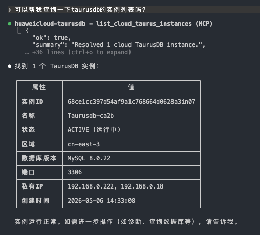
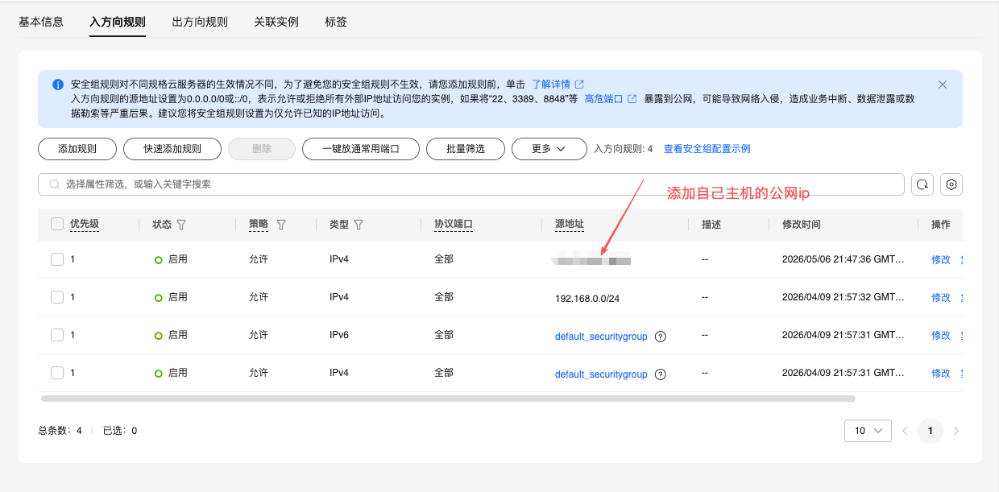
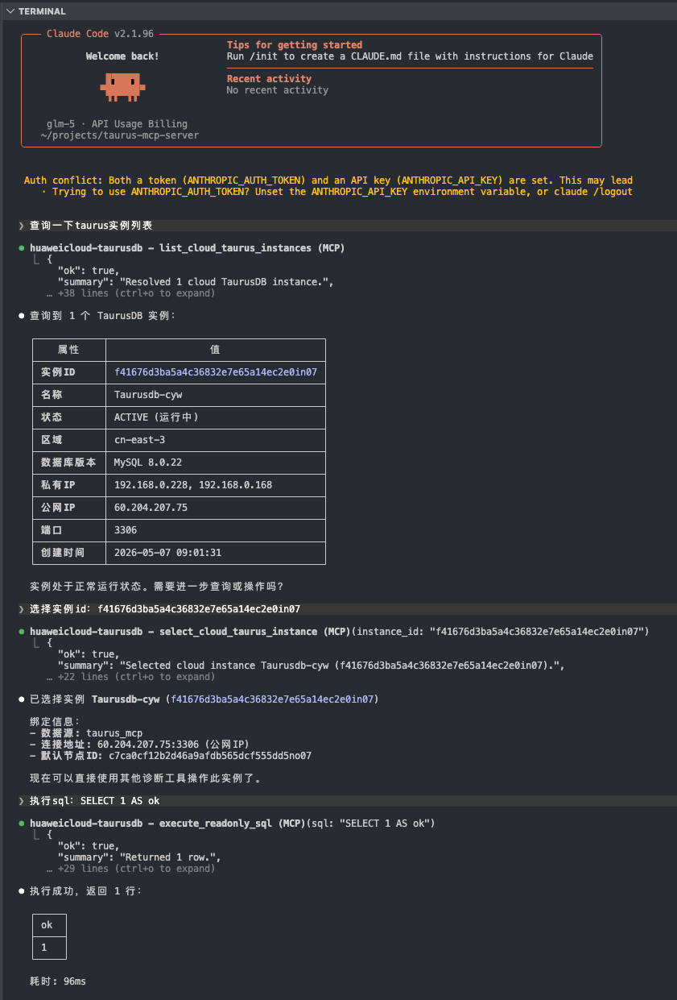
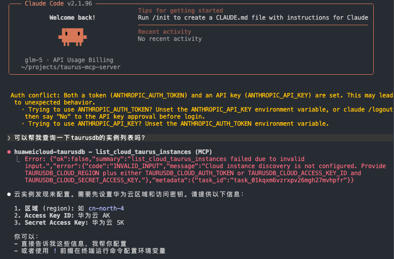
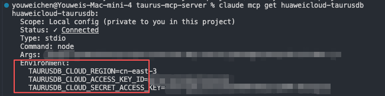

# TaurusDB MCP Server

当前对外发布的 npm 包：

- `taurusdb-core`
- `taurusdb-mcp`

环境要求：

- Node.js `>= 20`
- npm

## Use From npm

普通用户不需要 clone 或 build 当前仓库，直接通过 npm 启动 MCP server：

```bash
npx -y taurusdb-mcp --version
```

也可以先安装到项目里：

```bash
npm install taurusdb-mcp
npx taurusdb-mcp --version
```

MCP 客户端里的启动命令统一使用：

```json
{
  "command": "npx",
  "args": ["-y", "taurusdb-mcp"]
}
```

最小云控制面 + 数据面环境变量：

```bash
TAURUSDB_CLOUD_REGION=<your-region>
TAURUSDB_CLOUD_ACCESS_KEY_ID=<your-ak>
TAURUSDB_CLOUD_SECRET_ACCESS_KEY=<your-sk>
TAURUSDB_SQL_DATABASE=<your-database>
TAURUSDB_SQL_USER=<your-readonly-user>
TAURUSDB_SQL_PASSWORD=<your-readonly-password>
```

如果使用华为云临时凭证，再补：

```bash
TAURUSDB_CLOUD_SECURITY_TOKEN=<your-session-token>
```

## MCP Client Setup

### Claude Code

推荐把云控制面凭证和只读数据面模板直接写进 MCP 配置，避免依赖外部 shell 的 `export`：

```bash
claude mcp add huaweicloud-taurusdb \
  --transport stdio \
  -s local \
  -e TAURUSDB_CLOUD_REGION=<your-region> \
  -e TAURUSDB_CLOUD_ACCESS_KEY_ID=<your-ak> \
  -e TAURUSDB_CLOUD_SECRET_ACCESS_KEY=<your-sk> \
  -e TAURUSDB_SQL_DATABASE=<your-database> \
  -e TAURUSDB_SQL_USER=<your-readonly-user> \
  -e TAURUSDB_SQL_PASSWORD=<your-readonly-password> \
  -- npx -y taurusdb-mcp
```

验证：

```bash
claude mcp list
claude mcp get huaweicloud-taurusdb
```

### Codex

Codex 支持通过 CLI 添加 stdio MCP server，也可以直接写 `~/.codex/config.toml`。CLI 和 IDE extension 共享这份配置。

```bash
codex mcp add huaweicloud-taurusdb \
  --env TAURUSDB_CLOUD_REGION=<your-region> \
  --env TAURUSDB_CLOUD_ACCESS_KEY_ID=<your-ak> \
  --env TAURUSDB_CLOUD_SECRET_ACCESS_KEY=<your-sk> \
  --env TAURUSDB_SQL_DATABASE=<your-database> \
  --env TAURUSDB_SQL_USER=<your-readonly-user> \
  --env TAURUSDB_SQL_PASSWORD=<your-readonly-password> \
  -- npx -y taurusdb-mcp
```

验证：

```bash
codex mcp list
```

等价的 `~/.codex/config.toml`：

```toml
[mcp_servers.huaweicloud-taurusdb]
command = "npx"
args = ["-y", "taurusdb-mcp"]
enabled = true

[mcp_servers.huaweicloud-taurusdb.env]
TAURUSDB_CLOUD_REGION = "<your-region>"
TAURUSDB_CLOUD_ACCESS_KEY_ID = "<your-ak>"
TAURUSDB_CLOUD_SECRET_ACCESS_KEY = "<your-sk>"
TAURUSDB_SQL_DATABASE = "<your-database>"
TAURUSDB_SQL_USER = "<your-readonly-user>"
TAURUSDB_SQL_PASSWORD = "<your-readonly-password>"
```

### Cursor

创建或编辑 `~/.cursor/mcp.json`：

```json
{
  "mcpServers": {
    "huaweicloud-taurusdb": {
      "command": "npx",
      "args": ["-y", "taurusdb-mcp"],
      "env": {
        "TAURUSDB_CLOUD_REGION": "<your-region>",
        "TAURUSDB_CLOUD_ACCESS_KEY_ID": "<your-ak>",
        "TAURUSDB_CLOUD_SECRET_ACCESS_KEY": "<your-sk>",
        "TAURUSDB_SQL_DATABASE": "<your-database>",
        "TAURUSDB_SQL_USER": "<your-readonly-user>",
        "TAURUSDB_SQL_PASSWORD": "<your-readonly-password>"
      }
    }
  }
}
```

重启 Cursor 后，在 Agent 模式里让它调用：

- `list_cloud_taurus_instances`
- `select_cloud_taurus_instance`
- `execute_readonly_sql` with `SELECT 1 AS ok`

### Generated Client Config

`taurusdb-mcp` 也提供初始化命令，可生成 Claude Desktop、Cursor、VS Code 的基础 MCP 配置：

```bash
npx -y taurusdb-mcp init --client claude
npx -y taurusdb-mcp init --client cursor
npx -y taurusdb-mcp init --client vscode
```

生成后按需把上面的 `env` 补进对应配置文件。

## Local Development

如果你要开发当前仓库，再使用下面的本地流程。

安装依赖：

```bash
npm install
```

开发模式启动当前 MCP Server：

```bash
npm run dev
```

构建：

```bash
npm run build
```

运行测试：

```bash
npm test
```

只看 MCP 包的检查 / 测试：

```bash
npm run check --workspace taurusdb-mcp
npm run test --workspace taurusdb-mcp
```

查看本地 workspace 版本：

```bash
npx taurusdb-mcp --version
```

## npm Publish

发布前建议先检查包名是否可用：

```bash
npm view taurusdb-core name
npm view taurusdb-mcp name
```

本地检查打包内容：

```bash
npm run build
npm_config_cache=/private/tmp/taurus-npm-cache npm pack --workspace taurusdb-core --dry-run
npm_config_cache=/private/tmp/taurus-npm-cache npm pack --workspace taurusdb-mcp --dry-run
```

发布顺序：

```bash
npm login
npm run build
npm publish --workspace taurusdb-core
npm publish --workspace taurusdb-mcp
```

安装和运行已发布包：

```bash
npm install taurusdb-mcp
npx taurusdb-mcp --version
```

## Claude Code Setup From Source

下面是从本地源码构建并接入 Claude Code 的开发路径。普通用户优先使用上面的 npm 配置。

### 1. Build

```bash
cd /Users/youweichen/projects/taurus-mcp-server
npm run build
```

### 2. Add The Local MCP Server

如果你只想先验证本地 MCP 能否启动：

```bash
claude mcp add huaweicloud-taurusdb \
  --transport stdio \
  -- node /Users/youweichen/projects/taurus-mcp-server/packages/mcp/dist/index.js
```

如果你希望 Claude Code 直接带着华为云控制面配置启动，推荐一次性把 `region + AK/SK` 写进 MCP 配置，而不是依赖外部 shell 的 `export`：

```bash
claude mcp add huaweicloud-taurusdb \
  --transport stdio \
  -e TAURUSDB_CLOUD_REGION=<your-region> \
  -e TAURUSDB_CLOUD_ACCESS_KEY_ID=<your-ak> \
  -e TAURUSDB_CLOUD_SECRET_ACCESS_KEY=<your-sk> \
  -- node /Users/youweichen/projects/taurus-mcp-server/packages/mcp/dist/index.js
```

如果你使用的是临时凭证，再补：

```bash
-e TAURUSDB_CLOUD_SECURITY_TOKEN=<your-session-token>
```

### 3. Verify The MCP Registration

```bash
claude mcp list
claude mcp get huaweicloud-taurusdb
```

检查重点：

- `huaweicloud-taurusdb` 已出现在 `claude mcp list`
- `claude mcp get huaweicloud-taurusdb` 能看到正确的 `command`
- 如果你通过 `-e` 写入了云配置，`env` 不应为空

### 4. Verify Cloud Control Plane

在 Claude Code 里直接调用：

- `list_cloud_taurus_instances`

查询成功时，通常会看到类似下面这样的结果：



说明当前 MCP 会话已经能使用这组凭证访问华为云控制面，并且能看见实例列表。

### 5. Verify Database Data Plane

控制面通过后，再补最小数据面模板，然后在 Claude Code 里直接调用：

- `execute_readonly_sql` with `SELECT 1 AS ok`

如果 `SELECT 1` 成功，说明数据库数据面也已连通。

## Cloud Datasource Template

当前版本已经支持一种更适合云上多实例切换的用法：

- 只把 datasource 当作模板
- 不要求模板里预先写死 `host`
- 通过 `select_cloud_taurus_instance` 在运行时把当前实例的 `host/port` 绑定到这个模板

这意味着客户不需要每切一个实例就重新改一遍：

- `TAURUSDB_SQL_HOST`
- `TAURUSDB_SQL_PORT`
- `TAURUSDB_SQL_ENGINE`
- `TAURUSDB_SQL_DATASOURCE`

更推荐的方式是：

1. 先配一次云控制面凭证
2. 再配一次数据面模板
3. 后续切实例时只调用：
   - `list_cloud_taurus_instances`
   - `select_cloud_taurus_instance`

### Minimal Template

当前版本已经把这几个默认值内置好了：

- 默认 `engine = mysql`
- 默认 `datasource = taurus_mcp`
- 只要检测到最小 SQL 模板输入，就会自动把 `taurus_mcp` 作为默认 datasource

所以如果你使用环境变量，客户侧最小只需要：

```bash
export TAURUSDB_SQL_DATABASE=<default-database>
export TAURUSDB_SQL_USER=<readonly-user>
export TAURUSDB_SQL_PASSWORD=<readonly-password>
```

这里的关键点是：

- `database / user / password` 来自模板
- `host / port` 来自当前选中的云实例
- `engine` 默认按 `mysql` 处理，因为 TaurusDB for MySQL 走的是 MySQL 协议
- `datasource` 默认使用 `taurus_mcp`

### Connectivity Options

在执行下面的推荐流程之前，先确认你的客户端是通过公网还是私网访问 TaurusDB。

#### Option A: No ECS and Not in the Same VPC

如果本机不在和 TaurusDB 相同的 VPC 内，也没有可用的 ECS / VPN / 专线中转，通常需要通过数据库的读写公网地址访问实例。

建议配置：

- 为 TaurusDB 实例开通读写公网地址
- 在实例对应的安全组里放通你当前本机公网出口 IP，例如 `124.70.231.48/32`
- 优先只放通数据库端口 `3306`

可以先在本机终端获取当前公网出口 IP：

```bash
curl ifconfig.me; echo
```

例如返回：

```text
124.70.231.48
```

下图展示了一个将本机公网 IP 加入安全组规则的示例：



说明：

- 常见情况下，安全组重点是入方向规则；如果你的环境对出方向也做了限制，再补充对应的出方向规则
- 本机公网 IP 变化后，需要同步更新安全组规则
- 这种方式适合本地开发、临时调试或从办公室网络直连云上数据库

#### Option B: Use ECS in the Same VPC

如果你有和 TaurusDB 位于同一 VPC 内的 ECS，或已经通过 VPN / 专线打通到该私网，优先使用读写内网地址连接实例，不必依赖公网地址。

建议配置：

- 在 ECS 或已打通私网的运行环境中部署 Claude Code / MCP Server / 业务程序
- 使用 TaurusDB 的读写内网地址，例如 `192.168.x.x:3306`
- 在安全组里只放通 ECS 所在网段、ECS 安全组，或最小必要来源

说明：

- 这是更推荐的长期方案，安全性和稳定性通常都更好
- 一般不需要为数据库额外购买读写公网地址
- 适合生产环境、固定云上开发机和长期运行的自动化任务

### Recommended Flow

完成上面的网络打通后，推荐的实际使用顺序：

1. 在 Claude Code 里调用 `list_cloud_taurus_instances`
2. 调用 `select_cloud_taurus_instance`
3. 再调用 `execute_readonly_sql`，例如：

```json
{
  "sql": "SELECT 1 AS ok"
}
```

下图展示了按上述顺序执行后的实际调用效果：



### What `select_cloud_taurus_instance` Does Now

除了设置当前会话的：

- `project_id`
- `instance_id`
- `node_id`

它现在还会尝试把当前实例的：

- `private_ips[0]`
- 或 `hostnames[0]`
- 以及 `port`

绑定到当前 datasource 模板，然后重建 engine，避免连接池继续复用旧实例。

### DBA-Friendly Model

这套模型更适合 DBA 统一兜底：

- DBA 维护模板中的 `database / readonly user / password / tls`
- 用户只需要选实例
- MCP 自动把实例地址绑定到模板

如果不同实例共用同一套只读账号和默认库名，这种方式会明显比“每次切实例都重新 export 一组 SQL env”更顺畅。

如果你需要覆盖默认值，仍然可以显式设置：

- `TAURUSDB_SQL_ENGINE`
- `TAURUSDB_SQL_DATASOURCE`
- `TAURUSDB_DEFAULT_DATASOURCE`

## Common Issues

### `list_cloud_taurus_instances` returns `INVALID_INPUT`

如果你在 Claude Code 中看到类似错误：



这通常说明当前 MCP 进程没有拿到：

- `TAURUSDB_CLOUD_REGION`
- `TAURUSDB_CLOUD_ACCESS_KEY_ID`
- `TAURUSDB_CLOUD_SECRET_ACCESS_KEY`

最常见原因不是变量没配，而是：

- 你在外部 shell 里执行了 `export`，但 Claude Code 的 MCP 进程早已启动
- 你修改了环境变量，但没有重启 Claude Code 会话
- `claude mcp add` 时没有把 `-e` 写进 MCP 配置

### How To Fix Missing Cloud Env

先检查当前配置：

```bash
claude mcp get huaweicloud-taurusdb
```

如果 `env` 为空，直接重配：

```bash
claude mcp add "huaweicloud-taurusdb" \
  --transport stdio \
  -s local \
  -e TAURUSDB_CLOUD_REGION=cn-east-3 \
  -e TAURUSDB_CLOUD_ACCESS_KEY_ID=<your-ak> \
  -e TAURUSDB_CLOUD_SECRET_ACCESS_KEY=<your-sk> \
  -e TAURUSDB_SQL_DATABASE=<your-database> \
  -e TAURUSDB_SQL_USER=<your-readonly-user> \
  -e TAURUSDB_SQL_PASSWORD=<your-readonly-password> \
  -- npx -y taurusdb-mcp
```

如果是临时凭证，再补：

```bash
-e TAURUSDB_CLOUD_SECURITY_TOKEN=<your-session-token>
```

重配后再次执行：

```bash
claude mcp get huaweicloud-taurusdb
```

如果能看到类似下面这样带 `env` 的配置，就说明 Claude Code 的 MCP 启动环境已经写对了：



### `401 verify ak sk signature failed`

如果 `list_cloud_taurus_instances` 返回 `401`，通常说明：

- `AK/SK` 填错
- 使用的是临时凭证但缺少 `TAURUSDB_CLOUD_SECURITY_TOKEN`
- `AK/SK` 已禁用或已重置

当前仓库已经修复了华为云 IAM 签名中的 canonical URI 尾斜杠问题。如果你仍然收到 `401`，优先检查凭证本身，而不是 `project_id`。
