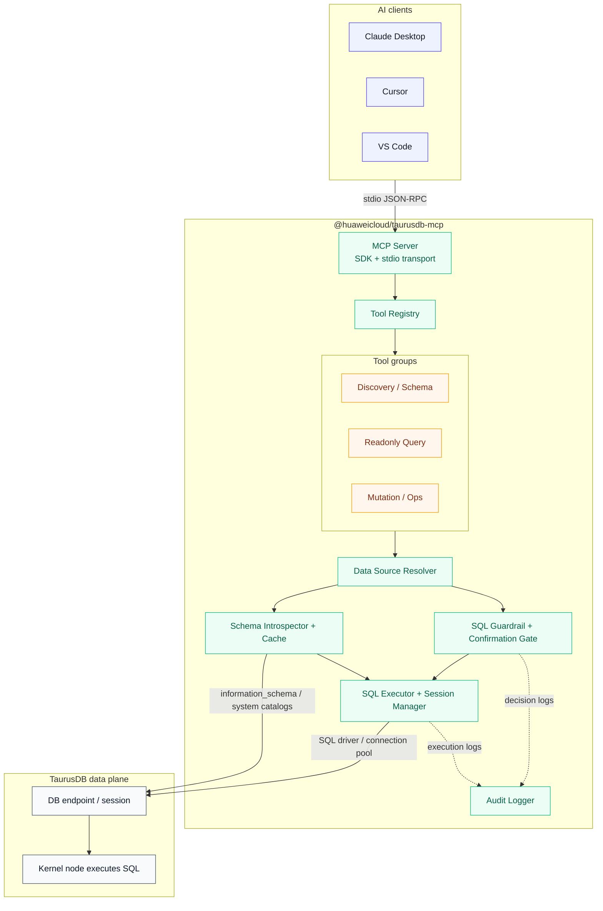
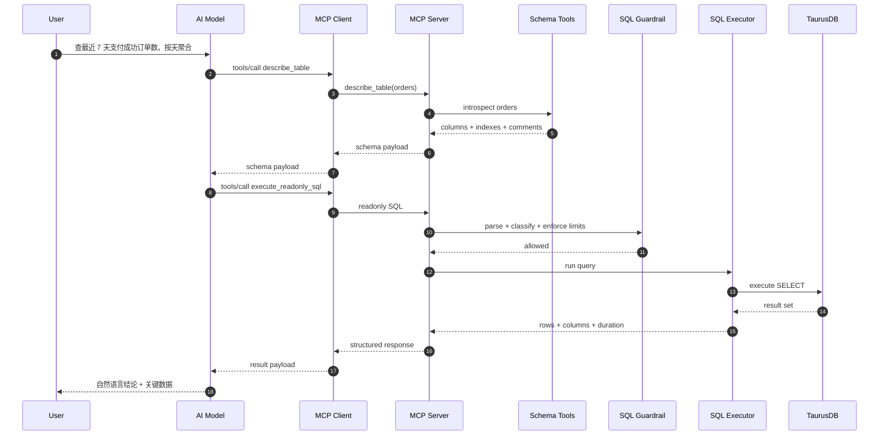
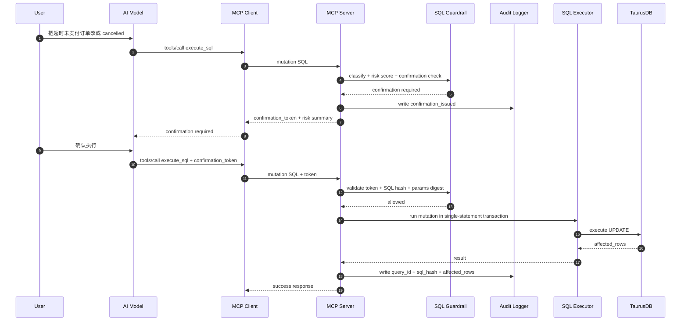
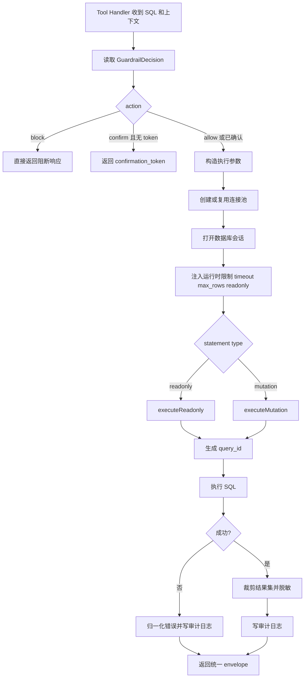
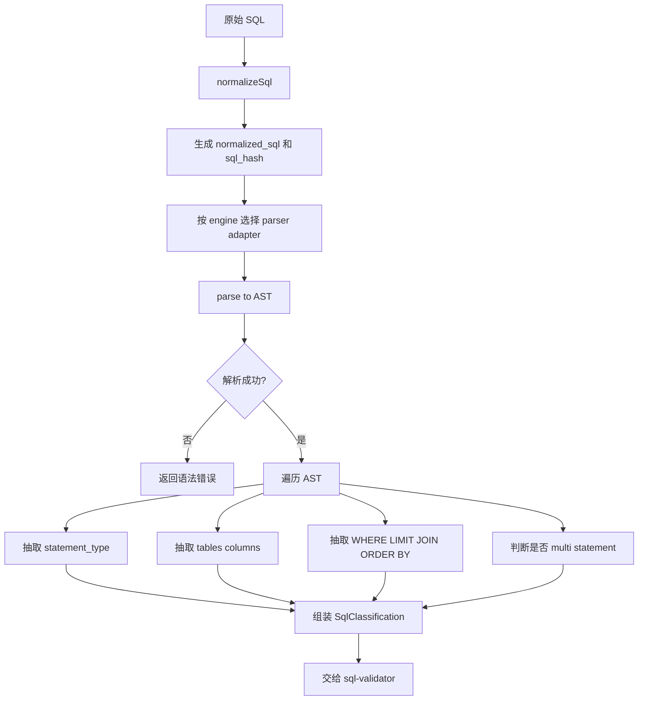
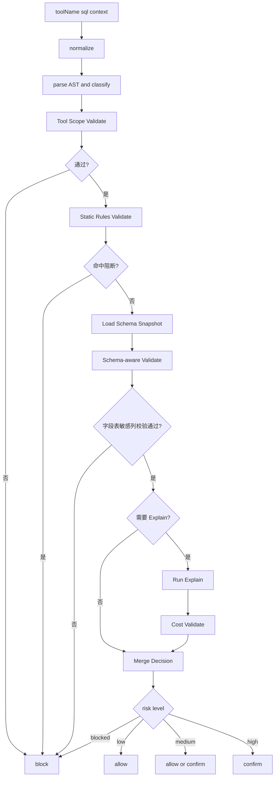
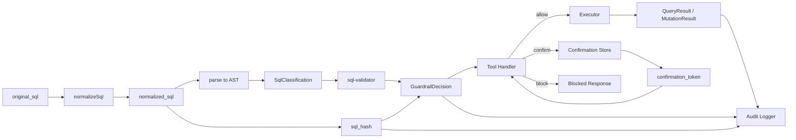

# 华为云 TaurusDB 数据面 MCP Server — 架构与方案设计

## 1. 项目概述

### 1.1 目标

构建一个符合 Model Context Protocol (MCP) 标准的服务器，让 AI 助手（Claude Desktop、Cursor、VS Code 等）能够通过自然语言与华为云 TaurusDB 的**数据面**交互，完成 schema 探查、只读 SQL 查询、Explain 分析和受控 SQL 执行。

这里的核心链路是：

```text
自然语言
→ schema 上下文
→ SQL
→ 风险校验
→ 数据面执行
→ 结构化结果
```

### 1.2 核心定位

| 维度         | 决策                                                            |
| ------------ | --------------------------------------------------------------- |
| 语言         | TypeScript（npm 生态和 MCP SDK 最成熟）                         |
| 分发         | npm 包，用户通过 `npx @huaweicloud/taurusdb-mcp` 零安装运行     |
| 传输         | `stdio`，本地 JSON-RPC over stdin/stdout                        |
| 首要认证     | 数据库连接凭证或数据源 profile                                  |
| 可选认证     | AK/SK 仅用于辅助发现实例、地址等管控面上下文                    |
| 执行路径     | 直接建立数据库会话，由 TaurusDB 数据面执行 SQL                  |
| 安全边界     | SQL AST 分类、结果限制、超时限制、确认 token、审计日志          |
| 推荐部署位点 | 与 TaurusDB 同 VPC、同可达网络的跳板机 / Sidecar / 本地安全环境 |

### 1.3 管控面与数据面的边界

| 维度         | 管控面                   | 数据面                         |
| ------------ | ------------------------ | ------------------------------ |
| 连接对象     | OpenAPI / SDK            | 数据库会话                     |
| 主要能力     | 查实例、备份、参数、日志 | 查库、查表、执行 SQL           |
| 结果粒度     | 资源元数据               | 真实业务数据                   |
| 风险类型     | 资源变更风险             | 数据误改、慢查询、敏感数据暴露 |
| 本项目优先级 | P2                       | P0                             |

结论是：这个 MCP Server 首先是一个 **SQL 执行与治理层**，不是一个数据库运维控制台。

---

## 2. 系统架构

### 2.1 分层架构



### 2.2 主数据流

一次完整的只读查询调用流程：

```text
用户自然语言
→ AI 先选择 schema 工具获取表结构
→ AI 组织 SQL
→ MCP Client 发起 tools/call
→ Server 解析数据源、数据库、schema 上下文
→ SQL Guardrail 解析 SQL，判定语句类型、风险和限制
→ Schema Introspector 提供字段信息辅助校验
→ SQL Executor 在数据面建立会话执行
→ 返回 rows / columns / truncated / duration_ms / query_id
→ AI 组织最终自然语言回答
```

### 2.3 关键交互示例

#### 2.3.1 自然语言到只读 SQL

**用户问：“查最近 7 天支付成功订单数，按天聚合。”**



#### 2.3.2 受控写 SQL

**用户问：“把超时未支付订单改成 cancelled。”**



### 2.4 为什么强调“内核节点执行”

这里说的“内核节点执行”，不是要求 MCP Server 必须部署进数据库进程内部，而是强调：

- SQL 的最终执行落点是 TaurusDB 的数据库内核，而不是云管 API
- 结果来自真实表数据，而不是资源元数据
- 风险控制必须围绕 SQL 执行语义，而不是只围绕 API 权限

所以部署建议是“尽量靠近数据面”，例如：

- 与 TaurusDB 同 VPC 的运维主机
- 客户侧堡垒机或跳板机
- 受控的本地开发环境

---

## 3. 模块设计

### 3.1 目录结构

```text
@huaweicloud/taurusdb-mcp/
├── src/
│   ├── index.ts                    # 入口：CLI 分发 + MCP Server 启动
│   ├── server.ts                   # MCP Server 初始化、Tool 注册
│   ├── auth/
│   │   ├── sql-profile-loader.ts   # 数据源 profile / DSN / env 加载
│   │   └── secret-resolver.ts      # 密码、密钥等敏感配置解析
│   ├── context/
│   │   ├── datasource-resolver.ts  # 默认数据源 / database / schema 覆盖
│   │   └── session-context.ts      # 单次调用上下文
│   ├── schema/
│   │   ├── introspector.ts         # 系统表 / catalog 查询
│   │   ├── cache.ts                # schema 短期缓存
│   │   └── adapters/               # 各内核类型的 schema 适配
│   ├── executor/
│   │   ├── sql-executor.ts         # SQL 执行主入口
│   │   ├── connection-pool.ts      # 连接池管理
│   │   ├── query-tracker.ts        # query_id 状态管理
│   │   └── adapters/               # MySQL / PostgreSQL compatible adapters
│   ├── safety/
│   │   ├── sql-classifier.ts       # AST 分类
│   │   ├── sql-validator.ts        # 黑白名单、单语句限制、风险规则
│   │   ├── confirmation-store.ts   # confirmation_token 签发与校验
│   │   └── redaction.ts            # 结果脱敏与字段裁剪
│   ├── tools/
│   │   ├── discovery.ts            # list_data_sources / list_databases
│   │   ├── schema.ts               # list_tables / describe_table / sample_rows
│   │   ├── query.ts                # execute_readonly_sql / explain_sql
│   │   ├── mutations.ts            # execute_sql
│   │   └── operations.ts           # get_query_status / cancel_query
│   ├── commands/
│   │   └── init.ts                 # 一键写入 MCP 客户端配置
│   └── utils/
│       ├── formatter.ts            # 统一 envelope
│       ├── audit.ts                # 审计落盘
│       └── hash.ts                 # SQL fingerprint / digest
├── tests/
│   ├── unit/
│   │   ├── sql-classifier.test.ts
│   │   ├── sql-validator.test.ts
│   │   ├── formatter.test.ts
│   │   └── confirmation-store.test.ts
│   └── integration/
│       ├── schema-tools.test.ts
│       ├── query-tools.test.ts
│       └── mutation-tools.test.ts
└── package.json
```

### 3.2 各模块职责

#### 3.2.1 入口层 (`index.ts`)

入口只做两件事：识别子命令和启动 MCP Server。

```typescript
#!/usr/bin/env node

if (args[0] === "init") {
  await runInit(args);
  process.exit(0);
}

const server = createServer();
const transport = new StdioServerTransport();
await server.connect(transport);
```

#### 3.2.2 数据源与凭证层 (`auth/` + `context/`)

数据面 MCP 的首要上下文不是 `region/project_id`，而是：

- `datasource`
- `database`
- `schema`
- `engine`
- `credential_source`

建议的加载优先级：

```text
1. Tool 显式参数        → datasource / database / schema
2. 命名 profile         → ~/.config/taurusdb-mcp/profiles.json
3. 环境变量             → TAURUSDB_SQL_DSN / HOST / PORT / USER / PASSWORD
4. init 写入的本地配置   → 面向 Claude / Cursor 的默认 profile
```

核心要求：

- 数据源与数据库上下文必须能被单次调用覆盖
- 密码不直接回显到工具结果
- 允许区分只读账号与写账号
- 为后续接入 Secret Manager 预留接口

#### 3.2.3 Schema 层 (`schema/`)

Schema 层负责做 3 件事：

1. 从系统表中抽取数据库、表、字段、索引、主键、注释
2. 输出 AI 易消费的结构化 schema 信息
3. 对高频元数据做短 TTL 缓存，减少重复查 catalog 的开销

推荐返回字段至少包括：

- `database`
- `table_name`
- `column_name`
- `data_type`
- `nullable`
- `default_value`
- `index_name`
- `is_primary_key`
- `comment`

为了让模型更容易生成正确 SQL，`describe_table` 建议额外返回：

- 常用 where 字段提示
- 可排序字段提示
- 时间字段识别
- 样本值摘要，而不是全量样本

#### 3.2.4 SQL 执行层 (`executor/`)

SQL 执行层是整个项目的中心。它不是单纯的 `query(sql)` 包装，而是一个受控会话执行器：

```typescript
class SqlExecutor {
  async explain(sql: string, context: SessionContext): Promise<ExplainResult>;

  async executeReadonly(
    sql: string,
    context: SessionContext,
    options?: QueryOptions
  ): Promise<QueryResult>;

  async executeMutation(
    sql: string,
    context: SessionContext,
    options?: MutationOptions
  ): Promise<MutationResult>;

  async getQueryStatus(queryId: string): Promise<QueryStatus>;
  async cancelQuery(queryId: string): Promise<CancelResult>;
}
```

关键设计决策：

- 按内核类型加载 driver adapter，而不是把所有引擎硬编码在一个执行器里
- 只允许单语句执行
- 只读查询与写查询走不同入口
- 每次执行都生成 `query_id`
- 长查询可查询状态、可取消
- 写 SQL 由服务端包裹为单次事务边界，避免客户端自己发 `BEGIN/COMMIT`

##### 3.2.4.1 Executor 执行流程图



#### 3.2.5 安全层 (`safety/`)

安全层是数据面 MCP 和“直接给模型一个数据库账号”之间的根本区别。

核心步骤如下：

1. SQL 解析：把 SQL 解析为 AST，识别语句类型
2. 单语句校验：禁止多语句批量执行
3. 语句分级：区分只读、写入、高风险、阻断
4. 规则检查：检查是否命中黑名单、缺少限制条件、可能大范围扫描
5. Explain / 成本评估：对复杂只读和全部写 SQL 生成成本摘要
6. 确认策略：命中风险规则时签发 `confirmation_token`
7. 脱敏与裁剪：结果输出前统一裁剪和脱敏

风险分层建议：

| 风险等级  | 典型 SQL                                               | 默认策略                         |
| --------- | ------------------------------------------------------ | -------------------------------- |
| `low`     | `SHOW TABLES`、有明确 `LIMIT` 的简单查询               | 直接执行                         |
| `medium`  | 联表聚合、大范围扫描风险、带 `WHERE` 的 `UPDATE`       | 先解释，必要时要求确认           |
| `high`    | 大范围 `UPDATE/DELETE`、`ALTER TABLE`                  | 默认阻断或仅在显式开关下允许确认 |
| `blocked` | `DROP DATABASE`、`TRUNCATE`、`GRANT`、`REVOKE`、多语句 | 直接拒绝                         |

阻断规则至少包括：

- 多语句
- DCL 语句
- `DROP DATABASE`
- `TRUNCATE`
- 文件系统相关 SQL
- 会修改全局参数的 SQL

##### 3.2.5.1 AST 校验是什么意思

AST 是 Abstract Syntax Tree，也就是抽象语法树。把 SQL 解析成 AST，本质上是在把一段字符串变成“结构化语义对象”。

例如下面这条 SQL：

```sql
UPDATE orders
SET status = 'cancelled'
WHERE id = 1001;
```

在 Guardrail 看来，不应该只是一段文本，而应该被解析成类似这样的结构：

```typescript
{
  kind: "update",
  table: "orders",
  set: [{ column: "status", value: "cancelled" }],
  where: {
    op: "=",
    left: { column: "id" },
    right: { literal: 1001 },
  },
}
```

这样做的价值是：

- 可以可靠识别语句类型，而不是靠正则猜它是不是 `UPDATE`
- 可以判断是不是多语句，而不是用分号硬拆
- 可以知道 `WHERE` 是否存在、作用在哪些列上
- 可以抽取引用的表、字段、函数、排序、分页和 join 结构
- 可以对不同引擎做 adapter，而不是把所有 SQL 方言混在一起处理

也就是说，**AST 校验不是“检查 SQL 长得像不像对”，而是“检查 SQL 的语义结构是否符合安全规则”**。

AST 解析链路可以画成这样：



##### 3.2.5.2 Guardrail 的分层执行流程

建议把 Guardrail 设计成 6 层，而不是一个大函数里堆所有 if/else：

1. 归一化层
   保留原始 SQL，生成 `normalized_sql`、`sql_hash`，统一空白和注释处理
2. 解析层
   按引擎调用 parser adapter，把 SQL 解析为 AST；解析失败直接返回语法类错误
3. 分类层
   从 AST 提取 `statement_type`、引用表、引用列、是否多语句、是否含 `WHERE/LIMIT/JOIN/ORDER BY`
4. 静态规则层
   不连数据库即可判断的规则，如多语句、DCL、危险 DDL、无 `WHERE` 的 `UPDATE/DELETE`
5. Schema / Explain 层
   结合 schema 信息和执行计划继续判断列是否存在、索引是否可能命中、是否疑似全表扫描
6. 运行时约束层
   把最终决策转成 executor 参数，例如 `readonly`、`timeout_ms`、`max_rows`、`requires_confirmation`

对应的调用顺序如下：

```text
SQL 文本
→ normalize
→ parse to AST
→ classify
→ static validate
→ schema-aware validate
→ explain / cost validate
→ decision: allow / confirm / block
→ executor.run with runtime limits
```

Guardrail 的决策流程可以画成这样：



##### 3.2.5.3 分类层输出什么

`sql-classifier.ts` 建议只做“抽取事实”，不直接做策略决策。它的输出可以设计成这样：

```typescript
type SqlClassification = {
  engine: "mysql" | "postgresql" | "unknown";
  statementType:
    | "select"
    | "show"
    | "explain"
    | "describe"
    | "insert"
    | "update"
    | "delete"
    | "alter"
    | "drop"
    | "create"
    | "grant"
    | "revoke"
    | "unknown";
  normalizedSql: string;
  sqlHash: string;
  isMultiStatement: boolean;
  referencedTables: string[];
  referencedColumns: string[];
  hasWhere: boolean;
  hasLimit: boolean;
  hasJoin: boolean;
  hasSubquery: boolean;
  hasOrderBy: boolean;
  hasAggregate: boolean;
};
```

这个阶段不回答“能不能执行”，只回答“这条 SQL 到底是什么”。

##### 3.2.5.4 校验层怎么分

`sql-validator.ts` 不应该只做一层检查，建议拆成 4 种校验。

**第一层：Tool 级校验**

先看当前工具允许什么：

- `execute_readonly_sql` 只允许 `SELECT / SHOW / EXPLAIN / DESCRIBE`
- `execute_sql` 才允许 `INSERT / UPDATE / DELETE`
- `execute_sql` 默认不暴露，只有开启 mutations 才能用

这层主要防止“用错工具”。

**第二层：静态语义校验**

这层只依赖 AST，不依赖数据库实时状态。建议至少覆盖这些规则：

| 规则              | 命中条件                     | 默认动作            |
| ----------------- | ---------------------------- | ------------------- |
| 多语句阻断        | AST 判断为多 statement       | `blocked`           |
| DCL 阻断          | `GRANT / REVOKE`             | `blocked`           |
| 危险 DDL 阻断     | `DROP DATABASE`、`TRUNCATE`  | `blocked`           |
| 全局参数阻断      | `SET GLOBAL` 等              | `blocked`           |
| 写 SQL 无条件限制 | `UPDATE/DELETE` 没有 `WHERE` | `high` 或 `blocked` |
| 只读大查询预警    | 普通明细查询没有 `LIMIT`     | `medium`            |
| 宽表全量查询预警  | `SELECT *` 且非聚合查询      | `medium`            |

注意：`LIMIT` 不是绝对规则。像聚合 SQL：

```sql
SELECT dt, count(*) FROM orders GROUP BY dt;
```

这种查询即使没有 `LIMIT`，也不能简单判死刑。更合理的做法是：

- 明细查询缺少 `LIMIT` 时提高风险
- 聚合查询缺少 `LIMIT` 时交给 Explain 阶段继续判断

**第三层：Schema 感知校验**

这层会用到 `Schema Introspector` 的结果，做更精确的校验：

- 引用的表是否存在
- 引用的列是否存在
- `WHERE` 条件列是不是索引列、主键列或常见过滤列
- `ORDER BY` 字段是否可能触发大排序
- 是否访问敏感字段，如手机号、证件号、邮箱、token

这里的目标不是代替数据库编译器，而是把“大模型常犯错”提前挡住。

例如模型生成：

```sql
SELECT user_id, phone_number FROM orders WHERE created_time > now() - interval 7 day;
```

如果 `orders` 根本没有 `phone_number` 字段，就没必要真的发到数据库再报错，可以直接在 Guardrail 层返回“字段不存在，建议先 `describe_table`”。

**第四层：Explain / 成本校验**

这一层主要处理“语法上合法，但代价可能很大”的 SQL。

建议对以下语句强制进入 Explain：

- 所有 `UPDATE/DELETE`
- 所有 `ALTER`
- 有 `JOIN`、子查询、排序、聚合的大查询
- 没有明显限制条件的 `SELECT`

Explain 重点看这些信号：

- 预计扫描行数是否过大
- 是否命中索引
- 是否出现 `Using temporary` / `Using filesort` 一类高代价特征
- 是否疑似全表扫描
- 写 SQL 预计影响行数是否过大

这一步的输出不是数据库原始计划，而是 Guardrail 需要的摘要：

```typescript
type ExplainRiskSummary = {
  fullTableScanLikely: boolean;
  indexHitLikely: boolean;
  estimatedRows: number | null;
  usesTempStructure: boolean;
  usesFilesort: boolean;
  riskHints: string[];
};
```

##### 3.2.5.5 最终决策模型

前面的分类和校验最后会收敛成一个统一决策对象：

```typescript
type GuardrailDecision = {
  action: "allow" | "confirm" | "block";
  riskLevel: "low" | "medium" | "high" | "blocked";
  reasonCodes: string[];
  normalizedSql: string;
  sqlHash: string;
  requiresExplain: boolean;
  requiresConfirmation: boolean;
  runtimeLimits: {
    readonly: boolean;
    timeoutMs: number;
    maxRows: number;
  };
};
```

建议的决策逻辑：

- `blocked`：直接拒绝，不进入 executor
- `high`：默认拒绝，或在显式开启 mutations 时进入确认流
- `medium`：先返回风险说明，部分场景允许直接执行
- `low`：直接执行

对象关系可以画成这样：



这张图里几个对象的职责分别是：

- `original_sql`
  用户或模型原始生成的 SQL 文本
- `normalized_sql`
  给系统做稳定比较和解析的 SQL 文本
- `SqlClassification`
  Guardrail 从 AST 中抽取出来的“事实对象”
- `GuardrailDecision`
  Guardrail 输出给下游的“裁决对象”
- `QueryResult / MutationResult`
  Executor 真正执行完成后的结果对象

这也是为什么 `GuardrailDecision` 里需要带 `sql_hash`：

- Tool Handler 需要它决定是否确认
- Confirmation Store 需要它绑定 token
- Audit Logger 需要它关联整条链路
- Executor 和最终响应也可以复用同一个指纹，不必重复计算

##### 3.2.5.6 运行时限制怎么落地

Guardrail 不应该只停留在“返回一个风险等级”，它还要把决策落成执行参数。

建议至少控制这些运行时限制：

- `readonly`
  只读工具必须走只读会话或只读账号
- `timeout_ms`
  防止模型跑出超长查询
- `max_rows`
  防止结果集把上下文塞爆
- `max_columns`
  防止宽表直接把几十上百列全抛给模型
- `redaction_policy`
  对敏感列做脱敏

注意一个原则：

- **默认不要静默改写用户 SQL 语义**

例如对没有 `LIMIT` 的查询，更稳的做法通常是：

- 返回风险提示，请模型补限制条件
- 或服务端仅在返回层截断结果，而不是偷偷把 SQL 改成另一个意思

##### 3.2.5.7 一个推荐的伪代码方案

```typescript
async function inspectSql(input: {
  toolName: string;
  sql: string;
  context: SessionContext;
}): Promise<GuardrailDecision> {
  const normalized = normalizeSql(input.sql);
  const ast = parseSql(normalized.sql, input.context.engine);
  const cls = classifySql(ast, normalized);

  const toolDecision = validateToolScope(input.toolName, cls);
  if (toolDecision.action === "block") return toolDecision;

  const staticDecision = validateStaticRules(cls);
  if (staticDecision.action === "block") return staticDecision;

  const schemaSnapshot = await schemaIntrospector.load(input.context);
  const schemaDecision = validateSchemaAwareRules(cls, schemaSnapshot);
  if (schemaDecision.action === "block") return schemaDecision;

  const explainSummary = shouldExplain(cls)
    ? await executor.explain(normalized.sql, input.context)
    : null;

  const costDecision = validateCostRules(cls, explainSummary);
  return mergeDecision(cls, staticDecision, schemaDecision, costDecision);
}
```

然后在 Tool Handler 里这样使用：

```typescript
const decision = await inspectSql({ toolName, sql, context });

if (decision.action === "block") {
  return formatBlocked(decision);
}

if (decision.action === "confirm" && !confirmationToken) {
  return formatConfirmationRequired(decision);
}

return executor.run(sql, {
  readonly: decision.runtimeLimits.readonly,
  timeoutMs: decision.runtimeLimits.timeoutMs,
  maxRows: decision.runtimeLimits.maxRows,
});
```

##### 3.2.5.8 典型 SQL 的判定示例

| SQL                                                  | AST / 结构特征                     | 结果                 |
| ---------------------------------------------------- | ---------------------------------- | -------------------- |
| `SHOW TABLES`                                        | 只读、低代价                       | `allow`              |
| `SELECT * FROM orders LIMIT 100`                     | 只读、有 `LIMIT`，但宽表风险待观察 | `allow` 或 `medium`  |
| `SELECT * FROM orders`                               | 明细查询、无 `LIMIT`               | `confirm` 或 `block` |
| `SELECT dt, count(*) FROM orders GROUP BY dt`        | 聚合查询，无 `LIMIT` 但不一定危险  | 进入 Explain 再判断  |
| `UPDATE orders SET status='x' WHERE id=1`            | 写 SQL、有明确条件                 | `confirm`            |
| `UPDATE orders SET status='x'`                       | 写 SQL、无 `WHERE`                 | `block`              |
| `DELETE FROM orders WHERE created_at < '2024-01-01'` | 写 SQL、有条件但可能影响大量行     | Explain 后 `confirm` |
| `TRUNCATE orders`                                    | 阻断语句                           | `block`              |

##### 3.2.5.9 为什么不能只靠正则

只靠正则做 Guardrail 很快会失效，原因很简单：

- SQL 方言很多，大小写、引号、函数、注释写法都不同
- 子查询、CTE、嵌套表达式会让正则几乎不可维护
- 很多风险不是看关键词，而是看结构关系
- `UPDATE ... WHERE ...` 和 `UPDATE ...` 的风险差异，本质上是 AST 结构差异

所以实现上建议是：

- 正则只做非常轻量的预清洗
- 真正的分类和校验必须基于 AST
- 成本和影响面判断再叠加 Explain 与 schema 信息

#### 3.2.6 审计层 (`utils/audit.ts`)

数据面场景下，光有数据库自身日志还不够，因为还需要记录 MCP 服务端的决策过程。建议每次调用都记录：

- `task_id`
- `query_id`
- `datasource`
- `database`
- `statement_type`
- `risk_level`
- `sql_hash`
- `decision`
- `duration_ms`
- `row_count` 或 `affected_rows`

默认建议：

- 本地只落结构化 JSONL
- 不默认保存完整结果集
- 原始 SQL 文本可选保存，默认只保存 hash 和归一化摘要

##### 3.2.6.1 为什么不把每一条 SQL 都上报 CTS

不建议把每一条数据面 SQL 都上报到 CTS。

原因很直接：

- CTS 更适合承接管控面、治理面、关键操作面事件，不适合作为高频 SQL 明细流水仓
- 数据面 SQL 的量级通常远高于管控面操作，全部上报会让噪音远大于价值
- 很多只读 SQL 的审计价值在于可追踪，而不是必须进入云审计主账本
- 如果把每一条 SQL 都强耦合到 CTS，链路复杂度、成本和检索负担都会明显上升
- SQL 本身可能包含敏感表名、字段名或字面量，不适合原样进入更宽的审计分发面

更合理的思路是做**分层审计**，而不是“一刀切全部进 CTS”。

##### 3.2.6.2 推荐的分层审计策略

建议把审计拆成 3 层：

**第一层：MCP 本地结构化审计**

这是数据面 MCP 的主审计层，建议默认开启，记录最小必要元数据：

- `task_id`
- `query_id`
- `sql_hash`
- `statement_type`
- `risk_level`
- `decision`
- `duration_ms`
- `row_count` 或 `affected_rows`

这一层覆盖：

- 所有 `execute_sql`
- 所有被阻断的高风险 SQL
- 所有签发 `confirmation_token` 的请求
- 所有执行失败的请求
- `execute_readonly_sql` 可记录最小摘要，不要求保留完整结果

**第二层：数据库原生日志 / 审计能力**

如果客户本身已经启用数据库审计、慢日志、general log 或内核审计能力，这一层负责回答“数据库到底执行了什么”。

它更适合承接：

- 精确 SQL 回放
- 慢 SQL 排查
- 内核侧真实执行证据

**第三层：CTS 或更上层治理审计**

CTS 不建议接所有 SQL，而建议只接少量关键治理事件摘要，例如：

- 开启或关闭 `TAURUSDB_MCP_ENABLE_MUTATIONS`
- 数据源 profile 被新增、修改、删除
- 高风险写 SQL 已确认并执行
- 高风险 SQL 被 Guardrail 阻断
- 审计策略、脱敏策略、权限策略被修改

也就是说，**CTS 里放“关键治理事件”，不要放“每条 SQL 明细”**。

##### 3.2.6.3 推荐口径

如果后续确实需要和 CTS 打通，推荐上报的是“事件摘要”，而不是原始 SQL 明文：

```json
{
  "event_type": "mcp_sql_mutation_confirmed",
  "task_id": "task-02",
  "query_id": "qry-02",
  "sql_hash": "c194...",
  "statement_type": "update",
  "risk_level": "high",
  "datasource": "prod_orders",
  "database": "orders_db",
  "affected_rows": 1
}
```

这样做有几个好处：

- CTS 保持低噪音、高价值
- 审计字段足够做治理追踪
- 不把原始 SQL 和结果集扩散到不必要的链路里
- 真要深挖明细时，再回到 MCP 本地审计或数据库原生日志中查

---

## 4. Tool 设计

### 4.1 Tool 筛选原则

每个候选 Tool 按 4 个维度评估：

- 高频
- 高价值
- 低歧义
- 安全可收口

这里不再优先“实例诊断”“备份审查”，而是优先那些能构成数据查询闭环的 Tool。

### 4.2 P0 Tool 集合

| Tool                   | 默认暴露 | 角色定位                      |
| ---------------------- | -------- | ----------------------------- |
| `list_data_sources`    | 是       | 查看可用数据源和默认上下文    |
| `list_databases`       | 是       | 查看数据库列表                |
| `list_tables`          | 是       | 查看表列表                    |
| `describe_table`       | 是       | 查看字段、索引、主键、注释    |
| `sample_rows`          | 是       | 拉取少量样本帮助理解字段      |
| `execute_readonly_sql` | 是       | 只读查询主入口                |
| `explain_sql`          | 是       | SQL 计划和风险解释入口        |
| `get_query_status`     | 是       | 长查询状态跟踪                |
| `cancel_query`         | 是       | 取消仍在运行的查询            |
| `execute_sql`          | 否       | 变更 SQL 执行入口，需显式开启 |

### 4.3 Tool 参数设计

所有核心 Tool 都建议支持以下上下文字段：

```typescript
{
  datasource?: string;
  database?: string;
  schema?: string;
  timeout_ms?: number;
}
```

`execute_readonly_sql` 的核心参数：

```typescript
{
  sql: z.string().describe("Readonly SQL to execute"),
  datasource: z.string().optional(),
  database: z.string().optional(),
  max_rows: z.number().int().positive().max(1000).optional(),
  timeout_ms: z.number().int().positive().max(30000).optional()
}
```

`execute_sql` 额外参数：

```typescript
{
  sql: z.string().describe("Single mutation SQL statement"),
  datasource: z.string().optional(),
  database: z.string().optional(),
  confirmation_token: z.string().optional(),
  dry_run: z.boolean().optional()
}
```

### 4.4 为什么不单独做 `generate_sql`

`generate_sql` 很容易变成“模型调模型”的重复层。这里更合理的分工是：

- 模型本身负责自然语言到 SQL 的生成
- MCP Server 负责 schema 提供、风险校验、Explain 和执行

真正应该产品化的是执行与治理，不是把 SQL 文本生成本身再封一层 Tool。

---

## 5. MCP 协议与响应模型

### 5.1 Server 声明

```typescript
const server = new McpServer({
  name: "huaweicloud-taurusdb",
  version: "0.1.0",
  capabilities: {
    tools: {},
  },
});
```

### 5.2 统一响应结构

所有 Tool 继续返回统一 envelope，优先保证模型稳定消费。

**只读成功响应**

```json
{
  "ok": true,
  "summary": "Query succeeded and returned 42 rows.",
  "data": {
    "columns": [
      { "name": "dt", "type": "date" },
      { "name": "order_count", "type": "bigint" }
    ],
    "rows": [
      ["2026-04-09", 128],
      ["2026-04-10", 141]
    ],
    "row_count": 42,
    "truncated": false
  },
  "metadata": {
    "task_id": "task-01",
    "query_id": "qry-01",
    "sql_hash": "8bb4...",
    "statement_type": "select",
    "duration_ms": 182
  }
}
```

**需确认响应**

```json
{
  "ok": false,
  "summary": "This SQL will modify data and requires explicit confirmation.",
  "error": {
    "code": "CONFIRMATION_REQUIRED",
    "message": "Re-run the same SQL with confirmation_token to continue.",
    "retryable": true
  },
  "data": {
    "confirmation_token": "ctok_eyJhbGciOi...",
    "risk_level": "medium",
    "sql_hash": "c194..."
  },
  "metadata": {
    "task_id": "task-02"
  }
}
```

**阻断响应**

```json
{
  "ok": false,
  "summary": "The SQL statement is blocked by safety policy.",
  "error": {
    "code": "BLOCKED_SQL",
    "message": "TRUNCATE and DROP DATABASE are not allowed.",
    "retryable": false
  },
  "metadata": {
    "task_id": "task-03",
    "sql_hash": "95d2..."
  }
}
```

### 5.3 结果裁剪策略

结果返回必须有上限，否则模型上下文会很快失控。建议策略：

- 默认 `max_rows=200`
- 列数超阈值时提示用户缩小查询范围
- 大文本字段按字符数截断
- 二进制字段不直接回传
- 敏感字段按规则脱敏

---

## 6. 安全与部署策略

### 6.1 默认安全策略

| 策略                 | 说明                                                             |
| -------------------- | ---------------------------------------------------------------- |
| 默认只读             | 默认只注册 schema 和只读工具                                     |
| mutations 需显式开启 | 设置 `TAURUSDB_MCP_ENABLE_MUTATIONS=true` 后才暴露 `execute_sql` |
| 单语句               | 不允许一次调用执行多条 SQL                                       |
| 默认超时             | 每次查询都有最大执行时长                                         |
| 结果上限             | 返回行数、列数、文本长度都有限制                                 |
| 审计必达             | 至少记录 `task_id`、`query_id/sql_hash` 和决策结果               |

### 6.2 数据库权限建议

建议至少区分两套账号：

- 只读账号：用于默认 MCP 运行
- 写账号：仅在明确开启 `execute_sql` 的环境使用

不要让默认 profile 直接使用高权限 DBA 账号。

### 6.3 推荐环境变量

```bash
TAURUSDB_DEFAULT_DATASOURCE=prod_orders
TAURUSDB_SQL_PROFILES=/path/to/profiles.json
TAURUSDB_MCP_ENABLE_MUTATIONS=false
TAURUSDB_MCP_MAX_ROWS=200
TAURUSDB_MCP_MAX_COLUMNS=50
TAURUSDB_MCP_MAX_STATEMENT_MS=15000
TAURUSDB_MCP_AUDIT_LOG_PATH=~/.taurusdb-mcp/audit.jsonl
```

### 6.4 部署建议

优先顺序建议如下：

1. 与 TaurusDB 同 VPC 的运维主机
2. 企业堡垒机 / 跳板机
3. 受控本地开发机

不建议把拥有生产库写权限的 MCP Server 暴露在公共网络中。

---

## 7. 测试与演进

### 7.1 测试重点

单元测试应覆盖：

- SQL 分类
- 风险规则
- token 签发与校验
- 结果裁剪和脱敏

集成测试应覆盖：

- schema 工具链路
- 只读执行链路
- 写 SQL 二阶段确认
- 长查询取消

### 7.2 Phase 2 演进方向

在首版数据面闭环稳定后，再考虑：

- 慢 SQL 摘要和热点表分析
- 管控面实例发现与 endpoint 解析
- MCP Resources 形式的 schema 快照
- 预设 Prompt 模板，如“按业务问题自动补齐 schema 上下文”
- 更细粒度的行列级访问策略
