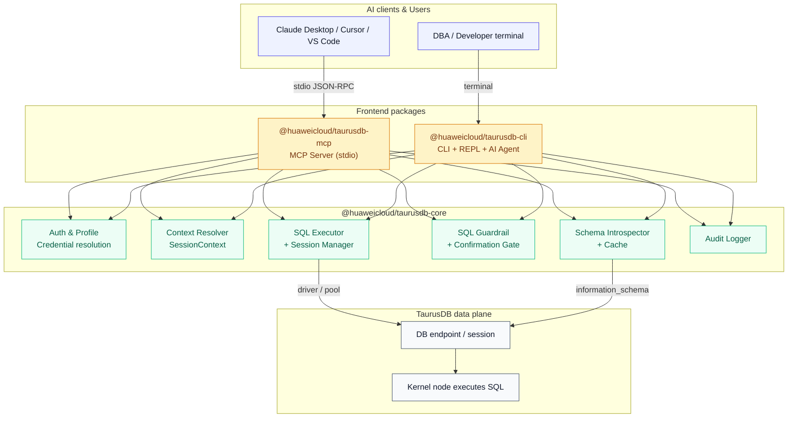
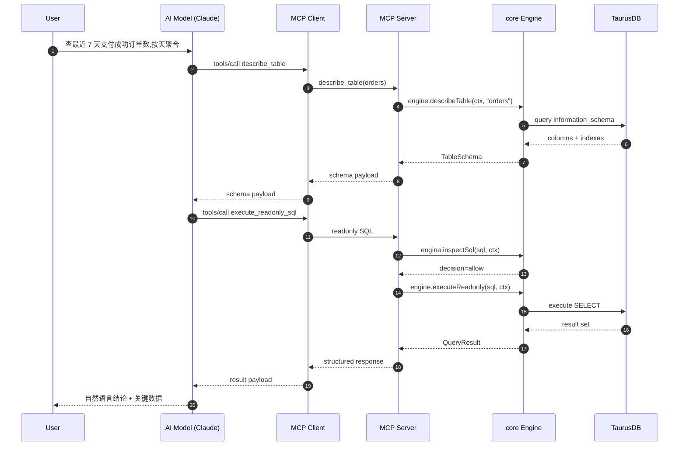
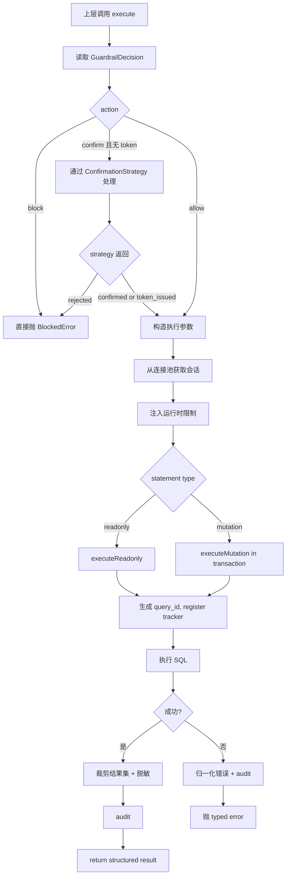
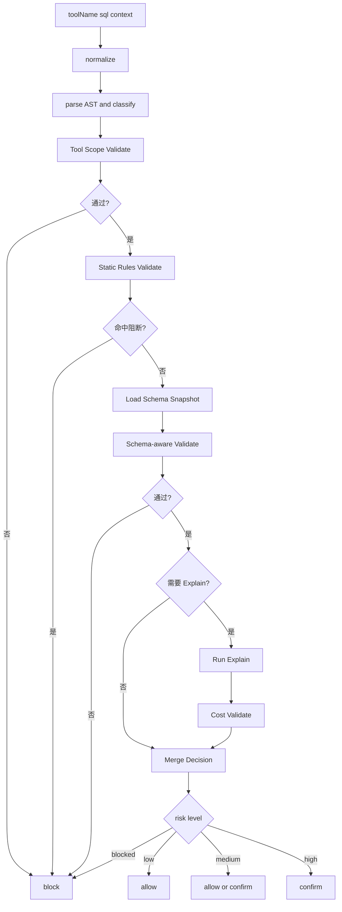

# 华为云 TaurusDB 数据面工具 — 架构与方案设计

## 1. 项目概述

### 1.1 目标

构建一套围绕华为云 TaurusDB **数据面**的 AI 友好工具，让用户通过自然语言完成 schema 探查、只读 SQL 查询、Explain 分析和受控 SQL 执行。

这套工具以两种形态交付：

- **MCP Server 形态**：供 Claude Desktop、Cursor、VS Code 等 AI 客户端通过 MCP 协议接入
- **CLI 形态**：作为独立的命令行工具，面向 DBA、开发者、支持人员，既支持传统命令，也支持 AI 辅助和交互式 REPL

两种形态共享同一个核心引擎（core），核心链路是：

```text
自然语言 / 命令
→ schema 上下文
→ SQL
→ 风险校验
→ 数据面执行
→ 结构化结果
```

### 1.1.1 当前仓库状态与目标形态

当前仓库已经完成了第一轮 workspace 拆分，现状是：

- `packages/core` 已承载共享的数据面能力与 `TaurusDBEngine`
- `packages/mcp` 已承载 MCP 启动、Tool 装配和 `init` 命令
- `packages/cli` 仍未落地，属于下一阶段新增前端

这意味着后续工作不再是“从单包抽第一刀”，而是继续**稳固 core 与 mcp 的边界，并补齐 cli 前端**。目标形态仍然是本文档描述的 monorepo：

- `packages/core`：沉淀数据面能力、类型、策略与执行引擎
- `packages/mcp`：MCP 协议适配、Tool 注册、客户端 `init`
- `packages/cli`：命令行、REPL、AI Agent、终端输出

实施时应优先保证两点：

- 避免把 MCP 协议细节重新回灌到 `core`
- CLI 作为新增前端，只复用 `core`，不复制 `mcp` 的装配逻辑

### 1.1.2 文档导航

这三份文档现在分别承担不同职责：

- [`architecture.md`](./architecture.md)：目标架构、包边界、核心抽象、能力映射
- [`taurusdb-mcp-implementation-plan.md`](./taurusdb-mcp-implementation-plan.md)：从当前单包实现收敛出 `core + mcp` 的实施路线
- [`taurusdb-cli-implementation.md`](./taurusdb-cli-implementation.md)：在共享 `core` 之上新增 CLI 前端的实施路线

阅读顺序建议：

1. 先看架构文档，统一边界和命名
2. 再看 MCP 计划，确认 shared core 如何从当前代码里抽出
3. 最后看 CLI 计划，确认新增前端如何复用 core 而不是复制逻辑

### 1.2 核心定位

| 维度         | 决策                                                                  |
| ------------ | --------------------------------------------------------------------- |
| 仓库结构     | 单 monorepo（pnpm workspace），三个 package：core / mcp / cli         |
| 语言         | TypeScript（npm 生态与 MCP SDK 最成熟）                               |
| 分发         | npm 包，用户通过 `npx @huaweicloud/taurusdb-mcp` 或 `taurusdb-cli`    |
| MCP 传输     | `stdio`，本地 JSON-RPC over stdin/stdout                              |
| CLI 传输     | 本地进程，直接读写终端                                                |
| 首要认证     | 数据库连接凭证或数据源 profile                                        |
| 可选认证     | AK/SK 仅用于辅助发现实例、地址等管控面上下文；LLM API Key（CLI 专用） |
| 执行路径     | 直接建立数据库会话，由 TaurusDB 数据面执行 SQL                        |
| 安全边界     | SQL AST 分类、结果限制、超时限制、确认流、审计日志                    |
| 推荐部署位点 | 与 TaurusDB 同 VPC、同可达网络的跳板机 / Sidecar / 本地安全环境       |

### 1.3 管控面与数据面的边界

| 维度         | 管控面                   | 数据面                         |
| ------------ | ------------------------ | ------------------------------ |
| 连接对象     | OpenAPI / SDK            | 数据库会话                     |
| 主要能力     | 查实例、备份、参数、日志 | 查库、查表、执行 SQL           |
| 结果粒度     | 资源元数据               | 真实业务数据                   |
| 风险类型     | 资源变更风险             | 数据误改、慢查询、敏感数据暴露 |
| 本项目优先级 | P2                       | P0                             |

结论是：本套工具首先是一个 **SQL 执行与治理层**，不是一个数据库运维控制台。

### 1.4 MCP 形态与 CLI 形态的定位

| 维度       | MCP Server                        | CLI                                 |
| ---------- | --------------------------------- | ----------------------------------- |
| 谁是主动方 | LLM 通过 AI 客户端调用            | 人直接操作终端                      |
| 典型用户   | 使用 Claude / Cursor 的开发者、PM | DBA、运维、堡垒机用户、脚本自动化   |
| LLM 谁提供 | 由 AI 客户端提供（Claude / 其他） | CLI 自己配置（华为盘古 / 自建 LLM） |
| 交互模式   | 单轮 Tool 调用                    | 命令 / REPL / 多轮 Agent 对话       |
| 输出格式   | JSON-RPC（给模型消费）            | 人类可读表格 + 可选 JSON（给管道）  |
| 确认方式   | 返回 `confirmation_token`         | 终端直接 `[y/N]` 交互               |
| 会话状态   | 无                                | 有（历史、补全、上下文）            |

两种形态**共享 core 包中所有业务能力**，只在人机交互和 LLM 集成层面不同。

---

## 2. 系统架构

### 2.1 分层架构（Monorepo 视角）



### 2.2 Monorepo 包依赖

```text
@huaweicloud/taurusdb-core    ← 业务内核,不依赖任何前端
         ↑          ↑
         │          │ 依赖(workspace:*)
         │          │
taurusdb-mcp    taurusdb-cli   ← 两个前端互不依赖
```

**关键原则**：

- `core` 包**完全不感知** MCP 协议和 CLI 命令格式，它只暴露 TypeScript SDK
- `mcp` 包只把 core 的方法包装成 MCP Tool
- `cli` 包只把 core 的方法包装成命令、REPL 和 AI Agent
- `mcp` 和 `cli` **互不依赖**，可独立发布、独立升级（尽管我们选择同步发版）

### 2.3 主数据流（MCP 形态）

```text
用户自然语言
→ AI 先选择 schema 工具获取表结构
→ AI 组织 SQL
→ MCP Client 发起 tools/call
→ MCP Server 解析数据源、数据库、schema 上下文
→ core.Guardrail 解析 SQL,判定语句类型、风险和限制
→ core.SchemaIntrospector 提供字段信息辅助校验
→ core.SqlExecutor 在数据面建立会话执行
→ 返回 rows / columns / truncated / duration_ms / query_id
→ AI 组织最终自然语言回答
```

### 2.4 主数据流（CLI Agent 形态）

```text
用户在终端输入自然语言
→ CLI AI Agent 本地调用 LLM(盘古 / OpenAI / 自建)
→ LLM 通过 core SDK 调用 schema 工具
→ LLM 生成 SQL
→ core.Guardrail 校验
→ CLI 在终端向用户展示 SQL 和风险,请求确认 [y/N]
→ 用户确认后 core.SqlExecutor 执行
→ CLI 格式化为终端表格输出
```

**关键差异**：CLI 的确认是 **交互式终端提示**，MCP 的确认是 **token 回合机制**。两种确认都由 core 层的 `ConfirmationStrategy` 抽象统一。

### 2.5 关键交互示例

#### 2.5.1 MCP 形态：自然语言到只读 SQL



#### 2.5.2 CLI 形态：受控写 SQL

```mermaid
sequenceDiagram
  autonumber
  participant U as User (terminal)
  participant CLI as taurusdb-cli
  participant AGENT as CLI AI Agent
  participant LLM as LLM Provider
  participant CORE as core Engine
  participant DB as TaurusDB

  U->>CLI: taurusdb ask "把超时未支付订单改成 cancelled"
  CLI->>AGENT: start agent loop
  AGENT->>LLM: chat with SDK tools
  LLM-->>AGENT: call describe_table
  AGENT->>CORE: engine.describeTable
  CORE-->>AGENT: TableSchema
  AGENT->>LLM: schema result
  LLM-->>AGENT: proposed UPDATE SQL
  AGENT->>CORE: engine.inspectSql
  CORE-->>AGENT: decision=confirm, risk_summary
  AGENT->>U: print SQL + risk, prompt [y/N]
  U->>AGENT: y
  AGENT->>CORE: engine.issueConfirmation
  CORE-->>AGENT: token
  AGENT->>CORE: engine.executeMutation(sql, ctx, token)
  CORE->>DB: BEGIN; UPDATE; COMMIT
  DB-->>CORE: affected_rows
  CORE-->>AGENT: MutationResult
  AGENT->>U: print success + affected rows
```

### 2.6 为什么强调"内核节点执行"

这里说的"内核节点执行"不是要求 MCP Server 或 CLI 必须部署进数据库进程内部，而是强调：

- SQL 的最终执行落点是 TaurusDB 的数据库内核，而不是云管 API
- 结果来自真实表数据，而不是资源元数据
- 风险控制必须围绕 SQL 执行语义，而不是只围绕 API 权限

所以部署建议是"尽量靠近数据面"，例如：

- 与 TaurusDB 同 VPC 的运维主机
- 客户侧堡垒机或跳板机
- 受控的本地开发环境

---

## 3. 模块设计

### 3.1 Monorepo 目录结构

```text
huaweicloud-taurusdb/                        ← 仓库根
├── packages/
│   │
│   ├── core/                                ← @huaweicloud/taurusdb-core
│   │   ├── src/
│   │   │   ├── index.ts                     # 对外导出 TaurusDBEngine + 类型
│   │   │   ├── engine.ts                    # TaurusDBEngine 主类
│   │   │   ├── auth/
│   │   │   │   ├── sql-profile-loader.ts
│   │   │   │   └── secret-resolver.ts
│   │   │   ├── context/
│   │   │   │   ├── datasource-resolver.ts
│   │   │   │   └── session-context.ts
│   │   │   ├── schema/
│   │   │   │   ├── introspector.ts
│   │   │   │   ├── cache.ts
│   │   │   │   └── adapters/
│   │   │   │       ├── mysql.ts
│   │   │   │       └── postgres.ts
│   │   │   ├── executor/
│   │   │   │   ├── sql-executor.ts
│   │   │   │   ├── connection-pool.ts
│   │   │   │   ├── query-tracker.ts
│   │   │   │   └── adapters/
│   │   │   ├── safety/
│   │   │   │   ├── parser/
│   │   │   │   ├── sql-classifier.ts
│   │   │   │   ├── sql-validator.ts
│   │   │   │   ├── guardrail.ts
│   │   │   │   ├── confirmation/
│   │   │   │   │   ├── confirmation-store.ts
│   │   │   │   │   └── strategy.ts          # ConfirmationStrategy 抽象
│   │   │   │   └── redaction.ts
│   │   │   ├── audit/
│   │   │   │   └── audit-logger.ts
│   │   │   └── utils/
│   │   │       ├── formatter.ts
│   │   │       ├── hash.ts
│   │   │       └── logger.ts
│   │   ├── tests/
│   │   └── package.json
│   │
│   ├── mcp/                                 ← @huaweicloud/taurusdb-mcp
│   │   ├── src/
│   │   │   ├── index.ts                     # CLI 入口(init 子命令 + MCP 启动)
│   │   │   ├── server.ts                    # MCP Server 初始化
│   │   │   ├── bootstrap.ts                 # 从 env / profile 构建 core Engine
│   │   │   ├── tools/
│   │   │   │   ├── registry.ts              # Tool 注册逻辑
│   │   │   │   ├── discovery.ts
│   │   │   │   ├── schema.ts
│   │   │   │   ├── query.ts
│   │   │   │   ├── mutations.ts
│   │   │   │   └── operations.ts
│   │   │   ├── commands/
│   │   │   │   └── init.ts                  # init 写入客户端配置
│   │   │   └── utils/
│   │   │       └── envelope.ts              # 统一响应 envelope
│   │   ├── tests/
│   │   └── package.json
│   │
│   └── cli/                                 ← @huaweicloud/taurusdb-cli
│       ├── src/
│       │   ├── index.ts                     # CLI 入口(commander)
│       │   ├── bootstrap.ts                 # 构建 core Engine
│       │   ├── commands/
│       │   │   ├── query.ts                 # taurusdb query "..."
│       │   │   ├── tables.ts                # taurusdb tables
│       │   │   ├── describe.ts              # taurusdb describe <table>
│       │   │   ├── explain.ts               # taurusdb explain "..."
│       │   │   ├── ask.ts                   # taurusdb ask "..."  (单次 AI)
│       │   │   ├── agent.ts                 # taurusdb agent      (多轮 AI)
│       │   │   ├── repl.ts                  # taurusdb repl       (交互式)
│       │   │   └── doctor.ts                # taurusdb doctor
│       │   ├── agent/
│       │   │   ├── llm-client.ts            # LLM 抽象
│       │   │   ├── providers/
│       │   │   │   ├── anthropic.ts
│       │   │   │   ├── pangu.ts             # 华为盘古
│       │   │   │   ├── openai.ts
│       │   │   │   └── ollama.ts
│       │   │   ├── agent-loop.ts            # 多轮工具调用循环
│       │   │   └── tool-schema.ts           # 暴露给 LLM 的工具定义
│       │   ├── repl/
│       │   │   ├── session.ts               # REPL 会话
│       │   │   ├── completer.ts             # Tab 补全
│       │   │   └── history.ts               # 命令历史
│       │   ├── ui/
│       │   │   ├── table.ts                 # 表格渲染
│       │   │   ├── spinner.ts
│       │   │   ├── prompt.ts                # 交互提示
│       │   │   └── highlight.ts             # SQL 语法高亮
│       │   └── formatter/
│       │       ├── human.ts                 # 人类可读
│       │       └── json.ts                  # JSON 输出(给管道)
│       ├── tests/
│       └── package.json
│
├── examples/
│   ├── mcp-with-claude/
│   ├── cli-basic-usage/
│   └── cli-agent-demo/
│
├── docs/
│   ├── architecture.md                      (本文档)
│   ├── guardrail-deep-dive.md
│   └── error-handbook.md
│
├── .github/workflows/ci.yml
├── pnpm-workspace.yaml
├── tsconfig.base.json
├── package.json                             (根 package)
└── README.md
```

### 3.2 核心包职责

#### 3.2.1 `@huaweicloud/taurusdb-core`

对外只暴露一个主类 `TaurusDBEngine`，是整个项目的业务内核。

```typescript
// packages/core/src/index.ts
export class TaurusDBEngine {
  static async create(config: EngineConfig): Promise<TaurusDBEngine>;

  // Profile / Context
  listDataSources(): Promise<DataSourceInfo[]>;
  getDefaultDataSource(): string | undefined;

  // Schema
  listDatabases(ctx: SessionContext): Promise<DatabaseInfo[]>;
  listTables(ctx: SessionContext, database: string): Promise<TableInfo[]>;
  describeTable(
    ctx: SessionContext,
    database: string,
    table: string,
  ): Promise<TableSchema>;
  sampleRows(
    ctx: SessionContext,
    database: string,
    table: string,
    n: number,
  ): Promise<SampleResult>;

  // Guardrail
  inspectSql(input: InspectInput): Promise<GuardrailDecision>;

  // Execution
  explain(sql: string, ctx: SessionContext): Promise<ExplainResult>;
  executeReadonly(
    sql: string,
    ctx: SessionContext,
    opts?: ReadonlyOptions,
  ): Promise<QueryResult>;
  executeMutation(
    sql: string,
    ctx: SessionContext,
    opts: MutationOptions,
  ): Promise<MutationResult>;

  // Query lifecycle
  getQueryStatus(queryId: string): Promise<QueryStatus>;
  cancelQuery(queryId: string): Promise<CancelResult>;

  // Confirmation
  issueConfirmation(input: IssueInput): Promise<ConfirmationToken>;
  validateConfirmation(
    token: string,
    sql: string,
    ctx: SessionContext,
  ): Promise<ValidationResult>;

  // Context resolution helper (前端调用前使用)
  resolveContext(input: ResolveInput): Promise<SessionContext>;

  // 生命周期
  close(): Promise<void>;
}

// 配置模式
export interface EngineConfig {
  profiles: ProfileSource; // 数据源来源
  defaultDatasource?: string;
  enableMutations: boolean; // 全局开关
  limits: RuntimeLimits;
  audit: AuditConfig;
  confirmationStrategy?: ConfirmationStrategy; // 默认内存 token store
}
```

**核心原则**：

- 所有方法接受 `SessionContext`，不接受 raw 参数。前端负责构造 context
- 所有方法返回结构化的 TypeScript 对象，**不返回 MCP envelope 或 CLI 格式**
- 错误通过 typed error class 抛出，前端决定如何展示

#### 3.2.2 `@huaweicloud/taurusdb-mcp`

```typescript
// packages/mcp/src/bootstrap.ts
export async function bootstrap(): Promise<{
  engine: TaurusDBEngine;
  server: McpServer;
}> {
  const config = loadConfigFromEnv();
  const engine = await TaurusDBEngine.create({
    ...config,
    confirmationStrategy: new TokenConfirmationStrategy(), // MCP 用 token
  });
  const server = createMcpServer(engine);
  return { engine, server };
}
```

**职责**：

- 把每个 core 方法包装成一个 MCP Tool
- 构造统一响应 envelope
- 处理 MCP 协议特有的错误和重试语义
- `init` 子命令写入 Claude/Cursor 等客户端配置

#### 3.2.3 `@huaweicloud/taurusdb-cli`

```typescript
// packages/cli/src/bootstrap.ts
export async function bootstrap(): Promise<{
  engine: TaurusDBEngine;
  llm?: LlmClient;
}> {
  const config = loadConfigFromEnv();
  const engine = await TaurusDBEngine.create({
    ...config,
    confirmationStrategy: new InteractiveConfirmationStrategy(), // CLI 用交互
  });
  const llm = config.llm ? await createLlmClient(config.llm) : undefined;
  return { engine, llm };
}
```

**职责**：

- 命令模式（`query`、`tables`、`describe` 等）
- REPL 模式（交互式 SQL 终端）
- AI 模式（`ask` 单次、`agent` 多轮）
- 终端 UI（表格、颜色、spinner、补全）
- LLM 客户端抽象（支持多 provider）

### 3.3 Confirmation Strategy：跨形态的确认抽象

这是 core 层必须设计好的一个关键抽象。

```typescript
// packages/core/src/safety/confirmation/strategy.ts
export interface ConfirmationStrategy {
  /**
   * Handle a guardrail decision that requires confirmation.
   * Different strategies implement this differently:
   *   - TokenStrategy: issue a token, return it so caller can re-invoke with token
   *   - InteractiveStrategy: prompt user directly on terminal, block until answered
   */
  handle(decision: GuardrailDecision, ctx: SessionContext): Promise<ConfirmationOutcome>;
}

export type ConfirmationOutcome =
  | { status: "token_issued"; token: string; expiresAt: number }   // MCP
  | { status: "confirmed"; autoToken?: string }                    // CLI (already confirmed)
  | { status: "rejected"; reason: string };

// packages/mcp 提供
export class TokenConfirmationStrategy implements ConfirmationStrategy {
  async handle(decision, ctx) {
    const token = await this.store.issue({...});
    return { status: "token_issued", token, expiresAt: ... };
  }
}

// packages/cli 提供
export class InteractiveConfirmationStrategy implements ConfirmationStrategy {
  async handle(decision, ctx) {
    console.log("⚠  This SQL will modify data:");
    console.log(this.highlight(decision.normalizedSql));
    console.log(`Risk level: ${decision.riskLevel}`);
    const answer = await prompt("Confirm execute? [y/N]");
    if (answer === "y") {
      const token = await this.store.issue({...});  // 内部仍走 token,保证审计
      return { status: "confirmed", autoToken: token };
    }
    return { status: "rejected", reason: "user declined" };
  }
}
```

**这个抽象让 core 永远不关心前端如何确认**，两种形态都能工作。

### 3.4 各模块职责（与原架构一致，仅强调归属）

以下模块全部位于 `packages/core/src/`：

#### 3.4.1 数据源与凭证层 (`auth/` + `context/`)

数据面工具的首要上下文不是 `region/project_id`，而是：

- `datasource`
- `database`
- `schema`
- `engine`
- `credential_source`

建议的加载优先级：

```text
1. 前端显式传入         → Tool 参数 / CLI flag
2. 命名 profile         → ~/.config/taurusdb/profiles.json
3. 环境变量             → TAURUSDB_SQL_DSN / HOST / PORT / USER / PASSWORD
4. init 写入的本地配置   → 面向 Claude / Cursor / CLI 的默认 profile
```

核心要求：

- 数据源与数据库上下文必须能被单次调用覆盖
- 密码不直接回显到任何日志、响应或终端
- 允许区分只读账号与写账号
- 为后续接入 Secret Manager 预留接口

#### 3.4.2 Schema 层 (`schema/`)

Schema 层负责：

1. 从系统表中抽取数据库、表、字段、索引、主键、注释
2. 输出模型友好和终端友好的结构化 schema
3. 对高频元数据做短 TTL 缓存，减少重复查 catalog

推荐返回字段至少包括：

- `database`、`table_name`、`column_name`
- `data_type`、`nullable`、`default_value`
- `index_name`、`is_primary_key`、`comment`

为了让上层更容易生成正确 SQL，`describe_table` 额外返回 `engineHints`：

- 常用 where 字段提示
- 可排序字段提示
- 时间字段识别
- 敏感字段识别

#### 3.4.3 SQL 执行层 (`executor/`)

```typescript
class SqlExecutor {
  async explain(sql: string, ctx: SessionContext): Promise<ExplainResult>;
  async executeReadonly(sql, ctx, opts?): Promise<QueryResult>;
  async executeMutation(sql, ctx, opts): Promise<MutationResult>;
  async getQueryStatus(queryId): Promise<QueryStatus>;
  async cancelQuery(queryId): Promise<CancelResult>;
}
```

关键设计决策：

- 按内核类型加载 driver adapter
- 只允许单语句执行
- 只读查询与写查询走不同连接池（绑定不同账号）
- 每次执行都生成 `query_id`
- 长查询可查询状态、可取消
- 写 SQL 由服务端包裹为单次事务边界

##### Executor 执行流程图



#### 3.4.4 安全层 (`safety/`)

安全层是本项目"可控 AI SQL"与"直接给模型一个数据库账号"之间的根本区别。

核心步骤：

1. **归一化**：保留原始 SQL，生成 `normalized_sql`、`sql_hash`
2. **解析**：按引擎选择 parser，生成统一 IR（SqlAst）
3. **分类**：提取 `statement_type`、引用表、引用列、是否多语句、WHERE/LIMIT/JOIN 等
4. **静态规则校验**：多语句、DCL、危险 DDL、无 WHERE 的 UPDATE/DELETE
5. **Schema 感知校验**：结合 schema 检查字段是否存在、是否敏感
6. **Explain / 成本校验**：对复杂只读和写 SQL 评估代价
7. **确认策略**：命中风险时通过 `ConfirmationStrategy` 处理
8. **脱敏与裁剪**：结果输出前统一裁剪和脱敏

风险分层：

| 风险等级  | 典型 SQL                                               | 默认策略                         |
| --------- | ------------------------------------------------------ | -------------------------------- |
| `low`     | `SHOW TABLES`、有明确 `LIMIT` 的简单查询               | 直接执行                         |
| `medium`  | 联表聚合、大范围扫描风险、带 `WHERE` 的 `UPDATE`       | 先解释，必要时要求确认           |
| `high`    | 大范围 `UPDATE/DELETE`、`ALTER TABLE`                  | 默认阻断或仅在显式开关下允许确认 |
| `blocked` | `DROP DATABASE`、`TRUNCATE`、`GRANT`、`REVOKE`、多语句 | 直接拒绝                         |

阻断规则至少包括：

- 多语句
- DCL 语句
- `DROP DATABASE`
- `TRUNCATE`
- 文件系统相关 SQL
- 修改全局参数的 SQL

##### AST 校验原理

AST = Abstract Syntax Tree，抽象语法树。把 SQL 解析成 AST，本质上是把一段字符串变成"结构化语义对象"。

例如：

```sql
UPDATE orders SET status = 'cancelled' WHERE id = 1001;
```

在 Guardrail 看来不应该只是一段文本，而应该被解析成：

```typescript
{
  kind: "update",
  table: "orders",
  set: [{ column: "status", value: "cancelled" }],
  where: {
    op: "=",
    left: { column: "id" },
    right: { literal: 1001 },
  },
}
```

这样做的价值：

- 可靠识别语句类型，而不是靠正则猜
- 判断是不是多语句，而不是分号硬拆
- 知道 WHERE 是否存在、作用在哪些列上
- 抽取引用的表、字段、函数、排序、分页和 join 结构
- 对不同引擎做 adapter，而不是方言硬编码

**AST 校验不是"检查 SQL 长得像不像对"，而是"检查 SQL 的语义结构是否符合安全规则"**。

##### Guardrail 分层执行

建议把 Guardrail 设计成 6 层：

1. **归一化层** — 保留原始 SQL，生成 `normalized_sql`、`sql_hash`
2. **解析层** — 按引擎调用 parser adapter，解析失败直接返回语法错误
3. **分类层** — 从 AST 提取事实（statement_type、表、列、是否多语句等）
4. **静态规则层** — 不连数据库可判断（多语句、DCL、危险 DDL、无 WHERE）
5. **Schema / Explain 层** — 结合 schema 判断列是否存在、索引是否命中
6. **运行时约束层** — 最终决策转成 executor 参数（readonly、timeout、max_rows）

调用顺序：

```text
SQL 文本
→ normalize
→ parse to AST
→ classify
→ static validate
→ schema-aware validate
→ explain / cost validate
→ decision: allow / confirm / block
→ executor.run with runtime limits
```

Guardrail 决策流程图：



##### 分类层输出

```typescript
type SqlClassification = {
  engine: "mysql" | "postgresql" | "unknown";
  statementType:
    | "select"
    | "show"
    | "explain"
    | "describe"
    | "insert"
    | "update"
    | "delete"
    | "alter"
    | "drop"
    | "create"
    | "grant"
    | "revoke"
    | "unknown";
  normalizedSql: string;
  sqlHash: string;
  isMultiStatement: boolean;
  referencedTables: string[];
  referencedColumns: string[];
  hasWhere: boolean;
  hasLimit: boolean;
  hasJoin: boolean;
  hasSubquery: boolean;
  hasOrderBy: boolean;
  hasAggregate: boolean;
};
```

分类器**只回答事实，不做决策**。

##### 最终决策模型

```typescript
type GuardrailDecision = {
  action: "allow" | "confirm" | "block";
  riskLevel: "low" | "medium" | "high" | "blocked";
  reasonCodes: string[];
  normalizedSql: string;
  sqlHash: string;
  requiresExplain: boolean;
  requiresConfirmation: boolean;
  runtimeLimits: {
    readonly: boolean;
    timeoutMs: number;
    maxRows: number;
  };
};
```

决策逻辑：

- `blocked`：直接拒绝
- `high`：默认拒绝，或在开启 mutations 时进入确认流
- `medium`：返回风险说明，部分场景允许直接执行
- `low`：直接执行

##### 运行时限制

Guardrail 要把决策落成执行参数：

- `readonly` — 只读工具强制走只读账号
- `timeout_ms` — 防止超长查询
- `max_rows` — 防止结果塞爆上下文
- `max_columns` — 防止宽表暴露
- `redaction_policy` — 敏感列脱敏

**不要静默改写用户 SQL 语义**。对没有 `LIMIT` 的查询，更稳的做法是返回风险提示或在返回层截断，而不是偷偷改 SQL。

##### 典型 SQL 判定

| SQL                                                  | 结果                 |
| ---------------------------------------------------- | -------------------- |
| `SHOW TABLES`                                        | `allow`              |
| `SELECT * FROM orders LIMIT 100`                     | `allow` 或 `medium`  |
| `SELECT * FROM orders`                               | `confirm` 或 `block` |
| `SELECT dt, count(*) FROM orders GROUP BY dt`        | 进入 Explain 再判断  |
| `UPDATE orders SET status='x' WHERE id=1`            | `confirm`            |
| `UPDATE orders SET status='x'`                       | `block`              |
| `DELETE FROM orders WHERE created_at < '2024-01-01'` | Explain 后 `confirm` |
| `TRUNCATE orders`                                    | `block`              |

##### 为什么不能只靠正则

- SQL 方言繁多，大小写、引号、函数、注释写法都不同
- 子查询、CTE、嵌套表达式让正则几乎不可维护
- 很多风险不是看关键词，而是看结构关系
- `UPDATE ... WHERE ...` 和 `UPDATE ...` 的风险差异，本质是 AST 结构差异

所以实现上：

- 正则只做非常轻量的预清洗
- 真正的分类和校验必须基于 AST
- 成本和影响面判断再叠加 Explain 与 schema 信息

#### 3.4.5 审计层 (`audit/`)

数据面场景下，光有数据库自身日志不够，还需要记录 core 引擎的决策过程。每次调用记录：

- `task_id`、`query_id`
- `datasource`、`database`
- `statement_type`、`risk_level`
- `sql_hash`、`decision`
- `duration_ms`、`row_count` 或 `affected_rows`
- `frontend`：标识是 `mcp` 还是 `cli`（方便区分调用来源）

默认策略：

- 本地只落结构化 JSONL
- 不默认保存完整结果集
- 原始 SQL 文本可选保存，默认只保存 hash 和归一化摘要

##### 分层审计

建议拆成 3 层：

**第一层：core 本地结构化审计**

默认开启，记录所有 Tool / 命令调用的最小元数据。

**第二层：数据库原生日志 / 审计能力**

客户已启用的数据库审计、慢日志、general log、内核审计。回答"数据库到底执行了什么"。

**第三层：CTS 或更上层治理审计**

**不建议接所有 SQL**，只接少量关键治理事件：

- 开启或关闭 `TAURUSDB_ENABLE_MUTATIONS`
- 数据源 profile 被新增、修改、删除
- 高风险写 SQL 已确认并执行
- 高风险 SQL 被 Guardrail 阻断
- 审计策略、脱敏策略、权限策略被修改

**CTS 里放"关键治理事件"，不要放"每条 SQL 明细"**。

---

## 4. Tool 与命令设计

### 4.1 MCP Tool 集合（由 `@huaweicloud/taurusdb-mcp` 实现）

| Tool                   | 默认暴露 | 角色定位                      |
| ---------------------- | -------- | ----------------------------- |
| `list_data_sources`    | 是       | 查看可用数据源和默认上下文    |
| `list_databases`       | 是       | 查看数据库列表                |
| `list_tables`          | 是       | 查看表列表                    |
| `describe_table`       | 是       | 查看字段、索引、主键、注释    |
| `sample_rows`          | 是       | 拉取少量样本                  |
| `execute_readonly_sql` | 是       | 只读查询主入口                |
| `explain_sql`          | 是       | SQL 计划和风险解释入口        |
| `get_query_status`     | 是       | 长查询状态跟踪                |
| `cancel_query`         | 是       | 取消仍在运行的查询            |
| `execute_sql`          | 否       | 变更 SQL 执行入口，需显式开启 |

所有核心 Tool 都支持上下文字段：

```typescript
{
  datasource?: string;
  database?: string;
  schema?: string;
  timeout_ms?: number;
}
```

### 4.2 CLI 命令集合（由 `@huaweicloud/taurusdb-cli` 实现）

| 命令                                     | 角色定位                      |
| ---------------------------------------- | ----------------------------- |
| `taurusdb sources`                       | 列出所有数据源                |
| `taurusdb databases [--datasource NAME]` | 列出数据库                    |
| `taurusdb tables [--database NAME]`      | 列出表                        |
| `taurusdb describe <table>`              | 查看表结构                    |
| `taurusdb sample <table>`                | 查看样本行                    |
| `taurusdb query "<SQL>"`                 | 执行只读 SQL                  |
| `taurusdb exec "<SQL>"`                  | 执行写 SQL（需 mutations）    |
| `taurusdb explain "<SQL>"`               | SQL 计划分析                  |
| `taurusdb ask "<question>"`              | 单次 AI 辅助                  |
| `taurusdb agent`                         | 进入多轮 AI 对话              |
| `taurusdb repl`                          | 进入交互式 REPL               |
| `taurusdb doctor`                        | 健康检查与配置诊断            |
| `taurusdb init`                          | 初始化配置（包括 MCP 客户端） |

**共同 flags**：

```
--datasource <name>
--database <name>
--format <table|json|csv>
--max-rows <n>
--timeout <ms>
--config <path>
```

### 4.3 两种形态的 Tool / 命令映射

| core 能力         | MCP Tool               | CLI 命令                     |
| ----------------- | ---------------------- | ---------------------------- |
| `listDataSources` | `list_data_sources`    | `taurusdb sources`           |
| `listDatabases`   | `list_databases`       | `taurusdb databases`         |
| `listTables`      | `list_tables`          | `taurusdb tables`            |
| `describeTable`   | `describe_table`       | `taurusdb describe <table>`  |
| `sampleRows`      | `sample_rows`          | `taurusdb sample <table>`    |
| `executeReadonly` | `execute_readonly_sql` | `taurusdb query "<SQL>"`     |
| `explain`         | `explain_sql`          | `taurusdb explain "<SQL>"`   |
| `getQueryStatus`  | `get_query_status`     | `taurusdb status <query_id>` |
| `cancelQuery`     | `cancel_query`         | `taurusdb cancel <query_id>` |
| `executeMutation` | `execute_sql`          | `taurusdb exec "<SQL>"`      |

**CLI 额外增值命令**（没有对应 Tool，因为它们本质是前端编排）：

- `taurusdb ask` — 单次 AI 问答
- `taurusdb agent` — 多轮 AI Agent
- `taurusdb repl` — 交互式 REPL
- `taurusdb doctor` — 健康检查

### 4.4 为什么不单独做 `generate_sql` Tool

`generate_sql` 很容易变成"模型调模型"的重复层。更合理的分工：

- **MCP 形态**：模型本身负责自然语言到 SQL，MCP 提供 schema + guardrail + execute
- **CLI 形态**：CLI 内嵌的 Agent 负责自然语言到 SQL，core 提供 schema + guardrail + execute

真正应该产品化的是 **执行与治理**，不是把 SQL 文本生成本身封装成服务。

---

## 5. 协议与响应模型

### 5.1 MCP Server 声明

```typescript
const server = new McpServer({
  name: "huaweicloud-taurusdb",
  version: "0.1.0",
  capabilities: { tools: {} },
});
```

### 5.2 统一响应 Envelope（MCP 形态）

所有 Tool 继续返回统一 envelope，保证模型稳定消费。

**只读成功响应**

```json
{
  "ok": true,
  "summary": "Query succeeded and returned 42 rows.",
  "data": {
    "columns": [
      { "name": "dt", "type": "date" },
      { "name": "order_count", "type": "bigint" }
    ],
    "rows": [
      ["2026-04-09", 128],
      ["2026-04-10", 141]
    ],
    "row_count": 42,
    "truncated": false
  },
  "metadata": {
    "task_id": "task-01",
    "query_id": "qry-01",
    "sql_hash": "8bb4...",
    "statement_type": "select",
    "duration_ms": 182
  }
}
```

**需确认响应**

```json
{
  "ok": false,
  "summary": "This SQL will modify data and requires explicit confirmation.",
  "error": {
    "code": "CONFIRMATION_REQUIRED",
    "message": "Re-run the same SQL with confirmation_token to continue.",
    "retryable": true
  },
  "data": {
    "confirmation_token": "ctok_eyJhbGciOi...",
    "risk_level": "medium",
    "sql_hash": "c194..."
  },
  "metadata": { "task_id": "task-02" }
}
```

**阻断响应**

```json
{
  "ok": false,
  "summary": "The SQL statement is blocked by safety policy.",
  "error": {
    "code": "BLOCKED_SQL",
    "message": "TRUNCATE and DROP DATABASE are not allowed.",
    "retryable": false
  },
  "metadata": { "task_id": "task-03", "sql_hash": "95d2..." }
}
```

### 5.3 CLI 输出格式

CLI 同时支持多种输出格式（通过 `--format`）：

**默认（人类可读表格）**

```
$ taurusdb query "SELECT dt, count(*) FROM orders GROUP BY dt LIMIT 3"

┌────────────┬──────────┐
│ dt         │ count(*) │
├────────────┼──────────┤
│ 2026-04-09 │ 128      │
│ 2026-04-10 │ 141      │
│ 2026-04-11 │ 156      │
└────────────┴──────────┘
3 rows in 182ms  |  query_id: qry-01
```

**JSON 格式（管道友好）**

```bash
$ taurusdb query "..." --format json
{
  "ok": true,
  "columns": [...],
  "rows": [...],
  "metadata": { "query_id": "qry-01", "duration_ms": 182 }
}
```

**CSV 格式**

```bash
$ taurusdb query "..." --format csv > report.csv
```

### 5.4 结果裁剪策略

结果必须有上限，否则模型上下文或终端都会失控。默认策略：

- `max_rows = 200`
- 列数超阈值提示用户缩小查询范围
- 大文本字段按字符数截断
- 二进制字段不直接回传
- 敏感字段按规则脱敏

**核心原则**：截断必须**显式透出**，不能偷偷截。

---

## 6. 安全与部署策略

### 6.1 默认安全策略

| 策略                 | 说明                                                   |
| -------------------- | ------------------------------------------------------ |
| 默认只读             | 两种形态默认只注册 schema 和只读能力                   |
| mutations 需显式开启 | 设置 `TAURUSDB_ENABLE_MUTATIONS=true` 后才暴露写入能力 |
| 单语句               | 不允许一次调用执行多条 SQL                             |
| 默认超时             | 每次查询都有最大执行时长                               |
| 结果上限             | 返回行数、列数、文本长度都有限制                       |
| 审计必达             | 至少记录 `task_id`、`query_id/sql_hash` 和决策结果     |

### 6.2 数据库权限建议

建议至少区分两套账号：

- 只读账号：默认运行使用
- 写账号：仅在明确开启 mutations 的环境使用

不要让默认 profile 直接使用 DBA 账号。

### 6.3 推荐环境变量

```bash
# 数据源
TAURUSDB_DEFAULT_DATASOURCE=prod_orders
TAURUSDB_PROFILES_PATH=/path/to/profiles.json

# 开关
TAURUSDB_ENABLE_MUTATIONS=false

# 运行时限制
TAURUSDB_MAX_ROWS=200
TAURUSDB_MAX_COLUMNS=50
TAURUSDB_MAX_STATEMENT_MS=15000

# 审计
TAURUSDB_AUDIT_LOG_PATH=~/.taurusdb/audit.jsonl

# CLI 专用：LLM 配置
TAURUSDB_LLM_PROVIDER=pangu        # anthropic | pangu | openai | ollama
TAURUSDB_LLM_API_KEY=xxx
TAURUSDB_LLM_BASE_URL=https://...  # 可选,自建 LLM 网关
TAURUSDB_LLM_MODEL=xxx
```

### 6.4 部署建议

优先顺序：

1. 与 TaurusDB 同 VPC 的运维主机
2. 企业堡垒机 / 跳板机
3. 受控本地开发机

不建议把拥有生产库写权限的工具暴露在公共网络中。

### 6.5 数据出境防御（MCP 与 CLI 同等重要）

**MCP 形态** 和 **CLI Agent 形态** 的返回值都会流向 LLM，需要同样严格的数据出境控制：

- 结果集行数和列数限制
- 敏感字段自动脱敏
- 审计只记 hash 不记原文
- 大字段截断

**CLI 命令模式**（非 Agent）不经 LLM，但仍要小心控制台输出被他人看到。

---

## 7. 测试与演进

### 7.1 测试分层

**core 包单元测试**：

- SQL 分类、风险规则、AST 解析
- Token 签发与校验
- 结果裁剪和脱敏
- Confirmation Strategy 的两种实现

**MCP 包测试**：

- Tool Schema 正确性
- Envelope 稳定性
- `init` 命令的客户端集成

**CLI 包测试**：

- 命令参数解析
- 输出格式（table / json / csv）
- REPL 交互（补全、历史）
- AI Agent 的 tool-calling 循环（mock LLM）

**集成测试**：

- 使用 `testcontainers-node` 起真实 MySQL
- schema 工具链路
- 只读执行链路
- 写 SQL 二阶段确认（MCP token 模式 + CLI 交互模式）
- 长查询取消

### 7.2 Phase 2 演进方向

在首版数据面闭环稳定后：

- 慢 SQL 摘要和热点表分析
- 管控面实例发现与 endpoint 解析
- MCP Resources 形式的 schema 快照
- 预设 Prompt 模板
- 更细粒度的行列级访问策略
- CLI AI Agent 的更多 LLM provider（自建网关、私有部署模型）
- CLI 脚本化友好特性（`--no-color`、`--quiet`、退出码规范）
