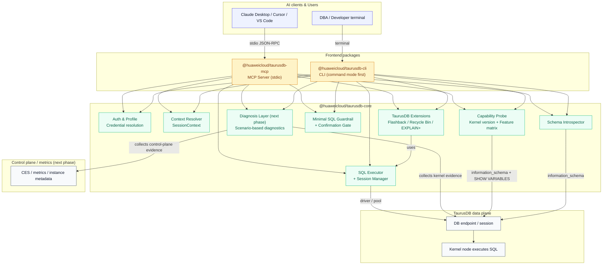
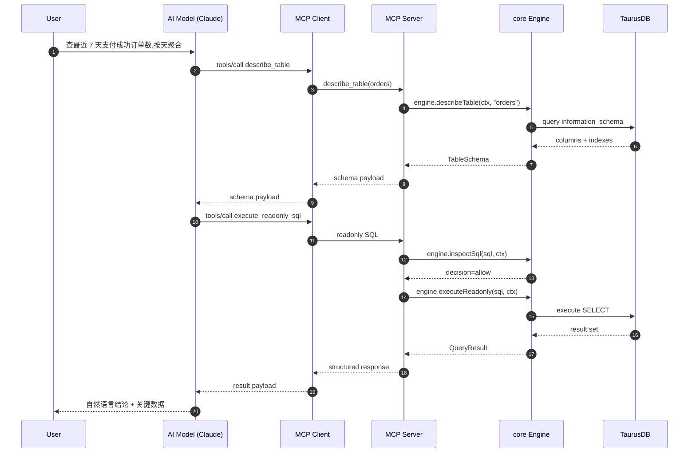
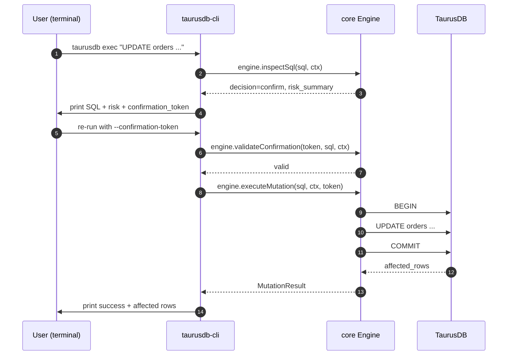
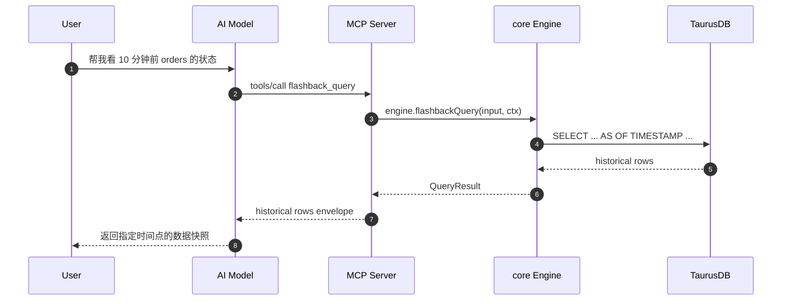
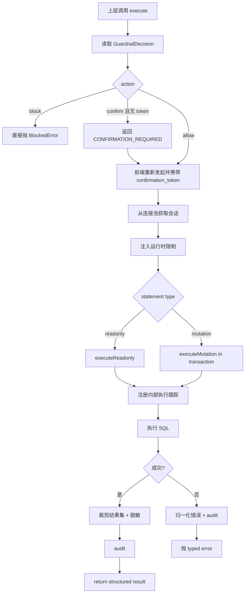
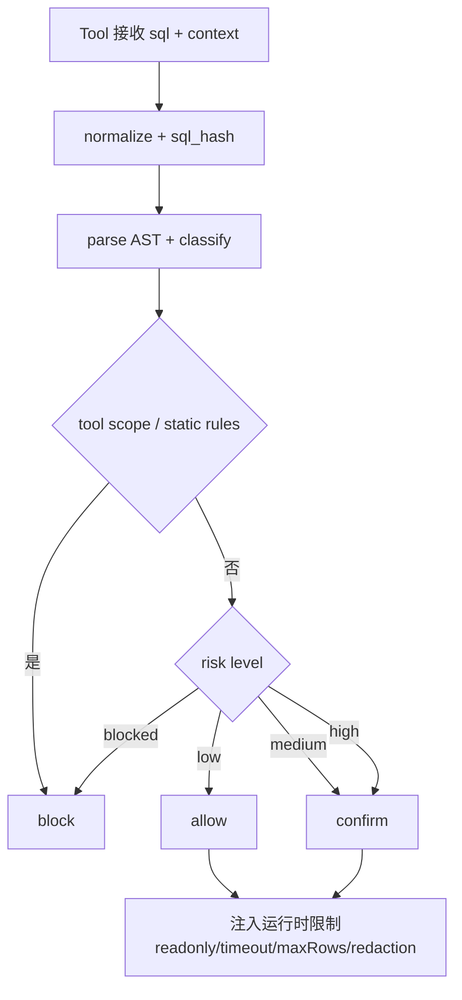

# 华为云 TaurusDB 数据面工具 — 架构与方案设计

## 1. 项目概述

### 1.1 目标

构建一套围绕华为云 TaurusDB **数据面**的 AI 友好工具，让用户通过自然语言完成 schema 探查、只读 SQL 查询、Explain 分析和受控 SQL 执行。

这套工具以两种形态交付：

- **MCP Server 形态**：供 Claude Desktop、Cursor、VS Code 等 AI 客户端通过 MCP 协议接入
- **CLI 形态**：作为独立的命令行工具，面向 DBA、开发者、支持人员，第一阶段先支持传统命令模式

两种形态共享同一个核心引擎（core），核心链路是：

```text
自然语言 / 命令
→ schema 上下文
→ SQL
→ 风险校验
→ 数据面执行
→ 结构化结果
```

除了通用的 MySQL 数据面能力以外，首版还会专门暴露一组 **TaurusDB 专属 Tool**，用来让 AI 和用户感知到 TaurusDB 相对社区 MySQL 的差异化内核能力（闪回查询、NDP/PQ 执行计划增强、能力发现）。下一阶段则会增加一条 **诊断线**，把管控面指标、TaurusDB 内核状态和 SQL 现场联合起来做故障分析。详见 [4.1.2 TaurusDB 专属 Tool](#412--taurusdb-专属-tool当前首阶段) 与 [7.4 下一阶段的增量方向](#74-下一阶段的增量方向)。

### 1.1.1 当前仓库状态与目标形态

当前仓库已经完成了第一轮 workspace 拆分，现状是：

- `packages/core` 已承载共享的数据面能力与 `TaurusDBEngine`
- `packages/mcp` 已承载 MCP 启动、Tool 装配和 `init` 命令
- `packages/cli` 仍未落地，属于下一阶段新增前端

这意味着后续工作不再是“从单包抽第一刀”，而是继续**稳固 core 与 mcp 的边界，并补齐 cli 前端**。目标形态仍然是本文档描述的 monorepo：

- `packages/core`：沉淀数据面能力、类型、策略与执行引擎
- `packages/mcp`：MCP 协议适配、Tool 注册、客户端 `init`
- `packages/cli`：命令行前端（第一阶段以命令模式为主）

实施时应优先保证两点：

- 避免把 MCP 协议细节重新回灌到 `core`
- CLI 作为新增前端，只复用 `core`，不复制 `mcp` 的装配逻辑

### 1.1.2 文档导航

这三份文档现在分别承担不同职责：

- [`architecture.md`](./architecture.md)：目标架构、包边界、核心抽象、能力映射
- [`taurusdb-mcp-implementation-plan.md`](./taurusdb-mcp-implementation-plan.md)：从当前单包实现收敛出 `core + mcp` 的实施路线
- [`taurusdb-cli-implementation.md`](./taurusdb-cli-implementation.md)：在共享 `core` 之上新增 CLI 前端的实施路线

阅读顺序建议：

1. 先看架构文档，统一边界和命名
2. 再看 MCP 计划，确认 shared core 如何从当前代码里抽出
3. 最后看 CLI 计划，确认新增前端如何复用 core 而不是复制逻辑

### 1.2 核心定位

| 维度         | 决策                                                                  |
| ------------ | --------------------------------------------------------------------- |
| 仓库结构     | 单 monorepo（pnpm workspace），三个 package：core / mcp / cli         |
| 语言         | TypeScript（npm 生态与 MCP SDK 最成熟）                               |
| 分发         | npm 包，用户通过 `npx @huaweicloud/taurusdb-mcp` 或 `taurusdb-cli`    |
| MCP 传输     | `stdio`，本地 JSON-RPC over stdin/stdout                              |
| CLI 传输     | 本地进程，直接读写终端                                                |
| 首要认证     | 数据库连接凭证或数据源 profile                                        |
| 可选认证     | AK/SK 仅用于辅助发现实例、地址等管控面上下文                          |
| 执行路径     | 直接建立数据库会话，由 TaurusDB 数据面执行 SQL                        |
| 安全边界     | SQL AST 分类、结果限制、超时限制、确认流、审计日志                    |
| 差异化层     | 基于内核版本的能力发现 + TaurusDB 专属 Tool 动态注册                  |
| 推荐部署位点 | 与 TaurusDB 同 VPC、同可达网络的跳板机 / Sidecar / 本地安全环境       |

### 1.3 管控面与数据面的边界

| 维度         | 管控面                   | 数据面                         |
| ------------ | ------------------------ | ------------------------------ |
| 连接对象     | OpenAPI / SDK            | 数据库会话                     |
| 主要能力     | 查实例、备份、参数、日志 | 查库、查表、执行 SQL           |
| 结果粒度     | 资源元数据               | 真实业务数据                   |
| 风险类型     | 资源变更风险             | 数据误改、慢查询、敏感数据暴露 |
| 本项目优先级 | P2                       | P0                             |

结论是：本套工具首先是一个 **SQL 执行与治理层**，不是一个数据库运维控制台；但下一阶段会围绕高频故障场景补一层 **管控面 + 内核 + SQL 现场** 的联合诊断能力。

### 1.4 MCP 形态与 CLI 形态的定位

| 维度       | MCP Server                        | CLI                                 |
| ---------- | --------------------------------- | ----------------------------------- |
| 谁是主动方 | LLM 通过 AI 客户端调用            | 人直接操作终端                      |
| 典型用户   | 使用 Claude / Cursor 的开发者、PM | DBA、运维、堡垒机用户、脚本自动化   |
| LLM 谁提供 | 由 AI 客户端提供（Claude / 其他） | 第一阶段不内建                      |
| 交互模式   | 单轮 Tool 调用                    | 第一阶段以命令模式为主              |
| 输出格式   | JSON-RPC（给模型消费）            | 人类可读表格 + 可选 JSON（给管道）  |
| 确认方式   | 返回 `confirmation_token`         | 计划复用 token 流并包装终端交互     |
| 会话状态   | 无                                | 第一阶段无长会话状态                |

两种形态**共享 core 包中所有业务能力**，只在人机交互和 LLM 集成层面不同。

### 1.4.1 云厂商 RDS CLI 竞品对照（阿里云 / AWS）

为了校准 `taurusdb-cli` 的产品边界，可以先看两类成熟云 CLI 的公开命令面。下面结论基于官方 CLI / API 文档整理；其中“更偏控制面还是数据面”是**基于公开命令面的归纳判断**。

| 维度 | 阿里云 CLI | AWS CLI | 对 `taurusdb-cli` 的启发 |
| --- | --- | --- | --- |
| CLI 形态 | 统一 `aliyun` CLI，按产品 + OpenAPI 动作调用，例如 `aliyun rds DescribeDBInstances` | 统一 `aws` CLI，按 service namespace + command 调用，例如 `aws rds describe-db-instances` | 我们不需要再做一层“云 API 通用壳”，而应直接收口到 TaurusDB 场景命令 |
| RDS 典型入口 | 实例列表用 `DescribeDBInstances`，实例详情常见用 `DescribeDBInstanceAttribute` | 实例列表/详情常见从 `describe-db-instances` 进入，可按实例标识或过滤条件查询 | 竞品 CLI 的主入口是“实例资源管理”，而不是“对库执行 SQL” |
| 参数与过滤 | 偏 OpenAPI 参数风格，强调 `--region`、`--profile`、大小写敏感参数；支持 `--output` 用 JMESPath 抽取并表格化 | 命令参考原生支持 `--filters`、`--query`、`--output`，过滤和脚本集成体验成熟 | 我们 CLI 也应保留明确的 `--datasource` / `--database` / `--format` / `--timeout`，但核心过滤对象应是 schema / SQL 结果，而不是云资源元数据 |
| 输出能力 | 官方提供 JSON 返回，也支持 `--output` 提取字段并直接表格化 | 官方支持 `json`、`yaml`、`yaml-stream`、`text`、`table`，并可结合 `--query` 做客户端过滤 | 我们 CLI 第一阶段保留 `table/json/csv` 已足够；没必要复刻完整通用云 CLI 的输出矩阵 |
| 分页 / 轮询 | 支持 `--pager` 聚合分页结果、`--waiter` 轮询结果状态 | 命令参考原生支持分页，`describe-db-instances` 可 `--no-paginate` / `--page-size` / `--max-items` | 对我们更重要的不是资源分页，而是 schema / explain / 受控执行这些数据面主链路 |
| 多凭证 / 多环境 | 官方文档强调多 profile、region、endpoint 切换，适合多账号多地域管控 | 官方文档强调 named profiles、config/credentials 文件、region/output 配置 | 我们也需要稳定的数据源 profile，但重点应落在数据库连接上下文，而不是云账号编排 |
| 更偏控制面还是数据面 | 更偏控制面。公开命令面围绕实例、网络、参数、备份、属性等 OpenAPI 操作展开 | 更偏控制面。RDS CLI 公开命令面围绕 DB instance / snapshot / parameter group 等资源操作展开 | 这正好反衬出 `taurusdb-cli` 的差异化：**不是云资源控制台 CLI，而是数据库数据面执行与治理 CLI** |
| 与本项目最直接的差异 | 更适合“查实例、改配置、做运维编排” | 更适合“资源管理 + 自动化脚本” | 我们的首要价值应放在 `describe` / `sample` / `query` / `explain` / `exec` / `flashback` / `diagnose`，而不是补一套实例 CRUD 命令 |

可直接参考的官方入口：

- 阿里云 CLI 概览：Alibaba Cloud CLI is built based on API，并支持多 profile、多输出格式、自动重试与插件机制[^aliyun-overview]
- 阿里云 CLI 选项：`--profile`、`--region`、`--output`、`--pager`、`--waiter`[^aliyun-options]
- 阿里云 RDS API：`DescribeDBInstances`、`DescribeDBInstanceAttribute`[^aliyun-rds-list] [^aliyun-rds-attr]
- AWS CLI RDS 命令参考：`aws rds describe-db-instances`，支持分页与过滤[^aws-rds]
- AWS CLI 用户指南：输出格式、`--query` 过滤、named profiles[^aws-output] [^aws-filter] [^aws-profiles]

基于这组竞品对照，`taurusdb-cli` 的定位应继续保持两个原则：

1. 不与云厂商通用 CLI 正面竞争“控制面资源管理命令的完整度”。
2. 把 CLI 产品力集中在**数据库数据面**：schema 上下文、SQL 执行治理、TaurusDB 专属能力和故障诊断。

### 1.5 TaurusDB 差异化叙事

本项目不是"能连 TaurusDB 的 MySQL MCP"，而是**优先暴露 TaurusDB 内核差异化能力的数据面 Tool**。

当前收敛后的首期只围绕三个叙事展开：

| 叙事                    | 对应 Tool 组                                      | 故事场景                                |
| ----------------------- | ------------------------------------------------- | --------------------------------------- |
| TaurusDB 能感知能力边界 | 能力发现（`get_kernel_info`、`list_taurus_features`） | "这个实例支持哪些 TaurusDB 特性？"      |
| TaurusDB 比 MySQL 更快  | NDP/PQ 执行计划增强                               | "这条 SQL 慢，TaurusDB 层面怎么优化？"  |
| TaurusDB 能做历史只读   | 闪回查询                                          | "帮我查 10 分钟前订单表里的状态"        |

像 CTS / 全量 SQL / SQL 审计 / Binlog 驱动的**历史追溯与事后恢复闭环**，仍然是后续值得做的方向，但**不再作为当前 core/mcp/cli 第一阶段的必做范围**。当前阶段先把主执行链路、最小 Guardrail、能力发现和 TaurusDB 差异化 Tool 做稳。

再下一阶段，会补一条新的叙事：

| 叙事 | 对应 Tool 组 | 故事场景 |
| --- | --- | --- |
| TaurusDB 能帮你定位故障 | 场景化诊断 Tool | “CPU 打满了怎么查？”“为什么主从延迟？”“为什么连接突然暴涨？” |

[^aliyun-overview]: Alibaba Cloud CLI overview: https://www.alibabacloud.com/help/en/cli/overview
[^aliyun-options]: Alibaba Cloud CLI command-line options: https://www.alibabacloud.com/help/en/cli/command-line-options
[^aliyun-rds-list]: Alibaba Cloud RDS `DescribeDBInstances`: https://www.alibabacloud.com/help/en/rds/developer-reference/api-rds-2014-08-15-describedbinstances
[^aliyun-rds-attr]: Alibaba Cloud RDS `DescribeDBInstanceAttribute`: https://www.alibabacloud.com/help/en/rds/developer-reference/api-rds-2014-08-15-describedbinstanceattribute
[^aws-rds]: AWS CLI `describe-db-instances`: https://docs.aws.amazon.com/cli/latest/reference/rds/describe-db-instances.html
[^aws-output]: AWS CLI output formats: https://docs.aws.amazon.com/cli/latest/userguide/cli-usage-output-format.html
[^aws-filter]: AWS CLI filtering and `--query`: https://docs.aws.amazon.com/cli/latest/userguide/cli-usage-filter.html
[^aws-profiles]: AWS CLI profiles and config files: https://docs.aws.amazon.com/cli/latest/userguide/cli-configure-files.html

---

## 2. 系统架构

### 2.1 分层架构（Monorepo 视角）



### 2.2 Monorepo 包依赖

```text
@huaweicloud/taurusdb-core    ← 业务内核,不依赖任何前端
         ↑          ↑
         │          │ 依赖(workspace:*)
         │          │
taurusdb-mcp    taurusdb-cli   ← 两个前端互不依赖
```

**关键原则**：

- `core` 包**完全不感知** MCP 协议和 CLI 命令格式，它只暴露 TypeScript SDK
- `mcp` 包只把 core 的方法包装成 MCP Tool
- `cli` 包只把 core 的方法包装成命令，REPL 和 AI 交互属于后续阶段
- `mcp` 和 `cli` **互不依赖**，可独立发布、独立升级（尽管我们选择同步发版）

### 2.3 主数据流（MCP 形态）

```text
用户自然语言
→ AI 先选择 schema 工具获取表结构
→ AI 组织 SQL
→ MCP Client 发起 tools/call
→ MCP Server 解析数据源、数据库、schema 上下文
→ core.Guardrail 做最小阻断和确认判断
→ core.SqlExecutor 在数据面建立会话执行
→ 返回 rows / columns / truncated / duration_ms / task_id / sql_hash
→ AI 组织最终自然语言回答
```

### 2.4 主数据流（CLI 命令形态）

```text
用户在终端输入命令或 SQL
→ CLI 解析 datasource / database / flags
→ core.Guardrail 校验
→ 若需要确认,CLI 展示 confirmation token 并要求用户重试
→ 用户携带 token 重新执行
→ core.SqlExecutor 执行
→ CLI 格式化为终端表格输出
```

**关键差异**：MCP 当前直接使用 token 二阶段确认；CLI 后续如果需要交互确认，应由 CLI 前端包裹同一套 token 流程，而不是把终端交互抽象灌回 core。

### 2.5 关键交互示例

#### 2.5.1 MCP 形态：自然语言到只读 SQL



#### 2.5.2 CLI 形态：命令模式下的受控写 SQL



#### 2.5.3 TaurusDB 专属：闪回查询链路



### 2.6 为什么强调"内核节点执行"

这里说的"内核节点执行"不是要求 MCP Server 或 CLI 必须部署进数据库进程内部，而是强调：

- SQL 的最终执行落点是 TaurusDB 的数据库内核，而不是云管 API
- 结果来自真实表数据，而不是资源元数据
- 风险控制必须围绕 SQL 执行语义，而不是只围绕 API 权限

所以部署建议是"尽量靠近数据面"，例如：

- 与 TaurusDB 同 VPC 的运维主机
- 客户侧堡垒机或跳板机
- 受控的本地开发环境

---

## 3. 模块设计

### 3.1 Monorepo 目录结构

```text
huaweicloud-taurusdb/                        ← 仓库根
├── packages/
│   │
│   ├── core/                                ← @huaweicloud/taurusdb-core
│   │   ├── src/
│   │   │   ├── index.ts                     # 对外导出 TaurusDBEngine + 类型
│   │   │   ├── engine.ts                    # TaurusDBEngine 主类
│   │   │   ├── auth/
│   │   │   │   ├── sql-profile-loader.ts
│   │   │   │   └── secret-resolver.ts
│   │   │   ├── context/
│   │   │   │   ├── datasource-resolver.ts
│   │   │   │   └── session-context.ts
│   │   │   ├── schema/
│   │   │   │   ├── introspector.ts
│   │   │   │   └── adapters/
│   │   │   │       ├── mysql.ts
│   │   │   │       └── postgres.ts
│   │   │   ├── capability/                  # 🆕 TaurusDB 能力发现
│   │   │   │   ├── probe.ts                 # 内核版本探测
│   │   │   │   ├── feature-matrix.ts        # 特性门控矩阵(版本→可用特性)
│   │   │   │   ├── version.ts               # 版本比较
│   │   │   │   └── types.ts                 # KernelInfo / FeatureMatrix
│   │   │   ├── executor/
│   │   │   │   ├── sql-executor.ts
│   │   │   │   ├── connection-pool.ts
│   │   │   │   ├── query-tracker.ts
│   │   │   │   └── adapters/
│   │   │   ├── taurus/                      # 🆕 TaurusDB 专属能力封装
│   │   │   │   └── flashback.ts             # 闪回查询 SQL 构造
│   │   │   ├── safety/
│   │   │   │   ├── parser/
│   │   │   │   ├── sql-classifier.ts
│   │   │   │   ├── sql-validator.ts
│   │   │   │   ├── guardrail.ts
│   │   │   │   ├── confirmation-store.ts
│   │   │   │   └── redaction.ts
│   │   │   └── utils/
│   │   │       ├── formatter.ts
│   │   │       ├── hash.ts
│   │   │       ├── id.ts
│   │   │       └── logger.ts
│   │   ├── tests/
│   │   └── package.json
│   │
│   ├── mcp/                                 ← @huaweicloud/taurusdb-mcp
│   │   ├── src/
│   │   │   ├── index.ts                     # CLI 入口(init 子命令 + MCP 启动)
│   │   │   ├── server.ts                    # MCP Server 初始化
│   │   │   ├── tools/
│   │   │   │   ├── registry.ts              # Tool 注册逻辑(支持按 feature 动态注册)
│   │   │   │   ├── common.ts
│   │   │   │   ├── discovery.ts
│   │   │   │   ├── query.ts
│   │   │   │   ├── ping.ts
│   │   │   │   ├── error-handling.ts
│   │   │   │   └── taurus/                  # 🆕 TaurusDB 专属 Tool
│   │   │   │       ├── capability.ts        # get_kernel_info / list_taurus_features
│   │   │   │       ├── flashback.ts         # flashback_query
│   │   │   │       └── explain.ts           # explain_sql_enhanced
│   │   │   ├── commands/
│   │   │   │   └── init.ts                  # init 写入客户端配置
│   │   │   └── utils/
│   │   │       ├── formatter.ts             # 统一响应格式
│   │   │       └── version.ts
│   │   ├── tests/
│   │   └── package.json
│   │
│   └── cli/                                 ← @huaweicloud/taurusdb-cli
│       ├── src/
│       │   └── index.ts                     # 当前仅有脚手架入口
│       ├── tests/
│       └── package.json
│
├── examples/
│   ├── mcp-with-claude/
│   ├── cli-basic-usage/
│   └── cli-agent-demo/
│
├── docs/
│   ├── architecture.md                      (本文档)
│   ├── taurusdb-mcp-implementation-plan.md
│   └── taurusdb-cli-implementation.md
│
├── .github/workflows/ci.yml
├── pnpm-workspace.yaml
├── tsconfig.base.json
├── package.json                             (根 package)
└── README.md
```

### 3.2 核心包职责

#### 3.2.1 `@huaweicloud/taurusdb-core`

对外只暴露一个主类 `TaurusDBEngine`，是整个项目的业务内核。

```typescript
// packages/core/src/index.ts
export class TaurusDBEngine {
  static async create(config: EngineConfig): Promise<TaurusDBEngine>;

  // Profile / Context
  listDataSources(): Promise<DataSourceInfo[]>;
  getDefaultDataSource(): Promise<string | undefined>;
  resolveContext(input: ResolveInput, taskId: string): Promise<SessionContext>;

  // Schema
  listDatabases(ctx: SessionContext): Promise<DatabaseInfo[]>;
  listTables(ctx: SessionContext, database: string): Promise<TableInfo[]>;
  describeTable(
    ctx: SessionContext,
    database: string,
    table: string,
  ): Promise<TableSchema>;

  // Guardrail
  inspectSql(input: InspectInput): Promise<GuardrailDecision>;

  // Capability
  probeCapabilities(ctx: SessionContext): Promise<CapabilitySnapshot>;
  getKernelInfo(ctx: SessionContext): Promise<KernelInfo>;
  listFeatures(ctx: SessionContext): Promise<FeatureMatrix>;

  // Execution
  explain(sql: string, ctx: SessionContext): Promise<ExplainResult>;
  explainEnhanced(
    sql: string,
    ctx: SessionContext,
  ): Promise<EnhancedExplainResult>;
  executeReadonly(
    sql: string,
    ctx: SessionContext,
    opts?: ReadonlyOptions,
  ): Promise<QueryResult>;
  executeMutation(
    sql: string,
    ctx: SessionContext,
    opts: MutationOptions,
  ): Promise<MutationResult>;

  // Query lifecycle
  getQueryStatus(queryId: string): Promise<QueryStatus>;
  cancelQuery(queryId: string): Promise<CancelResult>;

  // Confirmation
  issueConfirmation(input: IssueInput): Promise<ConfirmationToken>;
  validateConfirmation(
    token: string,
    sql: string,
    ctx: SessionContext,
  ): Promise<ValidationResult>;
  handleConfirmation(
    decision: GuardrailDecision,
    ctx: SessionContext,
  ): Promise<ConfirmationOutcome>;

  // 闪回查询
  flashbackQuery(
    input: FlashbackInput,
    ctx: SessionContext,
    opts?: ReadonlyOptions,
  ): Promise<QueryResult>;

  // 生命周期
  close(): Promise<void>;
}

// 配置模式
export interface EngineConfig {
  profiles: ProfileSource; // 数据源来源
  defaultDatasource?: string;
  enableMutations: boolean; // 全局开关
  limits: RuntimeLimits;
}

// ---- 🆕 TaurusDB 专属类型 ----

export interface KernelInfo {
  isTaurusDB: boolean; // 如果为 false,专属 Tool 不应注册
  kernelVersion?: string; // 形如 "2.0.69.250900"
  mysqlCompat: "5.7" | "8.0" | "unknown";
  instanceSpecHint?: "small" | "medium" | "large"; // 影响 PQ/NDP 是否默认生效
  rawVersion: string; // SELECT VERSION() 原始返回
}

export interface FeatureMatrix {
  flashback_query: FeatureStatus;
  parallel_query: FeatureStatus & { param?: string };
  ndp_pushdown: FeatureStatus & { mode?: "OFF" | "ON" | "REPLICA_ON" };
  offset_pushdown: FeatureStatus;
  recycle_bin: FeatureStatus;
  statement_outline: FeatureStatus;
  column_compression: FeatureStatus;
  multi_tenant: FeatureStatus & { active?: boolean };
  partition_mdl: FeatureStatus;
  dynamic_masking: FeatureStatus;
  nonblocking_ddl: FeatureStatus;
  hot_row_update: FeatureStatus;
}

export type FeatureStatus = {
  available: boolean; // 当前内核版本是否支持
  enabled?: boolean; // 是否已开启(有开关的特性才有这个字段)
  minVersion?: string; // 启用该特性要求的最低内核版本
  reason?: string; // 不可用时的原因
};

export interface EnhancedExplainResult {
  standardPlan: ExplainResult; // 原始 EXPLAIN 输出
  treePlan?: string; // EXPLAIN FORMAT=TREE
  taurusHints: {
    ndpPushdown: {
      condition: boolean; // Using pushed NDP condition
      columns: boolean; // Using pushed NDP columns
      aggregate: boolean; // Using pushed NDP aggregate
      blockedReason?: string; // 没下推的原因(HASH 索引/非 InnoDB/加锁等)
    };
    parallelQuery: {
      wouldEnable: boolean; // 当前 SQL 是否满足 PQ 触发条件
      estimatedDegree?: number; // 预估并行度
      blockedReason?: string;
    };
    offsetPushdown: boolean;
  };
  optimizationSuggestions: string[]; // 给 AI 消费的建议文本
}

export interface FlashbackInput {
  database?: string;
  table: string;
  asOf:
    | { timestamp: string } // ISO 时间或 'YYYY-MM-DD HH:MM:SS'
    | { relative: string }; // 形如 "5m"、"10min"、"1h"
  where?: string; // 可选过滤条件
  columns?: string[]; // 可选列裁剪
  limit?: number;
}
```

**核心原则**：

- 所有方法接受 `SessionContext`，不接受 raw 参数。前端负责构造 context
- 所有方法返回结构化的 TypeScript 对象，**不返回 MCP envelope 或 CLI 格式**
- 错误通过 typed error class 抛出，前端决定如何展示
- **TaurusDB 专属方法在内核不支持时抛 `UnsupportedFeatureError`**,前端据此决定是否注册 Tool 或提示降级

#### 3.2.2 `@huaweicloud/taurusdb-mcp`

```typescript
// packages/mcp/src/server.ts
export async function bootstrapDependencies(): Promise<ServerDeps> {
  const config = loadConfigFromEnv();
  const engine = await TaurusDBEngine.create({ config });
  const defaultDatasource = await engine.getDefaultDataSource();
  let startupProbe: CapabilitySnapshot | undefined;

  if (defaultDatasource) {
    const bootstrapContext = await engine.resolveContext(
      { datasource: defaultDatasource, readonly: true },
      "task_bootstrap_probe",
    );
    startupProbe = await engine.probeCapabilities(bootstrapContext);
  }

  return { config, engine, startupProbe };
}
```

**职责**：

- 把每个 core 方法包装成一个 MCP Tool
- 构造统一响应 envelope
- 处理 MCP 协议特有的错误和重试语义
- **基于启动时 capability probe 动态注册 TaurusDB 专属 Tool**(非 TaurusDB 实例自动降级为纯 MySQL 模式)
- `init` 子命令写入 Claude/Cursor 等客户端配置

#### 3.2.3 `@huaweicloud/taurusdb-cli`

```typescript
// packages/cli/src/index.ts
#!/usr/bin/env node
process.stderr.write(
  "@huaweicloud/taurusdb-cli is scaffolded but not implemented yet.\\n"
);
process.exit(1);
```

**职责**：

- 命令模式（`query`、`tables`、`describe`、`exec`、`status`、`cancel`）
- TaurusDB 专属命令（`features`、`explain+`、`flashback`）
- REPL / AI / doctor 属于后续阶段，不计入第一阶段交付范围

### 3.3 当前确认模型

当前实现不再引入 `ConfirmationStrategy` 抽象。`core` 只保留一套 token-based confirmation 原语：

- `issueConfirmation`
- `validateConfirmation`
- `handleConfirmation`

MCP 直接把 token 返回给客户端，要求用户携带 `confirmation_token` 重试。CLI 后续如果实现交互式确认，也应当在前端包装这套 token 流，而不是把终端交互重新注入 `core`。

### 3.4 各模块职责（与原架构一致，仅强调归属）

以下模块全部位于 `packages/core/src/`：

#### 3.4.1 数据源与凭证层 (`auth/` + `context/`)

数据面工具的首要上下文不是 `region/project_id`，而是：

- `datasource`
- `database`
- `schema`
- `engine`
- `credential_source`

建议的加载优先级：

```text
1. 前端显式传入         → Tool 参数 / CLI flag
2. 命名 profile         → ~/.config/taurusdb/profiles.json
3. 环境变量             → TAURUSDB_SQL_DSN / HOST / PORT / USER / PASSWORD
4. init 写入的本地配置   → 面向 Claude / Cursor / CLI 的默认 profile
```

核心要求：

- 数据源与数据库上下文必须能被单次调用覆盖
- 密码不直接回显到任何日志、响应或终端
- 允许区分只读账号与写账号
- 为后续接入 Secret Manager 预留接口

#### 3.4.2 Schema 层 (`schema/`)

Schema 层负责：

1. 从系统表中抽取数据库、表、字段、索引、主键、注释
2. 输出模型友好和终端友好的结构化 schema
3. 为上层的 `describe_table` / `execute_readonly_sql` / SQL 生成提供稳定字段语义

推荐返回字段至少包括：

- `database`、`table_name`、`column_name`
- `data_type`、`nullable`、`default_value`
- `index_name`、`is_primary_key`、`comment`

为了让上层更容易生成正确 SQL，`describe_table` 额外返回 `engineHints`：

- 常用 where 字段提示
- 可排序字段提示
- 时间字段识别
- 敏感字段识别

#### 3.4.3 能力发现层 (`capability/`) 🆕

这一层是 TaurusDB 差异化能力的前置基础设施。当前所有专属能力都先经过它,再决定：

- 当前连接是不是 TaurusDB
- 当前内核版本支持哪些特性
- 某个 Tool 是否该注册
- 某个调用是否应抛 `UnsupportedFeatureError`

当前实现刻意保持简单：

- `probe()` 每次直接探测,**不在 core 内做 capability cache**
- MCP 启动时只对默认数据源做一次 probe,把结果用于动态注册 Tool
- 后续单次调用仍可按需再次探测,保证行为和当前连接状态一致

当前首阶段真正依赖的能力门控只有三类：

| 能力 | 用途 |
| --- | --- |
| `flashback_query` | 决定是否注册 `flashback_query` Tool / 命令 |
| `parallel_query` + `ndp_pushdown` | 决定是否注册 `explain_sql_enhanced` |
| 其余 feature | 暂时只在 `list_taurus_features` 中展示，不驱动额外执行路径 |

降级策略：

- 非 TaurusDB: `isTaurusDB=false`，只保留通用 MySQL Tool
- 低版本 TaurusDB:专属 Tool 按 feature 门控部分暴露
- 探测失败:启动日志记录 warning，MCP 退回通用 Tool 集合

#### 3.4.4 SQL 执行层 (`executor/`)

```typescript
class SqlExecutor {
  async explain(sql: string, ctx: SessionContext): Promise<ExplainResult>;
  async executeReadonly(sql, ctx, opts?): Promise<QueryResult>;
  async executeMutation(sql, ctx, opts): Promise<MutationResult>;
  async getQueryStatus(queryId): Promise<QueryStatus>;
  async cancelQuery(queryId): Promise<CancelResult>;
}
```

关键设计决策：

- 按内核类型加载 driver adapter
- 只允许单语句执行
- 只读查询与写查询走不同连接池（绑定不同账号）
- 每次调用都生成 `task_id`
- 对外默认返回最小有用 metadata，不把查询生命周期概念暴露给 MCP 客户端
- 写 SQL 由服务端包裹为单次事务边界

##### 🆕 增强 EXPLAIN 的实现要点

`explainEnhanced` 当前放在 `TaurusDBEngine` 层实现，底层仍复用标准 `explain()` 与 capability probe：

```text
1. 跑标准 EXPLAIN <sql>
2. 根据执行计划中的 Extra / extra 字段解析 TaurusDB 标记:
   - "Using pushed NDP condition"  → ndpPushdown.condition = true
   - "Using pushed NDP columns"    → ndpPushdown.columns = true
   - "Using pushed NDP aggregate"  → ndpPushdown.aggregate = true
   - "Using offset pushdown"       → offsetPushdown = true
3. 结合 `listFeatures()` 的结果给出 PQ/NDP/OFFSET 的可用性与阻断原因
4. 合成 `optimizationSuggestions`
```

##### Executor 执行流程图



#### 3.4.5 TaurusDB 专属能力层 (`taurus/`) 🆕

这一层是对 executor 的薄封装，不引入新的连接或事务模型。当前首阶段只落地了 `flashback.ts`，回收站相关能力保留到下一阶段。

##### 闪回查询 (`taurus/flashback.ts`)

```typescript
export class FlashbackOps {
  async query(
    input: FlashbackInput,
    ctx: SessionContext,
    opts?: ReadonlyOptions,
  ): Promise<QueryResult> {
    // 前置检查:
    //  1. 内核版本 ≥2.0.69.250900
    //  2. innodb_rds_backquery_enable = ON
    // 构造 SQL: SELECT ... FROM t AS OF TIMESTAMP '...' WHERE ... LIMIT ...
    // 这是只读操作,走 executor.executeReadonly 链路
    // 相对时间("5m")在 core 层转成绝对时间戳,不要把"5m"直接塞进 SQL
  }

  private resolveTimestamp(asOf: FlashbackInput["asOf"]): string {
    // 将 { relative: "5m" } 转成 ISO 时间戳
    // 将 { timestamp: "..." } 规范化
  }
}
```

##### 设计原则

- 这一层**不自己建连接、不自己管事务**,一切都走 executor
- SQL 模板的构造应该集中在这里,方便未来内核语法调整时一处修改
- 每个操作都应该先调 `capability.probe` 确认能力可用,不可用时抛 `UnsupportedFeatureError`
- 回收站恢复、历史回溯编排等写路径暂不纳入第一阶段实现

#### 3.4.6 安全层 (`safety/`)

安全层是本项目"可控 AI SQL"与"直接给模型一个数据库账号"之间的根本区别。

##### Guardrail 的职责边界(重要)

当前 Guardrail 已明确收敛为**最小阻断 + token 确认 + 运行时限制**，而不是“全能 SQL 审核代理”。

当前职责边界：

| 类型 | 归属 |
| --- | --- |
| 多语句、DCL、`TRUNCATE`、`DROP DATABASE`、`SET GLOBAL` 阻断 | Guardrail |
| `UPDATE/DELETE` 的 `WHERE` 检查与确认要求 | Guardrail |
| `SELECT *`、无 `LIMIT` 明细查询的中风险提示 | Guardrail |
| `sql_hash`、`normalized_sql`、runtime limits | Guardrail |
| 列存在、类型匹配、语法细节 | 数据库内核报错 |
| EXPLAIN/cost 预检查 | 不做 |
| SQL 历史、Binlog、CTS | 后续阶段，不在当前 guardrail 内承担 |

##### 核心步骤(精简后为 4 层)

1. **归一化**:保留原始 SQL,生成 `normalized_sql`、`sql_hash`
2. **分类**:基于 AST 提取 `statement_type`、是否多语句、是否有 `WHERE`、是否 `SELECT *`
3. **静态规则校验**:执行 tool scope 校验和最小安全规则
4. **运行时限制**:把决策落成 executor 参数(readonly / timeout / max_rows / redaction)

##### 风险分层

| 风险等级 | 典型 SQL | 默认策略 |
| --- | --- | --- |
| `low` | `SHOW TABLES`、有限制的简单查询、只读元数据查询 | 直接执行 |
| `medium` | `SELECT *`、无 `LIMIT` 的明细查询 | 允许执行，但附带风险提示与结果截断 |
| `high` | 带 `WHERE` 的 `UPDATE/DELETE` | 要求确认 |
| `blocked` | 多语句、DCL、`TRUNCATE`、`DROP DATABASE`、无 `WHERE` 的 `UPDATE/DELETE` | 直接拒绝 |

阻断规则至少包括：

- 多语句
- DCL 语句
- `DROP DATABASE`(默认)
- `TRUNCATE`
- 无 `WHERE` 的 `UPDATE/DELETE`
- 修改全局参数的 SQL

##### 关于 TaurusDB 专属操作的风险分级

| 操作 | 风险等级 | 说明 |
| --- | --- | --- |
| `get_kernel_info` | `low` | 只读能力探测 |
| `list_taurus_features` | `low` | 只读特性枚举 |
| `explain_sql_enhanced` | `low` | 只读执行计划增强 |
| `flashback_query` | `low` | 本质是只读历史查询 |

##### AST 校验原理

AST = Abstract Syntax Tree,抽象语法树。把 SQL 解析成 AST,本质上是把一段字符串变成"结构化语义对象"。

例如：

```sql
UPDATE orders SET status = 'cancelled' WHERE id = 1001;
```

在 Guardrail 看来不应该只是一段文本,而应该被解析成：

```typescript
{
  kind: "update",
  table: "orders",
  set: [{ column: "status", value: "cancelled" }],
  where: {
    op: "=",
    left: { column: "id" },
    right: { literal: 1001 },
  },
}
```

这样做的价值：

- 可靠识别语句类型,而不是靠正则猜
- 判断是不是多语句,而不是分号硬拆
- 知道 WHERE 是否存在、作用在哪些列上
- 抽取引用的表、字段、函数、排序、分页和 join 结构
- 对不同引擎做 adapter,而不是方言硬编码

**AST 校验不是"检查 SQL 长得像不像对",而是"检查 SQL 的语义结构是否符合安全规则"**。

##### 精简后的 Guardrail 流程



##### 分类层输出(精简)

```typescript
type SqlClassification = {
  engine: "mysql" | "postgresql" | "unknown";
  statementType:
    | "select"
    | "show"
    | "explain"
    | "describe"
    | "insert"
    | "update"
    | "delete"
    | "alter"
    | "drop"
    | "create"
    | "truncate"
    | "grant"
    | "revoke"
    | "unknown";
  normalizedSql: string;
  sqlHash: string;
  isMultiStatement: boolean;
  referencedTables: string[]; // 只保留表,不再深度提取列
  hasWhere: boolean; // 判断 UPDATE/DELETE 是否有 WHERE
};
```

**移除字段**:`referencedColumns`、`hasJoin`、`hasSubquery`、`hasOrderBy`、`hasAggregate`、`hasLimit`。它们对决策无用,移除让代码更薄。

分类器**只回答事实,不做决策**。

##### 最终决策模型

```typescript
type GuardrailDecision = {
  action: "allow" | "confirm" | "block";
  riskLevel: "low" | "medium" | "high" | "blocked";
  reasonCodes: string[];
  riskHints: string[];
  normalizedSql: string;
  sqlHash: string;
  requiresExplain: boolean;
  requiresConfirmation: boolean;
  runtimeLimits: {
    readonly: boolean;
    timeoutMs: number;
    maxRows: number;
    maxColumns: number;
  };
};
```

决策逻辑：

- `blocked`:直接拒绝
- `high`:默认拒绝,或在开启 mutations 时进入确认流
- `medium`:返回风险说明 + 确认提示
- `low`:直接执行

##### 运行时限制

Guardrail 要把决策落成执行参数：

- `readonly` — 只读工具强制走只读账号
- `timeout_ms` — 防止超长查询
- `max_rows` — 防止结果塞爆上下文
- `max_columns` — 防止宽表暴露
- `redaction_policy` — 敏感列脱敏

**不要静默改写用户 SQL 语义**。对没有 `LIMIT` 的查询,更稳的做法是返回风险提示或在返回层截断,而不是偷偷改 SQL。

##### 典型 SQL 判定

| SQL                                                  | 结果                                           |
| ---------------------------------------------------- | ---------------------------------------------- |
| `SHOW TABLES`                                        | `allow`                                        |
| `SELECT * FROM orders LIMIT 100`                     | `allow`                                        |
| `SELECT * FROM orders`                               | `medium`(返回层截断 + 提示)                    |
| `UPDATE orders SET status='x' WHERE id=1`            | `confirm`                                      |
| `UPDATE orders SET status='x'`                       | `block`(无 WHERE)                              |
| `DELETE FROM orders WHERE created_at < '2024-01-01'` | `confirm`                                      |
| `TRUNCATE orders`                                    | `block`                                        |
| `DROP DATABASE foo`                                  | `block`                                        |
| `SELECT * FROM users; DROP TABLE orders`             | `block`(多语句)                                |

注意表中不再出现"Explain 后 confirm"——因为当前 guardrail 不做 EXPLAIN/cost 预检查,决策路径更直接。

##### 为什么不能只靠正则

- SQL 方言繁多,大小写、引号、函数、注释写法都不同
- 子查询、CTE、嵌套表达式让正则几乎不可维护
- 很多风险不是看关键词,而是看结构关系
- `UPDATE ... WHERE ...` 和 `UPDATE ...` 的风险差异,本质是 AST 结构差异

所以实现上：

- 正则只做非常轻量的预清洗
- 真正的分类和决策基于 AST
- 更复杂的历史追溯与恢复编排留到后续阶段

#### 3.4.7 审计层 (`audit/`)

##### 审计层的职责边界

`audit/` **只记录 MCP 引擎自己的决策过程**,不重复 TaurusDB 内核已有的审计能力。核心区分:

| 要回答的问题                 | 归属                             |
| ---------------------------- | -------------------------------- |
| MCP 对这条 SQL 的决策是什么? | **core 本地 audit logger**(本层) |
| 数据库到底执行了什么 SQL?    | TaurusDB **全量 SQL / SQL 审计** |
| 行级数据是怎么变的?          | TaurusDB **Binlog**              |
| 实例级管理事件?              | **CTS**(华为云审计服务)          |

**结论**:审计层从原本可能的"全量记录"瘦身为"最小决策记录"——因为内核已经提供了比 MCP 更权威、更全面的审计能力,MCP 再记一份只会冗余。

##### 精简后的记录字段

每次调用记录:

- `task_id`
- `datasource`、`database`
- `statement_type`、`risk_level`、`decision`
- `sql_hash`(**不记 SQL 原文**,原文追溯走全量 SQL)
- `duration_ms`、`rows_affected` 或 `row_count`
- `frontend`:标识是 `mcp` 还是 `cli`
- `tool_category`:标识是通用 Tool / TaurusDB 专属 Tool / 数据安全 Tool

##### 默认策略

- 本地只落结构化 JSONL
- **默认不保存 SQL 原文**,只保存 `sql_hash`(作为关联其他审计源的纽带)
- **默认不保存结果集**,只保存 `row_count`
- 单条记录字段数控制在 20 个以内,避免日志膨胀

##### 三层审计分工

**第一层：core 本地结构化审计**

默认开启，记录所有 Tool / 命令调用的最小元数据。

**第二层：数据库原生日志 / 审计能力**

客户已启用的数据库审计、慢日志、general log、内核审计。回答"数据库到底执行了什么"。

**第三层：CTS 或更上层治理审计**

**不建议接所有 SQL**，只接少量关键治理事件：

- 开启或关闭 `TAURUSDB_ENABLE_MUTATIONS`
- 数据源 profile 被新增、修改、删除
- 高风险写 SQL 已确认并执行
- 高风险 SQL 被 Guardrail 阻断
- **回收站恢复操作被执行**
- 审计策略、脱敏策略、权限策略被修改

**CTS 里放"关键治理事件"，不要放"每条 SQL 明细"**。

---

## 4. Tool 与命令设计

### 4.1 MCP Tool 集合（由 `@huaweicloud/taurusdb-mcp` 实现）

#### 4.1.1 通用 MySQL Tool

| Tool                   | 默认暴露 | 角色定位                      |
| ---------------------- | -------- | ----------------------------- |
| `list_data_sources`    | 是       | 查看可用数据源和默认上下文    |
| `list_databases`       | 是       | 查看数据库列表                |
| `list_tables`          | 是       | 查看表列表                    |
| `describe_table`       | 是       | 查看字段、索引、主键、注释    |
| `show_processlist`     | 是       | 查看当前连接/会话状态，服务连接与锁问题排查 |
| `execute_readonly_sql` | 是       | 只读查询主入口                |
| `explain_sql`          | 是       | SQL 计划和风险解释入口        |
| `execute_sql`          | 否       | 变更 SQL 执行入口，需显式开启 |

#### 4.1.2 🆕 TaurusDB 专属 Tool（当前首阶段）

> 以下 Tool 仅在连接到 TaurusDB 实例时暴露，依赖启动时能力探测的结果动态注册。
> 连接到自建 MySQL / RDS for MySQL 时，这些 Tool 自动不注册，MCP 优雅降级为纯 MySQL 模式。

当前首阶段围绕三条主线，只保留 4 个专属 Tool：

| Tool | 能力组 | 默认暴露 | 风险等级 | 前置依赖 |
| --- | --- | --- | --- | --- |
| `get_kernel_info` | 能力发现 | 是 | `low` | 无 |
| `list_taurus_features` | 能力发现 | 是 | `low` | 无 |
| `explain_sql_enhanced` | 性能洞察 | 是 | `low` | `parallel_query` 或 `ndp_pushdown` 可用时注册 |
| `flashback_query` | 闪回 | 是 | `low` | 内核 ≥ `2.0.69.250900` 且 `innodb_rds_backquery_enable=ON` |

当前不纳入首阶段实现：

- `list_recycle_bin`
- `restore_from_recycle_bin`
- 任何 CTS / 全量 SQL / Binlog 驱动的历史回溯 Tool

这些能力仍然在架构上保留演进空间，但文档不再把它们写成已交付能力。

##### 当前首阶段的三个叙事

1. “这个实例到底是不是 TaurusDB，支持哪些内核特性？”
   对应 `get_kernel_info` + `list_taurus_features`

2. “这条 SQL 在 TaurusDB 上能不能吃到 NDP / PQ / OFFSET pushdown 红利？”
   对应 `explain_sql_enhanced`

3. “我想看某张表在某个时间点之前的数据快照。”
   对应 `flashback_query`

##### 字段设计概要

**`get_kernel_info`**

- 输入：`{ datasource?: string }`
- 输出：`KernelInfo`
- 非 TaurusDB 实例返回 `isTaurusDB: false`，不抛错

**`list_taurus_features`**

- 输入：`{ datasource?: string }`
- 输出：`FeatureMatrix`
- 返回每个 feature 的 `available` / `enabled` / `minVersion` / `reason`

**`explain_sql_enhanced`**

- 输入：`{ sql: string, datasource?: string, database?: string }`
- 输出：`EnhancedExplainResult`
- 只接受只读 SQL

**`flashback_query`**

- 输入：`{ table: string, as_of: { timestamp?: string, relative?: string }, where?: string, columns?: string[], limit?: number, database?: string }`
- 输出：与 `execute_readonly_sql` 相同的 `QueryResult`
- `relative` 支持 `5m` / `10min` / `1h` / `2h30m`

#### 4.1.3 通用 Tool 的上下文字段

所有核心 Tool 都支持上下文字段：

```typescript
{
  datasource?: string;
  database?: string;
  schema?: string;
  timeout_ms?: number;
}
```

#### 4.1.4 诊断 Tool（下一阶段）

> 这一组不是当前首阶段能力，但建议作为下一阶段的正式产品线推进。
> 它们的共同特点是：**默认只读**、**场景化输出**、**联合使用管控面指标 + TaurusDB 内核状态 + SQL 现场**。

建议先落一个轻量 evidence collector：

- `show_processlist`: 直接返回受限 processlist 视图，用于连接暴涨、锁等待、长查询排查
- 它不是 `diagnose_connection_spike` 的替代品，而是后者可复用的底层证据入口

| Tool | 场景 | 主要证据源 | 验证级别 |
| --- | --- | --- | --- |
| `diagnose_slow_query` | “这条 SQL 为什么慢” | `explain_sql_enhanced`、慢 SQL / Top SQL、表规模、索引、NDP/PQ 机会 | `local-verifiable` |
| `diagnose_connection_spike` | “为什么连接数突然暴涨” | CES 连接指标、`processlist`、用户/IP 分布、连接参数 | `local-partial` |
| `diagnose_lock_contention` | “为什么锁住了 / DDL 卡住了” | 锁等待视图、死锁信息、长事务、MDL、阻塞链 | `local-verifiable` |
| `diagnose_replication_lag` | “为什么主从延迟 / 只读节点落后” | CES 延迟指标、复制状态、长事务、大事务、回放压力 | `cloud-required` |
| `diagnose_storage_pressure` | “为什么磁盘 / IOPS / 吞吐有压力” | CES 存储指标、临时表、排序落盘、扫描/排序 SQL | `local-partial` |

验证级别定义：

- `local-verifiable`: 本地单机 MySQL 就能验证主要诊断逻辑
- `local-partial`: 本地只能验证内核/SQL 证据链，控制面指标与 TaurusDB 特性需上云补齐
- `cloud-required`: 需要云实例、托管拓扑或控制面指标才能做有意义的完整验证

这组 Tool 不应该只是“查一个指标”，而是返回：

- 根因候选
- 证据摘要
- 可疑 SQL / 会话 / 表
- 下一步建议动作

当前第一版可先按分层落地：

- `diagnose_slow_query`：先基于 `EXPLAIN`、`performance_schema` digest / wait history 做本地可验证诊断，再补 Taurus slow-log external source、DAS / Top SQL 与更强的云侧运行时关联
- `diagnose_connection_spike`：先基于 `processlist` 做本地可验证的 evidence-backed 诊断，再逐步补 CES 指标
- `diagnose_lock_contention`：先基于 `performance_schema.data_lock_waits` + `INNODB_TRX` 做 InnoDB 锁等待诊断，后续再补 MDL / 死锁历史

#### 4.1.5 诊断 Tool 共同输入骨架（建议）

这组 Tool 建议共享一套基础输入字段，再按场景补专属参数：

```typescript
type DiagnosticBaseInput = {
  datasource?: string;
  database?: string;
  time_range?: {
    from?: string;      // ISO-8601
    to?: string;        // ISO-8601
    relative?: string;  // 5m | 15m | 1h | 24h
  };
  evidence_level?: "basic" | "standard" | "full";
  include_raw_evidence?: boolean;
  max_candidates?: number;
};
```

建议默认值：

- `time_range.relative = "15m"`
- `evidence_level = "standard"`
- `include_raw_evidence = false`
- `max_candidates = 3`

各 Tool 的专属输入建议如下：

```typescript
type DiagnoseSlowQueryInput = DiagnosticBaseInput & {
  sql?: string;
  sql_hash?: string;
  digest_text?: string;
};

type DiagnoseConnectionSpikeInput = DiagnosticBaseInput & {
  user?: string;
  client_host?: string;
  compare_baseline?: boolean;
};

type DiagnoseLockContentionInput = DiagnosticBaseInput & {
  table?: string;
  blocker_session_id?: string;
};

type DiagnoseReplicationLagInput = DiagnosticBaseInput & {
  replica_id?: string;
  channel?: string;
};

type DiagnoseStoragePressureInput = DiagnosticBaseInput & {
  scope?: "instance" | "database" | "table";
  table?: string;
};
```

输入约束建议：

- `diagnose_slow_query` 至少要提供 `sql`、`sql_hash`、`digest_text` 之一
- `diagnose_replication_lag` 在单机实例上应直接返回“不适用”而不是硬查空结果
- `time_range` 同时给 `from/to` 与 `relative` 时，优先显式 `from/to`

#### 4.1.6 诊断 Tool 共同输出骨架（建议）

5 个诊断 Tool 建议统一返回同一类诊断结果，而不是各自发明一套结构：

```typescript
type DiagnosticResult = {
  tool: string;
  status: "ok" | "inconclusive" | "not_applicable";
  severity: "info" | "warning" | "high" | "critical";
  summary: string;
  diagnosis_window: {
    from?: string;
    to?: string;
    relative?: string;
  };
  root_cause_candidates: Array<{
    code: string;
    title: string;
    confidence: "low" | "medium" | "high";
    rationale: string;
  }>;
  key_findings: string[];
  suspicious_entities?: {
    sqls?: Array<{ sql_hash?: string; digest_text?: string; reason: string }>;
    sessions?: Array<{ session_id?: string; user?: string; state?: string; reason: string }>;
    tables?: Array<{ table: string; reason: string }>;
    users?: Array<{ user: string; client_host?: string; reason: string }>;
  };
  evidence: Array<{
    source: string;
    title: string;
    summary: string;
    raw_ref?: string;
  }>;
  recommended_actions: string[];
  limitations?: string[];
};
```

输出设计要求：

- `summary` 必须是可直接给客户或一线支持看的结论句
- `root_cause_candidates` 只给候选和置信度，不假装“绝对根因”
- `evidence` 默认给摘要；只有 `include_raw_evidence=true` 才附更多原始内容
- `limitations` 要明确说明“缺少 CES 指标”“当前不是 TaurusDB”“当前实例无复制链路”等上下文缺口

#### 4.1.7 五个诊断 Tool 的最小返回重点

为避免实现时越做越散，每个 Tool 至少保证输出以下重点：

| Tool | 必须回答的问题 |
| --- | --- |
| `diagnose_slow_query` | 是索引/扫描问题、排序/临时表问题、锁等待问题，还是未利用 TaurusDB 特性 |
| `diagnose_connection_spike` | 是连接风暴、慢请求堆积、线程耗尽，还是客户端重试 |
| `diagnose_lock_contention` | blocker 是谁、waiter 是谁、锁型是什么、先处理谁 |
| `diagnose_replication_lag` | 是大事务、DDL、热点写入、IO 压力还是回放线程跟不上 |
| `diagnose_storage_pressure` | 是容量压力还是 IO 压力，是业务 SQL 导致还是后台活动导致 |

### 4.2 CLI 命令集合（由 `@huaweicloud/taurusdb-cli` 实现）

#### 4.2.1 通用命令

| 命令 | 角色定位 |
| --- | --- |
| `taurusdb sources` | 列出所有数据源 |
| `taurusdb databases [--datasource NAME]` | 列出数据库 |
| `taurusdb tables [--database NAME]` | 列出表 |
| `taurusdb describe <table>` | 查看表结构 |
| `taurusdb query "<SQL>"` | 执行只读 SQL |
| `taurusdb exec "<SQL>"` | 执行写 SQL（需 mutations） |
| `taurusdb explain "<SQL>"` | SQL 计划分析 |
| `taurusdb init` | 初始化本地配置 |

#### 4.2.2 🆕 TaurusDB 专属命令

| 命令 | 角色定位 |
| --- | --- |
| `taurusdb features` | 显示当前实例的内核版本和特性矩阵 |
| `taurusdb explain+ "<SQL>"` | 增强 EXPLAIN，显示 NDP/PQ/OFFSET pushdown 信息 |
| `taurusdb flashback <table> --at "..." [--where "..."]` | 闪回查询 |

非 TaurusDB 实例执行这些命令会给出明确提示：“当前连接的实例不是 TaurusDB，该命令不可用”。

当前 CLI 仍是脚手架状态，上表描述的是**第一阶段目标命令面**，不是已全部交付的实现清单。

#### 4.2.3 诊断命令（下一阶段）

与 MCP 侧对应，CLI 后续可增加：

- `taurusdb diagnose slow-query`
- `taurusdb diagnose connection-spike`
- `taurusdb diagnose lock-contention`
- `taurusdb diagnose replication-lag`
- `taurusdb diagnose storage-pressure`

这些命令建议仍保持只读，并优先输出“可操作结论 + 证据摘要”，而不是直接把原始监控指标倾倒给用户。

#### 4.2.4 共同 flags

```
--datasource <name>
--database <name>
--format <table|json|csv>
--max-rows <n>
--timeout <ms>
--config <path>
```

### 4.3 两种形态的 Tool / 命令映射

| core 能力                  | MCP Tool                   | CLI 命令                                      |
| -------------------------- | -------------------------- | --------------------------------------------- |
| `listDataSources`          | `list_data_sources`        | `taurusdb sources`                            |
| `listDatabases`            | `list_databases`           | `taurusdb databases`                          |
| `listTables`               | `list_tables`              | `taurusdb tables`                             |
| `describeTable`            | `describe_table`           | `taurusdb describe <table>`                   |
| `executeReadonly`          | `execute_readonly_sql`     | `taurusdb query "<SQL>"`                      |
| `explain`                  | `explain_sql`              | `taurusdb explain "<SQL>"`                    |
| `executeMutation`          | `execute_sql`              | `taurusdb exec "<SQL>"`                       |
| 🆕 `getKernelInfo`         | `get_kernel_info`          | `taurusdb features`(与下一行合并展示)         |
| 🆕 `listFeatures`          | `list_taurus_features`     | `taurusdb features`                           |
| 🆕 `explainEnhanced`       | `explain_sql_enhanced`     | `taurusdb explain+ "<SQL>"`                   |
| 🆕 `flashbackQuery`        | `flashback_query`          | `taurusdb flashback <table> --at "..."`       |

**CLI 后续可选能力**（不计入第一阶段范围）：

- `taurusdb repl` — 交互式 REPL
- `taurusdb ask` / `agent` — AI 前端编排
- `taurusdb doctor` — 诊断与健康检查

### 4.4 为什么不单独做 `generate_sql` Tool

`generate_sql` 很容易变成"模型调模型"的重复层。更合理的分工：

- **MCP 形态**：模型本身负责自然语言到 SQL，MCP 提供 schema + guardrail + execute
- **CLI 形态**：CLI 内嵌的 Agent 负责自然语言到 SQL，core 提供 schema + guardrail + execute

真正应该产品化的是 **执行与治理**，不是把 SQL 文本生成本身封装成服务。

### 4.5 动态 Tool 注册机制 🆕

MCP Server 启动时按以下顺序决定注册集合：

```text
1. 创建 engine
2. 若存在默认数据源，对默认数据源做一次 capability probe
3. 通用 Tool 总是注册
4. capability Tool 总是注册
5. 如果 probe 结果表明是 TaurusDB：
   - `parallel_query` 或 `ndp_pushdown` 可用 → 注册 `explain_sql_enhanced`
   - `flashback_query` 可用 → 注册 `flashback_query`
6. 其余专属 Tool 作为后续阶段扩展，不在当前首阶段注册
```

这个机制保证了：

- 非 TaurusDB 实例不会看到专属 Tool
- 低版本 TaurusDB 只看到它真正支持的 Tool
- `list_taurus_features` 始终可用，用于回答“当前支持什么”

当前注册逻辑已经落在 `packages/mcp/src/tools/registry.ts`，方向是“通用 Tool 常驻，专属 Tool 薄门控”，而不是维护一大套复杂注册状态机。

---

## 5. 协议与响应模型

### 5.1 MCP Server 声明

```typescript
const server = new McpServer({
  name: "huaweicloud-taurusdb",
  version: "0.1.0",
  capabilities: { tools: {} },
});
```

### 5.2 统一响应 Envelope（MCP 形态）

所有 Tool 继续返回统一 envelope，保证模型稳定消费。

**只读成功响应**

```json
{
  "ok": true,
  "summary": "Query succeeded and returned 42 rows.",
  "data": {
    "columns": [
      { "name": "dt", "type": "date" },
      { "name": "order_count", "type": "bigint" }
    ],
    "rows": [
      ["2026-04-09", 128],
      ["2026-04-10", 141]
    ],
    "row_count": 42,
    "truncated": false
  },
  "metadata": {
    "task_id": "task-01",
    "sql_hash": "8bb4...",
    "statement_type": "select",
    "duration_ms": 182
  }
}
```

**需确认响应**

```json
{
  "ok": false,
  "summary": "This SQL will modify data and requires explicit confirmation.",
  "error": {
    "code": "CONFIRMATION_REQUIRED",
    "message": "Re-run the same SQL with confirmation_token to continue.",
    "retryable": true
  },
  "data": {
    "confirmation_token": "ctok_eyJhbGciOi...",
    "risk_level": "medium",
    "sql_hash": "c194..."
  },
  "metadata": { "task_id": "task-02" }
}
```

**阻断响应**

```json
{
  "ok": false,
  "summary": "The SQL statement is blocked by safety policy.",
  "error": {
    "code": "BLOCKED_SQL",
    "message": "TRUNCATE and DROP DATABASE are not allowed.",
    "retryable": false
  },
  "metadata": { "task_id": "task-03", "sql_hash": "95d2..." }
}
```

**🆕 能力不支持响应(TaurusDB 专属 Tool 遇到低版本实例)**

```json
{
  "ok": false,
  "summary": "The requested TaurusDB feature is not available on this instance.",
  "error": {
    "code": "UNSUPPORTED_FEATURE",
    "message": "Flashback query requires kernel version >= 2.0.69.250900, current: 2.0.57.240900.",
    "retryable": false
  },
  "data": {
    "feature": "flashback_query",
    "required_version": "2.0.69.250900",
    "current_version": "2.0.57.240900"
  },
  "metadata": { "task_id": "task-04" }
}
```

**🆕 `list_taurus_features` 响应示例**

```json
{
  "ok": true,
  "summary": "TaurusDB instance detected. Kernel version 2.0.69.250900, 9 of 12 features available.",
  "data": {
    "kernel": {
      "is_taurusdb": true,
      "kernel_version": "2.0.69.250900",
      "mysql_compat": "8.0",
      "instance_spec_hint": "large"
    },
    "features": {
      "flashback_query": {
        "available": true,
        "enabled": true,
        "min_version": "2.0.69.250900"
      },
      "parallel_query": {
        "available": true,
        "enabled": false,
        "param": "force_parallel_execute=OFF"
      },
      "ndp_pushdown": {
        "available": true,
        "enabled": true,
        "mode": "REPLICA_ON"
      },
      "offset_pushdown": { "available": true, "enabled": true },
      "recycle_bin": {
        "available": true,
        "enabled": true,
        "min_version": "2.0.57.240900"
      },
      "statement_outline": {
        "available": true,
        "enabled": false,
        "min_version": "2.0.42.230600"
      },
      "column_compression": {
        "available": true,
        "min_version": "2.0.54.240600"
      },
      "multi_tenant": {
        "available": true,
        "active": false,
        "min_version": "2.0.54.240600"
      },
      "partition_mdl": { "available": true, "min_version": "2.0.57.240900" },
      "dynamic_masking": {
        "available": true,
        "enabled": false,
        "min_version": "2.0.69.250900"
      },
      "nonblocking_ddl": { "available": true, "min_version": "2.0.54.240600" },
      "hot_row_update": { "available": true, "min_version": "2.0.54.240600" }
    }
  },
  "metadata": { "task_id": "task-05" }
}
```

### 5.3 CLI 输出格式

CLI 同时支持多种输出格式（通过 `--format`）：

**默认（人类可读表格）**

```
$ taurusdb query "SELECT dt, count(*) FROM orders GROUP BY dt LIMIT 3"

┌────────────┬──────────┐
│ dt         │ count(*) │
├────────────┼──────────┤
│ 2026-04-09 │ 128      │
│ 2026-04-10 │ 141      │
│ 2026-04-11 │ 156      │
└────────────┴──────────┘
3 rows in 182ms
```

**JSON 格式（管道友好）**

```bash
$ taurusdb query "..." --format json
{
  "ok": true,
  "columns": [...],
  "rows": [...],
  "metadata": { "task_id": "task-01", "duration_ms": 182 }
}
```

**CSV 格式**

```bash
$ taurusdb query "..." --format csv > report.csv
```

**🆕 `taurusdb features` 输出示例**

```
$ taurusdb features

Instance: prod_orders  (kernel: 2.0.69.250900, MySQL 8.0 compatible, large spec)

┌──────────────────────┬───────────┬──────────┬──────────────────┐
│ Feature              │ Available │ Enabled  │ Min Kernel       │
├──────────────────────┼───────────┼──────────┼──────────────────┤
│ flashback_query      │    ✓      │    ✓     │ 2.0.69.250900    │
│ parallel_query       │    ✓      │    ✗     │ -                │
│ ndp_pushdown         │    ✓      │  REPLICA │ -                │
│ recycle_bin          │    ✓      │    ✓     │ 2.0.57.240900    │
│ statement_outline    │    ✓      │    ✗     │ 2.0.42.230600    │
│ multi_tenant         │    ✓      │  inactive│ 2.0.54.240600    │
│ ...                  │           │          │                  │
└──────────────────────┴───────────┴──────────┴──────────────────┘

Hint: parallel_query is available but disabled. Enable with:
      SET GLOBAL force_parallel_execute=ON;
```

### 5.4 结果裁剪策略

结果必须有上限，否则模型上下文或终端都会失控。默认策略：

- `max_rows = 200`
- 列数超阈值提示用户缩小查询范围
- 大文本字段按字符数截断
- 二进制字段不直接回传
- 敏感字段按规则脱敏

**核心原则**：截断必须**显式透出**，不能偷偷截。

---

## 6. 安全与部署策略

### 6.1 默认安全策略

| 策略                 | 说明                                                                   |
| -------------------- | ---------------------------------------------------------------------- |
| 默认只读             | 两种形态默认只注册 schema 和只读能力                                   |
| mutations 需显式开启 | 设置 `TAURUSDB_ENABLE_MUTATIONS=true` 后才暴露写入能力                 |
| 单语句               | 不允许一次调用执行多条 SQL                                             |
| 默认超时             | 每次查询都有最大执行时长                                               |
| 结果上限             | 返回行数、列数、文本长度都有限制                                       |
| 审计必达             | 至少记录 `task_id`、`sql_hash` 和决策结果                              |
| 专属能力门控         | TaurusDB 专属写操作(回收站恢复)同样受 `TAURUSDB_ENABLE_MUTATIONS` 控制 |

### 6.2 数据库权限建议

建议至少区分两套账号：

- 只读账号：默认运行使用
- 写账号：仅在明确开启 mutations 的环境使用

不要让默认 profile 直接使用 DBA 账号。

对 TaurusDB 专属能力:

- 能力发现 / 增强 EXPLAIN / 闪回查询 / 回收站列表 → 只读账号足够
- 回收站恢复 → 必须写账号

### 6.3 推荐环境变量

```bash
# 数据源
TAURUSDB_DEFAULT_DATASOURCE=prod_orders
TAURUSDB_PROFILES_PATH=/path/to/profiles.json

# 开关
TAURUSDB_ENABLE_MUTATIONS=false

# 运行时限制
TAURUSDB_MAX_ROWS=200
TAURUSDB_MAX_COLUMNS=50
TAURUSDB_MAX_STATEMENT_MS=15000

# 审计
TAURUSDB_AUDIT_LOG_PATH=~/.taurusdb/audit.jsonl

# TaurusDB 专属能力
TAURUSDB_DISABLE_TAURUS_TOOLS=false       # 紧急开关,强制关闭所有专属 Tool
```

### 6.4 部署建议

优先顺序：

1. 与 TaurusDB 同 VPC 的运维主机
2. 企业堡垒机 / 跳板机
3. 受控本地开发机

不建议把拥有生产库写权限的工具暴露在公共网络中。

### 6.5 数据出境防御（MCP 与 CLI 同等重要）

**MCP 形态** 和未来的 **CLI AI 形态** 的返回值都会流向 LLM，需要同样严格的数据出境控制：

- 结果集行数和列数限制
- 敏感字段自动脱敏
- 审计只记 hash 不记原文
- 大字段截断
- 闪回查询的结果同样受 `max_rows` 限制

**CLI 命令模式**（非 AI）不经 LLM，但仍要小心控制台输出被他人看到。

---

## 7. 当前边界与后续阶段

### 7.1 当前已落地的安全与恢复边界

当前项目刻意只保留三层最小闭环：

1. **最小 Guardrail**
   多语句、DCL、`TRUNCATE`、`DROP DATABASE`、无 `WHERE` 的 `UPDATE/DELETE` 直接阻断。

2. **Token 确认流**
   对高风险写 SQL 返回 `CONFIRMATION_REQUIRED`，由前端携带 `confirmation_token` 重试。

3. **TaurusDB 原生差异化只读能力**
   当前只桥接 `get_kernel_info`、`list_taurus_features`、`explain_sql_enhanced`、`flashback_query`。

这个边界的目的不是“功能少”，而是避免把首阶段做成一套过重的安全编排系统。

### 7.2 当前明确不做的部分

以下能力统一移到后续阶段，不再在本阶段文档中视为已交付：

- `list_recycle_bin`
- `restore_from_recycle_bin`
- `check_instance_safety_posture`
- `preflight_safety_check`
- `query_sql_history`
- `inspect_binlog_changes`
- 基于 Binlog / 全量 SQL / SQL 审计的历史追溯闭环
- CLI `doctor` / `ask` / `agent` / `repl`

### 7.3 为什么这样收敛

原因很直接：

- 这些能力依赖真实的 TaurusDB 语法、视图、日志源和运维配置，文档级设想不足以支撑稳定实现。
- 把 schema cache、capability cache、confirmation strategy、history orchestration 一次性塞进首版，会显著抬高理解和维护成本。
- 首阶段更重要的是先把 `core` / `mcp` 的边界、动态注册和最小安全模型做扎实。

### 7.4 下一阶段的增量方向

当首阶段稳定后，建议按以下顺序扩展：

1. 场景化诊断链路
   先引入一条新的诊断层，重点不是“多一个 SQL Tool”，而是把管控面指标、TaurusDB 内核视图和 SQL 现场联合起来做根因分析。

   第一批建议直接做 5 个：

   - `diagnose_slow_query`
   - `diagnose_connection_spike`
   - `diagnose_lock_contention`
   - `diagnose_replication_lag`
   - `diagnose_storage_pressure`

   建议的实现边界：

   - `core/diagnostics` 负责诊断编排与证据归一化
   - control-plane adapter 负责 CES / 实例元数据
   - data-plane collector 负责 `processlist`、锁等待、复制状态、慢 SQL / Top SQL 等内核证据
   - `mcp` / `cli` 只负责把诊断结果包装成 Tool / 命令

   当前进展补充：

   - `diagnose_slow_query` 已有 explain-based 第一版，并已接入 `performance_schema` digest / wait history 与 Taurus slow-log external source 第一版
   - `diagnose_connection_spike` 已接入 `show_processlist`
   - `diagnose_lock_contention` 已接入 InnoDB lock wait snapshot
   - `diagnose_replication_lag` 与 `diagnose_storage_pressure` 仍待 collector 落地

2. 回收站链路
   前提是补齐 TaurusDB 回收站查询视图与恢复语法的权威示例。

3. 历史追溯链路
   先明确全量 SQL / SQL 审计 / Binlog 的真实接入面，再决定是否产品化 `history` / `binlog-changes`。

4. CLI 高阶形态
   在命令模式稳定后，再考虑 REPL、AI、doctor。

5. 更多 TaurusDB 专属观测能力
   如分区、Statement Outline、长事务、只读节点状态等。

## 8. 测试与演进

### 8.1 当前测试重点

**core 包单元测试**：

- SQL 分类、风险规则、AST 解析
- confirmation token 的签发与校验
- 结果裁剪和脱敏
- capability probe 的版本比较与 feature matrix 构建
- flashback 时间解析与 SQL 构造
- enhanced explain 的 TaurusDB hint 解析

**MCP 包测试**：

- Tool schema 与 envelope 稳定性
- `execute_sql` 的确认流
- 动态 Tool 注册
- 非 TaurusDB 实例上的降级行为

**CLI 包测试**：

- 当前仅需覆盖脚手架入口与后续命令面的基础约束

**集成测试**：

- 真实 MySQL 基线链路
- 如条件允许，对接真实 TaurusDB 开发实例验证 capability probe
- `explain_sql_enhanced` 与 `flashback_query` 的端到端验证

### 8.2 首阶段实施顺序

```text
Step 1: capability/ 模块
Step 2: MCP 启动时 probe + 动态 Tool 注册
Step 3: explain_sql_enhanced
Step 4: flashback_query
Step 5: CLI 命令模式基础骨架
```

### 8.3 后续演进方向

- 场景化诊断 Tool：
  - `diagnose_slow_query`
  - `diagnose_connection_spike`
  - `diagnose_lock_contention`
  - `diagnose_replication_lag`
  - `diagnose_storage_pressure`
- 回收站 Tool 与命令
- 全量 SQL / SQL 审计 / Binlog 驱动的历史追溯
- CLI REPL / AI / doctor
- 更丰富的 TaurusDB 专属观测能力
