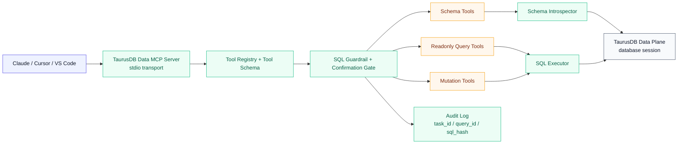

# 华为云 TaurusDB 数据面 MCP Server — 需求背景与概要设计

这篇文档聚焦 5 件事：需求背景、产品定位、功能清单、方案概要设计、测试设计。更细的目录边界、模块职责和协议细节，继续以 [《华为云 TaurusDB 数据面 MCP Server — 架构与方案设计》](./taurusdb-architecture) 为准。

---

## 01 · 需求背景

### 1.1 问题背景

TaurusDB 过去更容易先想到的是“管控面能力”：

- 查实例状态
- 查备份和参数
- 做日志排查
- 触发重启或备份等运维动作

但产品经理这次给出的方向很明确：**首要价值要落在数据面 MCP**，也就是让 AI 能真正进入数据库会话，围绕业务数据完成自然语言查询、SQL 解释和受控 SQL 执行。

这背后的原因也很直接：

- 用户最高频的问题，很多并不是“实例有没有备份”，而是“昨天支付成功订单有多少”“这个用户最近 30 天行为是什么”
- 管控面 API 只能回答资源状态，回答不了业务表上的真实数据问题
- 只把 OpenAPI 暴露给模型，无法覆盖“看 schema → 写 SQL → 校验风险 → 执行 → 返回结果”这条完整链路
- 纯粹开放自由 SQL 又会立刻碰到安全、审计、性能和误操作风险

所以，真正需要设计的不是“再加几个运维 Tool”，而是一个**以 SQL 为核心、以安全闸门为边界、以自然语言为入口**的 TaurusDB 数据面 MCP Server。

### 1.2 为什么首版要先做数据面

| 维度             | 管控面 MCP             | 数据面 MCP                       |
| ---------------- | ---------------------- | -------------------------------- |
| 面向对象         | 实例、备份、参数、日志 | 数据库、Schema、表、索引、行数据 |
| 典型问题         | “这个实例状态正常吗”   | “帮我查最近 7 天退款订单”        |
| 主要技术手段     | 云 API / SDK           | 数据库连接 + SQL 会话            |
| 对用户的即时价值 | 辅助运维               | 直接回答业务与数据问题           |
| MCP 价值密度     | 更接近 API 包装        | 更接近任务闭环                   |
| 首版优先级       | P1 / P2                | P0                               |

产品判断很清楚：

- **不是** 把 TaurusDB MCP 做成一个数据库版云控制台
- **而是** 让 AI 先具备可控的数据查询和 SQL 执行能力
- 管控面能力保留为补充上下文或后续扩展，不再作为首版主链路

### 1.3 目标用户

| 用户角色        | 主要诉求                         | 典型问题                                 |
| --------------- | -------------------------------- | ---------------------------------------- |
| 开发者          | 快速拿到业务数据，不想手写 SQL   | “查最近一小时创建失败的订单”             |
| 数据分析 / 产品 | 用自然语言拿到结果和样本数据     | “按城市统计本周新增用户”                 |
| DBA             | 在安全边界内审核、解释、执行 SQL | “先 explain 这条 SQL，再确认执行 update” |
| 支持 / 售前     | 用自然语言快速验证现场数据       | “帮我确认这个商户今天是否还有未结算记录” |

### 1.4 设计目标

| 目标           | 说明                                                                |
| -------------- | ------------------------------------------------------------------- |
| 数据面优先     | 首版核心链路围绕 schema 探查、SQL 查询、SQL 执行                    |
| 自然语言可落地 | 让模型能从自然语言稳定收敛到 SQL，而不是停在描述层                  |
| 默认安全       | 默认只读；写 SQL 需要显式开关和 `confirmation_token`                |
| 结果可解释     | 返回结果之外，还要返回实际执行 SQL、风险等级、截断说明              |
| 可审计         | 每次执行都能关联 `task_id`、`query_id`、`sql_hash` 和执行决策       |
| 部署可控       | 推荐部署在与 TaurusDB 同 VPC 或邻近跳板机的位置，缩短到数据面的链路 |

### 1.5 非目标

首版不做以下事情：

- 不做“华为云全产品通用 MCP Server”
- 不做 BI 平台替代品，不负责复杂报表建模和可视化分析
- 不默认开放任意 DDL / 高风险 SQL
- 不把重启、扩容、备份策略修改等管控面运维操作放在主路径
- 不在首版强依赖跨数据源联邦查询

---

## 02 · 产品定位

### 2.1 核心定位

TaurusDB 数据面 MCP Server 的首版定义为：

- **一个面向 AI 客户端的 SQL 能力层**
- **一个连接 TaurusDB 数据面的安全执行网关**
- **一个围绕 schema 和 SQL 构建的任务型 MCP Server**

它的价值不是“替代 SQL 编辑器”，而是把下面这条链路做顺：

```text
自然语言问题
→ 识别数据源与数据库上下文
→ 获取 schema / 表结构 / 样本
→ 生成或补全 SQL
→ 校验语义与风险
→ 在数据面执行
→ 返回结构化结果、风险信息和审计信息
```

### 2.2 首版产品结论

首版能力收口如下：

- 默认提供 schema 探查、样本查看、只读 SQL 执行
- 对“执行其他 SQL”提供单独的 `execute_sql` 入口，但默认不暴露
- 写 SQL 进入二阶段确认，且必须是单语句、可审计、可追踪
- 高风险 DDL 和破坏性语句直接拦截，不进入首版

### 2.3 用户请求与产品能力映射

| 用户请求                                      | 首选能力链路                                   |
| --------------------------------------------- | ---------------------------------------------- |
| “帮我看一下 orders 表有哪些字段”              | `list_tables` → `describe_table`               |
| “查最近 7 天每天下单人数”                     | `describe_table` → `execute_readonly_sql`      |
| “先 explain 这条 SQL 会不会扫全表”            | `explain_sql`                                  |
| “把状态为 pending 且超时的订单改成 cancelled” | `validate/explain` → `execute_sql`(确认后执行) |
| “这个查询跑太久了，停掉它”                    | `get_query_status` → `cancel_query`            |

---

## 03 · 功能清单

### 3.1 用户可见功能

| 编号 | 功能              | 描述                                                         | 优先级 |
| ---- | ----------------- | ------------------------------------------------------------ | ------ |
| F-01 | 数据源初始化      | 配置数据库连接信息、默认数据库和 MCP 客户端集成              | P0     |
| F-02 | 数据源发现        | 查询可用数据源、默认上下文、当前连接状态                     | P0     |
| F-03 | Schema 探查       | 查询数据库、Schema、表、索引、字段和注释                     | P0     |
| F-04 | 表结构查看        | 查看单表字段、索引、主键、分区和统计信息                     | P0     |
| F-05 | 样本数据预览      | 拉取少量样本行，帮助模型理解字段语义                         | P0     |
| F-06 | 只读 SQL 执行     | 执行 `SELECT / SHOW / EXPLAIN / DESCRIBE` 等只读 SQL         | P0     |
| F-07 | SQL 风险解释      | 对 SQL 做 AST 分类、Explain、风险评级和约束提示              | P0     |
| F-08 | 查询状态跟踪      | 查询长 SQL 状态、等待完成或主动取消                          | P0     |
| F-09 | 受控 SQL 执行     | 执行 `INSERT / UPDATE / DELETE` 等变更 SQL，需显式开关和确认 | P0     |
| F-10 | 多实例 / 多库切换 | 每次调用可覆盖默认数据源、数据库和 schema                    | P1     |
| F-11 | 慢 SQL 辅助分析   | 补充慢 SQL 摘要、热点表、执行代价等上下文                    | P1     |
| F-12 | 管控面上下文补充  | 辅助查询实例信息、连接地址、规格等元信息                     | P2     |

### 3.2 系统能力功能

| 编号 | 模块                 | 描述                                                               | 优先级 |
| ---- | -------------------- | ------------------------------------------------------------------ | ------ |
| S-01 | Tool Registry        | 统一注册 Tool 元数据、Schema、默认暴露级别                         | P0     |
| S-02 | SQL Profile Loader   | 多来源读取数据源配置和数据库凭证                                   | P0     |
| S-03 | Data Source Resolver | 解析默认数据源、当前数据库、局部覆盖上下文                         | P0     |
| S-04 | Schema Introspector  | 从系统表中抽取 schema、索引、统计信息，并做短期缓存                | P0     |
| S-05 | SQL Guardrail        | 基于 AST 的 SQL 解析、语句分类、风险判定、黑白名单和运行时约束注入 | P0     |
| S-06 | SQL Executor         | 建立数据库会话、执行语句、跟踪状态和取消查询                       | P0     |
| S-07 | Confirmation Gate    | 对写 SQL 和高风险只读 SQL 签发 `confirmation_token`                | P0     |
| S-08 | Formatter            | 统一成功 / 失败 / 需确认 envelope，降低模型解析成本                | P0     |
| S-09 | Audit Logger         | 记录 `task_id`、`query_id`、`sql_hash`、风险等级和执行结果         | P0     |
| S-10 | Redaction Engine     | 对敏感字段、敏感值和结果集做脱敏与截断                             | P1     |

### 3.3 MVP 范围

| 范围        | 内容                                                                                  |
| ----------- | ------------------------------------------------------------------------------------- |
| Schema 工具 | `list_data_sources`、`list_databases`、`list_tables`、`describe_table`、`sample_rows` |
| 查询工具    | `execute_readonly_sql`、`explain_sql`                                                 |
| 长查询工具  | `get_query_status`、`cancel_query`                                                    |
| 受控写 SQL  | `execute_sql`，默认关闭，需显式开启 mutations                                         |
| 安全边界    | 默认只读、单语句、结果行数限制、超时限制、危险 SQL 拦截                               |

### 3.4 关键术语

| 术语                 | 含义                                                                        |
| -------------------- | --------------------------------------------------------------------------- |
| 数据面               | 真正进入数据库连接会话并执行 SQL 的能力面                                   |
| 只读 SQL             | `SELECT`、`SHOW`、`EXPLAIN`、`DESCRIBE` 等不修改数据的语句                  |
| 写 SQL               | `INSERT`、`UPDATE`、`DELETE` 等会修改数据的语句                             |
| 高风险 SQL           | 可能造成大范围数据变更、锁表、结构变更或权限变更的 SQL                      |
| 阻断 SQL             | 首版直接禁止的 SQL，如 `DROP DATABASE`、`TRUNCATE`、`GRANT`、多语句批量执行 |
| `confirmation_token` | 服务端为高风险 SQL 签发的一次性短期确认令牌                                 |
| `query_id`           | 单次 SQL 执行的链路 ID，用于状态查询、取消和审计关联                        |
| `sql_hash`           | 归一化 SQL 指纹，用于审计、聚合和去重，不要求保存原始敏感 SQL 文本          |

---

## 04 · 方案概要设计

### 4.1 设计原则

| 原则                  | 说明                                          |
| --------------------- | --------------------------------------------- |
| 数据面优先于管控面    | 先把“自然语言到 SQL”这条链路做通              |
| Schema 优先于自由发挥 | 先给模型表结构和样本，再让它生成 SQL          |
| 先解释后执行          | 对复杂查询和所有写 SQL，先经过风险解释或确认  |
| 默认最小权限          | 默认连接只读账号；写账号和写工具单独开启      |
| 结果要可消费          | 统一返回行数、截断信息、耗时、风险和 SQL 指纹 |

### 4.2 整体架构



### 4.3 模块划分

| 模块                     | 责任                                      |
| ------------------------ | ----------------------------------------- |
| `index.ts` / `server.ts` | Server 启动、客户端接入、Tool 注册        |
| `auth/`                  | 数据源配置、凭证加载、连接上下文管理      |
| `context/`               | 默认数据源、数据库和 schema 覆盖策略      |
| `schema/`                | 数据库、表、索引、注释、样本抽取          |
| `executor/`              | 连接池、会话执行、超时、状态查询和取消    |
| `safety/`                | AST 解析、SQL 分类、限制策略、确认 token  |
| `tools/`                 | Schema、只读查询、写查询和操作辅助类 Tool |
| `utils/formatter.ts`     | 统一响应封装和结果裁剪                    |
| `utils/audit.ts`         | 审计日志与 SQL 指纹记录                   |

### 4.4 工具域划分

| 工具域              | 示例                                           | 设计目的                   |
| ------------------- | ---------------------------------------------- | -------------------------- |
| Discovery           | `list_data_sources`、`list_databases`          | 让模型先知道可在哪个库执行 |
| Schema              | `list_tables`、`describe_table`、`sample_rows` | 给模型稳定的结构化上下文   |
| Readonly Query      | `execute_readonly_sql`、`explain_sql`          | 完成主查询链路             |
| Operations          | `get_query_status`、`cancel_query`             | 管理长 SQL 生命周期        |
| Controlled Mutation | `execute_sql`                                  | 在受控边界内开放写 SQL     |

### 4.5 风险与确认策略

| SQL 类型          | 代表语句                                             | 默认策略                                  |
| ----------------- | ---------------------------------------------------- | ----------------------------------------- |
| 低风险只读        | `SELECT ... LIMIT 100`、`SHOW TABLES`                | 允许执行，受行数和超时限制                |
| 高代价只读        | 无 `LIMIT` 的大查询、可能全表扫描的复杂联表          | 先返回风险说明，必要时要求确认            |
| 低到中风险写 SQL  | 带明确 `WHERE` 条件的 `UPDATE/DELETE`、普通 `INSERT` | 默认不暴露；开启后需 `confirmation_token` |
| 高风险写 SQL      | 大范围 `UPDATE/DELETE`、`ALTER TABLE`                | 首版默认阻断或降级到 P1                   |
| 销毁 / 权限类 SQL | `DROP DATABASE`、`TRUNCATE`、`GRANT`、`REVOKE`       | 首版直接阻断                              |

### 4.6 与架构文的分工

本篇只定义“为什么做、做什么、首版如何收口”。更细的实现细节以 [taurusdb-architecture.md](./taurusdb-architecture) 为准，包括：

- 目录结构
- Tool Schema 设计
- SQL Guardrail 的分层实现
- 统一响应模型
- 部署位置和权限建议

---

## 05 · 测试设计

### 5.1 链路级观测点

| 链路节点            | 测试场景                                | 关键断言                                          |
| ------------------- | --------------------------------------- | ------------------------------------------------- |
| MCP Server 启动     | 启动服务并执行 `tools/list`             | 默认只暴露 schema / 只读工具；写 SQL 工具默认隐藏 |
| SQL Profile Loader  | 环境变量、配置文件、缺失凭证三类场景    | 数据源优先级正确；缺失时错误可解释                |
| Schema Introspector | 列表表、查字段、查索引                  | 返回字段名、类型、索引信息和注释                  |
| SQL Guardrail       | 危险 SQL、无 `LIMIT` 大查询、多语句执行 | 能正确分类、阻断或返回确认要求                    |
| SQL Executor        | 只读执行成功、超时、取消、连接失败      | 状态、耗时、错误结构稳定                          |
| Confirmation Gate   | 写 SQL 首次调用                         | 返回 `confirmation_token`，不直接执行             |
| Audit Logger        | 查询成功 / 阻断 / 确认执行              | 能关联 `task_id`、`query_id`、`sql_hash`          |
| Formatter           | 结果截断、敏感字段脱敏、错误返回        | 输出 envelope 稳定，模型易消费                    |

### 5.2 核心指标

| 指标                       | 目标 |
| -------------------------- | ---- |
| `tools/list` 启动耗时      | < 2s |
| `describe_table` P95       | < 3s |
| `execute_readonly_sql` P95 | < 5s |
| `explain_sql` P95          | < 3s |
| 危险 SQL 漏拦截率          | 0    |
| 结果截断标记透出率         | 100% |
| 审计字段完整率             | 100% |

### 5.3 故障注入观测点

| 场景              | 注入方式               | 通过标准                             |
| ----------------- | ---------------------- | ------------------------------------ |
| 数据库认证失败    | Mock 用户名 / 密码错误 | 返回可解释的认证错误，不暴露敏感信息 |
| Schema 获取超时   | Mock 系统表查询超时    | 工具失败可解释，不导致服务崩溃       |
| 只读 SQL 扫描过大 | 构造无 `LIMIT` 大查询  | 被风险提示或阻断                     |
| 写 SQL token 过期 | 使用旧 token 重试      | 拒绝执行，并提示重新确认             |
| 查询执行超时      | Mock 长时间运行 SQL    | 返回超时并保留 `query_id`            |
| 审计落盘失败      | Mock JSONL 写入失败    | SQL 主链路可降级，但错误可观测       |

### 5.4 核心测试用例

| 用例 ID | 场景                     | 前置条件                        | 步骤                            | 预期结果                                           |
| ------- | ------------------------ | ------------------------------- | ------------------------------- | -------------------------------------------------- |
| TC-01   | 列出表成功               | 已配置合法数据源                | 调用 `list_tables`              | 返回表名列表，`ok=true`                            |
| TC-02   | 查看表结构成功           | 指定表存在                      | 调用 `describe_table`           | 返回字段、类型、索引和主键信息                     |
| TC-03   | 样本预览成功             | 表存在且可读                    | 调用 `sample_rows`              | 返回少量样本行和截断标记                           |
| TC-04   | 只读 SQL 成功执行        | 账号具备查询权限                | 调用 `execute_readonly_sql`     | 返回列信息、结果集、耗时和 `query_id`              |
| TC-05   | 无限制大查询被拦截       | 构造大范围查询                  | 调用 `execute_readonly_sql`     | 返回风险说明或要求补充限制条件                     |
| TC-06   | Explain 成功输出代价信息 | SQL 可解析                      | 调用 `explain_sql`              | 返回执行计划摘要和风险等级                         |
| TC-07   | 写 SQL 首次调用被拦截    | 已开启 mutations                | 首次调用 `execute_sql`          | 返回确认说明和 token，不执行                       |
| TC-08   | 写 SQL 确认后执行成功    | 已获得有效 token                | 带 token 再次调用 `execute_sql` | 语句执行一次，返回 `affected_rows`                 |
| TC-09   | 危险 SQL 直接阻断        | 构造 `DROP` / `TRUNCATE`        | 调用 `execute_sql`              | 返回 `BLOCKED_SQL`，不执行                         |
| TC-10   | 长查询可取消             | 查询仍在运行                    | 调用 `cancel_query`             | 查询状态变为 `cancelled`                           |
| TC-11   | 错误 envelope 稳定       | Mock 认证失败 / 超时 / 语法错误 | 调用任意 SQL Tool               | 错误结构字段完整                                   |
| TC-12   | 审计字段完整             | 查询成功或被阻断                | 触发任意 SQL 工具               | 响应和日志包含 `task_id`、`query_id` 或 `sql_hash` |

### 5.5 发布验收标准

首版发布前至少满足以下条件：

- 默认工具集合完整覆盖 schema 探查和只读查询主链路
- 写 SQL 默认关闭，开启后必须走确认链路
- 高风险和阻断 SQL 有稳定的分类结果
- 响应中稳定透出 `summary + task_id + query_id/sql_hash`
- 文档与专题索引已同步，外部读者能明确感知这是“数据面 MCP”而不是“运维工具集”
