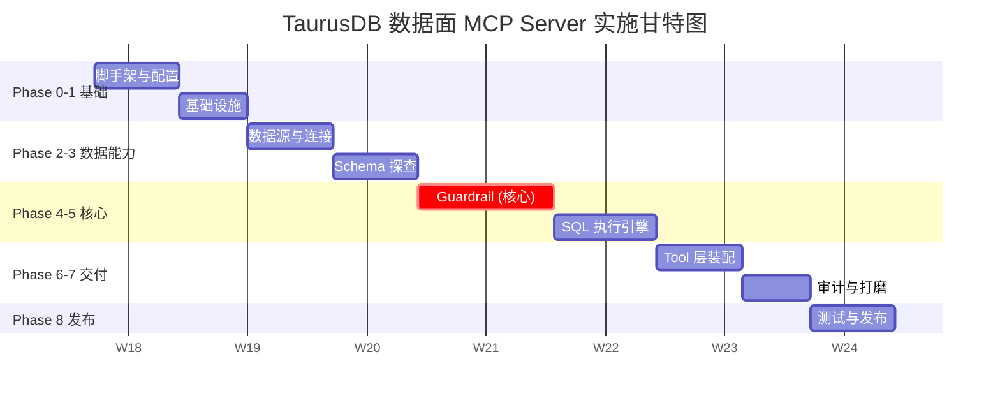

# 华为云 TaurusDB 数据面 MCP Server — 完整实施计划

> 基于《华为云 TaurusDB 数据面 MCP Server — 架构与方案设计》和《需求背景与概要设计》两份文档定制
>
> 适用范围：Phase 0 步骤 0.2 之后的全部实施内容

---

## 📋 总体路线图

```
Phase 0: 项目启动与脚手架       (3 步, 约 2-3 天)
Phase 1: 基础设施与类型系统     (4 步, 约 3-4 天)
Phase 2: 数据源与连接层         (4 步, 约 4-5 天)
Phase 3: Schema 探查能力        (4 步, 约 4-5 天)
Phase 4: SQL Guardrail 安全层   (5 步, 约 6-8 天) ← 核心难点
Phase 5: SQL 执行引擎           (4 步, 约 5-6 天)
Phase 6: MCP Tool 层装配        (4 步, 约 4-5 天)
Phase 7: 审计、可观测性与打磨   (3 步, 约 3-4 天)
Phase 8: 测试、发布与交付       (1 步, 约 3-5 天)
───────────────────────────────
总计: ~32 步, ~6-8 周 (1-2 人)
```

设计思路是：**后一阶段依赖前一阶段的稳定输出**，确保任何时候中断都有可交付的半成品。

---

## Phase 0 — 项目启动与脚手架

**目标**：让 `npx @huaweicloud/taurusdb-mcp` 能跑起来一个空的 MCP Server，Claude Desktop 能看到它。

### 步骤 0.2 — 最小 MCP Server 骨架

**做什么**

- 实现 `src/index.ts`：CLI 入口（仅分发）
- 实现 `src/server.ts`：MCP Server 初始化
- 注册一个 `ping` 工具作为 smoke test

**架构设计**

```typescript
// src/index.ts — 只做两件事
async function main() {
  const args = process.argv.slice(2);
  if (args[0] === "init") {
    await runInit(args);
    return;
  }
  if (args[0] === "--version") {
    printVersion();
    return;
  }
  await startMcpServer();
}

// src/server.ts — 可测试的工厂函数
export function createServer(deps: ServerDeps): McpServer {
  const server = new McpServer({
    name: "huaweicloud-taurusdb",
    version: VERSION,
    capabilities: { tools: {} },
  });
  registerTools(server, deps);
  return server;
}

export async function startMcpServer() {
  const deps = await bootstrapDependencies();
  const server = createServer(deps);
  await server.connect(new StdioServerTransport());
}
```

**关键设计点**

- `createServer(deps)` 接受依赖注入，便于单测 mock
- `bootstrapDependencies()` 集中初始化配置、连接池、审计器
- `startMcpServer()` 和 `createServer()` 分离，让测试不需要 stdio

**验收**：Claude Desktop 配置后能看到并调用 `ping` 工具返回 `pong`。

---

### 步骤 0.3 — `init` 子命令与客户端配置写入

**做什么**

- 实现 `src/commands/init.ts`
- 支持 `taurusdb-mcp init --client claude|cursor|vscode`
- 自动定位客户端配置文件位置（macOS/Windows/Linux）
- 合并写入（不覆盖用户已有配置）

**架构设计**

```typescript
interface ClientAdapter {
  name: "claude" | "cursor" | "vscode";
  getConfigPath(): string; // 跨平台路径解析
  readConfig(): Promise<object>;
  mergeServerEntry(config: object, entry: McpServerEntry): object;
  writeConfig(config: object): Promise<void>;
}
```

**验收**：运行 `npx @huaweicloud/taurusdb-mcp init --client claude` 后，Claude Desktop 重启能直接识别。

---

## Phase 1 — 基础设施与类型系统

**目标**：建立项目贯穿始终的类型契约、错误模型、响应 envelope、日志骨架。这一阶段**不写业务逻辑**，但它定义了后续所有模块的"接口话术"。

### 步骤 1.1 — 统一响应 Envelope 与错误模型

**做什么**

- 定义 `ToolResponse<T>`、`ToolError`、`ErrorCode`
- 实现 `formatSuccess`、`formatError`、`formatBlocked`、`formatConfirmationRequired`

**架构设计**

```typescript
// src/utils/formatter.ts
export type ToolResponse<T = unknown> = {
  ok: boolean;
  summary: string;
  data?: T;
  error?: ToolError;
  metadata: ResponseMetadata;
};

export type ResponseMetadata = {
  task_id: string;
  query_id?: string;
  sql_hash?: string;
  statement_type?: StatementType;
  duration_ms?: number;
};

export const ErrorCode = {
  // 配置类
  DATASOURCE_NOT_FOUND: "DATASOURCE_NOT_FOUND",
  CREDENTIAL_MISSING: "CREDENTIAL_MISSING",
  // 安全类
  BLOCKED_SQL: "BLOCKED_SQL",
  CONFIRMATION_REQUIRED: "CONFIRMATION_REQUIRED",
  CONFIRMATION_INVALID: "CONFIRMATION_INVALID",
  // 执行类
  SQL_SYNTAX_ERROR: "SQL_SYNTAX_ERROR",
  QUERY_TIMEOUT: "QUERY_TIMEOUT",
  QUERY_CANCELLED: "QUERY_CANCELLED",
  CONNECTION_FAILED: "CONNECTION_FAILED",
  // 结果类
  RESULT_TOO_LARGE: "RESULT_TOO_LARGE",
} as const;
```

**关键原则**

- **每个 Tool 返回同一种结构**，只在 `data` 上泛型化
- `task_id` 在请求入口生成，贯穿所有日志和响应
- `summary` 是给模型看的一句话总结，必须稳定

---

### 步骤 1.2 — ID、Hash 与时间工具

**做什么**

- `task_id` 生成（ULID，时间可排序）
- `query_id` 生成
- `sql_hash`：归一化后的稳定指纹

**架构设计**

```typescript
// src/utils/hash.ts
export function normalizeSql(sql: string): string {
  // 1. 去除行尾空白与注释
  // 2. 多空格合并
  // 3. 关键字大写
  // 4. 字符串字面量保留原样（指纹包含参数）
  // 5. 末尾分号可选剥离
}

export function sqlHash(normalized: string): string {
  return createHash("sha256").update(normalized).digest("hex").slice(0, 16);
}
```

**注意**：`sql_hash` 的算法一旦上线不要随意改，它会出现在审计日志里，改了就失去历史可比性。

---

### 步骤 1.3 — 结构化日志系统

**做什么**

- 基于 `pino` 构建 `Logger` 接口
- 所有日志自动带 `task_id`（通过 AsyncLocalStorage）
- 敏感字段自动脱敏（password、secret、token）

**架构设计**

```typescript
// src/utils/logger.ts
import { AsyncLocalStorage } from "async_hooks";

const taskContext = new AsyncLocalStorage<{ task_id: string }>();

export function withTaskContext<T>(task_id: string, fn: () => Promise<T>) {
  return taskContext.run({ task_id }, fn);
}

export const logger = pino({
  redact: {
    paths: ["password", "*.password", "credentials.*", "secret", "*.token"],
    censor: "[REDACTED]",
  },
  mixin: () => ({ task_id: taskContext.getStore()?.task_id }),
});
```

**关键点**：`stdio` 传输要求 stdout 只能走 JSON-RPC。**日志必须走 stderr**（pino 的默认已经是 stderr，但要明确设置并加测试）。

---

### 步骤 1.4 — 配置总线与环境变量契约

**做什么**

- 定义所有环境变量的类型化读取
- zod schema 校验配置合法性
- 提供 `getConfig()` 单例

**架构设计**

```typescript
// src/config/schema.ts
export const ConfigSchema = z.object({
  defaultDatasource: z.string().optional(),
  profilesPath: z.string().optional(),
  enableMutations: z.boolean().default(false),
  limits: z.object({
    maxRows: z.number().default(200),
    maxColumns: z.number().default(50),
    maxStatementMs: z.number().default(15000),
    maxFieldChars: z.number().default(2048),
  }),
  audit: z.object({
    logPath: z.string().default("~/.taurusdb-mcp/audit.jsonl"),
    includeRawSql: z.boolean().default(false), // 默认只记 hash
  }),
});
```

**验收**：启动时打印脱敏后的有效配置到 stderr，便于诊断。

---

## Phase 2 — 数据源与连接层

**目标**：能从多种来源解析数据源 profile，建立并管理数据库连接池，支持只读账号/写账号分离。

### 步骤 2.1 — SQL Profile Loader

**做什么**

- 实现 `src/auth/sql-profile-loader.ts`
- 按优先级加载：Tool 参数 > profiles.json > 环境变量 > init 配置

**架构设计**

```typescript
// src/auth/sql-profile-loader.ts
export interface DataSourceProfile {
  name: string;
  engine: "mysql" | "postgresql";
  host: string;
  port: number;
  database?: string; // 默认库
  readonlyUser: CredentialRef;
  mutationUser?: CredentialRef; // 可选，未配置即不允许写
  tls?: TlsOptions;
  poolSize?: number;
}

export interface ProfileLoader {
  load(): Promise<Map<string, DataSourceProfile>>;
  getDefault(): Promise<string | undefined>;
  get(name: string): Promise<DataSourceProfile | undefined>;
}
```

**关键设计**

- 一个 profile 可以同时有 **只读账号** 和 **写账号**，Executor 按语句类型选择
- **密码绝不出现在日志或响应里**；所有字段在 `toString` 时自动脱敏

---

### 步骤 2.2 — Secret Resolver

**做什么**

- 实现 `src/auth/secret-resolver.ts`
- 支持明文、环境变量引用（`env:VAR_NAME`）、文件引用（`file:/path`）
- 预留 `aws-sm:`、`hw-kms:` 等 URI scheme 扩展点

**架构设计**

```typescript
export type CredentialRef =
  | { type: "plain"; value: string }
  | { type: "env"; key: string }
  | { type: "file"; path: string }
  | { type: "uri"; uri: string }; // 未来扩展

export interface SecretResolver {
  resolve(ref: CredentialRef): Promise<string>;
}
```

**验收**：profile 里写 `"password": "env:TAURUSDB_PROD_PWD"` 能正确读取。

---

### 步骤 2.3 — 连接池管理器

**做什么**

- 实现 `src/executor/connection-pool.ts`
- 每个 profile 对应 2 个独立池（readonly + mutation）
- 支持连接预检、空闲回收、最大连接限制

**架构设计**

```typescript
export interface ConnectionPool {
  // 选择池：readonly | mutation
  acquire(datasource: string, mode: "ro" | "rw"): Promise<Session>;
  release(session: Session): Promise<void>;
  healthCheck(datasource: string): Promise<PoolHealth>;
  close(): Promise<void>;
}

export interface Session {
  id: string;
  datasource: string;
  mode: "ro" | "rw";
  execute(sql: string, options: ExecOptions): Promise<RawResult>;
  cancel(): Promise<void>;
  close(): Promise<void>;
}
```

**关键设计**

- **只读池使用只读账号**（如果 MySQL 有权限控制），即使 SQL 被 bypass 了，数据库层仍能守住
- 写入池在 `config.enableMutations=false` 时根本不会创建
- 连接建立失败要返回可解释的 `CONNECTION_FAILED`，不泄漏内部栈

---

### 步骤 2.4 — Data Source Resolver（调用上下文）

**做什么**

- 实现 `src/context/datasource-resolver.ts` 与 `session-context.ts`
- 把 Tool 参数、默认值、profile 合并成一次调用的 `SessionContext`

**架构设计**

```typescript
// src/context/session-context.ts
export interface SessionContext {
  task_id: string;
  datasource: string;
  engine: "mysql" | "postgresql";
  database?: string;
  schema?: string;
  limits: RuntimeLimits;
}

export interface RuntimeLimits {
  readonly: boolean;
  timeoutMs: number;
  maxRows: number;
  maxColumns: number;
}

export interface DatasourceResolver {
  resolve(
    input: {
      datasource?: string;
      database?: string;
      schema?: string;
      timeout_ms?: number;
    },
    task_id: string
  ): Promise<SessionContext>;
}
```

**验收**：同一个 Tool 可以 per-call 覆盖 datasource/database，覆盖不传的字段沿用默认。

---

## Phase 3 — Schema 探查能力

**目标**：让模型能拿到稳定、结构化、适合塞进 prompt 的 schema 上下文。

### 步骤 3.1 — Schema Introspector 核心接口

**做什么**

- 实现 `src/schema/introspector.ts`
- 定义 engine-agnostic 接口，每种引擎一个 adapter

**架构设计**

```typescript
// src/schema/introspector.ts
export interface SchemaIntrospector {
  listDatabases(ctx: SessionContext): Promise<DatabaseInfo[]>;
  listTables(ctx: SessionContext, database: string): Promise<TableInfo[]>;
  describeTable(
    ctx: SessionContext,
    database: string,
    table: string
  ): Promise<TableSchema>;
  sampleRows(
    ctx: SessionContext,
    database: string,
    table: string,
    n: number
  ): Promise<SampleResult>;
}

export interface TableSchema {
  database: string;
  table: string;
  columns: ColumnInfo[];
  indexes: IndexInfo[];
  primaryKey?: string[];
  engineHints?: {
    likelyTimeColumns: string[]; // created_at, updated_at...
    likelyFilterColumns: string[]; // 索引列 + 主键
    sensitiveColumns: string[]; // 启发式识别
  };
  comment?: string;
  rowCountEstimate?: number;
}
```

**关键设计**

- `engineHints` 是**模型友好的增值信息**，不是数据库原生字段
- `likelyTimeColumns`、`sensitiveColumns` 由 adapter 根据列名 + 类型启发式识别

---

### 步骤 3.2 — MySQL Adapter

**做什么**

- 实现 `src/schema/adapters/mysql.ts`
- 通过 `information_schema` 抽取 schema

**查询设计**

```sql
-- 列信息
SELECT COLUMN_NAME, DATA_TYPE, IS_NULLABLE, COLUMN_DEFAULT,
       COLUMN_KEY, EXTRA, COLUMN_COMMENT, CHARACTER_MAXIMUM_LENGTH
FROM information_schema.COLUMNS
WHERE TABLE_SCHEMA = ? AND TABLE_NAME = ?
ORDER BY ORDINAL_POSITION;

-- 索引信息
SELECT INDEX_NAME, COLUMN_NAME, NON_UNIQUE, SEQ_IN_INDEX
FROM information_schema.STATISTICS
WHERE TABLE_SCHEMA = ? AND TABLE_NAME = ?
ORDER BY INDEX_NAME, SEQ_IN_INDEX;

-- 行数估算
SELECT TABLE_ROWS FROM information_schema.TABLES
WHERE TABLE_SCHEMA = ? AND TABLE_NAME = ?;
```

**敏感列启发式**

```typescript
const SENSITIVE_PATTERNS = [
  /phone|mobile|tel/i,
  /id_?card|passport|ssn/i,
  /email/i,
  /password|passwd|secret/i,
  /token|api_?key/i,
  /bank|card_?no|account/i,
];
```

---

### 步骤 3.3 — Schema 缓存层

**做什么**

- 实现 `src/schema/cache.ts`
- 短 TTL（默认 60s）LRU 缓存
- 缓存 key 含 `datasource+database+table`

**架构设计**

```typescript
export interface SchemaCache {
  get(key: SchemaCacheKey): TableSchema | undefined;
  set(key: SchemaCacheKey, value: TableSchema): void;
  invalidate(datasource: string, database?: string, table?: string): void;
  stats(): CacheStats;
}
```

**关键点**

- Cache **只在同一个 MCP Server 进程内有效**，不做跨进程同步
- 对 DDL 类操作（不在首版）预留 invalidate 钩子

---

### 步骤 3.4 — Sample Rows 策略

**做什么**

- 实现样本抽取，但**不是简单的 `SELECT * LIMIT 10`**

**架构设计**

```typescript
async sampleRows(ctx, db, table, n = 5): Promise<SampleResult> {
  // 1. 先 describeTable 获取字段
  // 2. 排除敏感列 或 对敏感列自动脱敏
  // 3. 排除大字段（BLOB/TEXT > 1KB）
  // 4. 注入 LIMIT n
  // 5. 字符串超长截断
}
```

**输出**

```json
{
  "columns": [...],
  "rows": [...],
  "redacted_columns": ["phone_number"],
  "truncated_columns": ["description"],
  "sample_size": 5
}
```

---

## Phase 4 — SQL Guardrail 安全层（核心难点）

**目标**：实现架构文档里描述的 6 层 Guardrail 模型。这是整个项目"AI 安全执行 SQL"价值的核心体现。

### 步骤 4.1 — SQL Normalizer 与 Parser Adapter

**做什么**

- 实现 `normalizeSql` 与 AST 解析
- 按 engine 选择 parser（MySQL / PostgreSQL）

**架构设计**

```typescript
// src/safety/parser/index.ts
export interface SqlParser {
  normalize(sql: string): { normalizedSql: string; sqlHash: string };
  parse(sql: string): ParseResult;
}

export type ParseResult =
  | { ok: true; ast: SqlAst; isMultiStatement: boolean }
  | { ok: false; error: ParseError };

// 抽象 AST 到统一中间表示（IR），避免各 parser 差异渗透到上层
export interface SqlAst {
  kind: StatementType;
  tables: TableRef[];
  columns: ColumnRef[];
  where?: WhereNode;
  limit?: LimitNode;
  joins?: JoinNode[];
  orderBy?: OrderByNode[];
  groupBy?: GroupByNode[];
  hasAggregate: boolean;
  hasSubquery: boolean;
}
```

**关键决策**：不要直接把 `node-sql-parser` 的 AST 往外传，做一层 **IR（Intermediate Representation）** 隔离。未来换 parser 不用改 validator。

---

### 步骤 4.2 — SQL Classifier

**做什么**

- 实现 `src/safety/sql-classifier.ts`
- 只产出事实，不做决策

**架构设计**（完全按设计文档 §3.2.5.3）

```typescript
export function classifySql(
  ast: SqlAst,
  normalized: NormalizedSql,
  engine: Engine
): SqlClassification {
  return {
    engine,
    statementType: extractStatementType(ast),
    normalizedSql: normalized.sql,
    sqlHash: normalized.hash,
    isMultiStatement: ast.isMultiStatement,
    referencedTables: extractTables(ast),
    referencedColumns: extractColumns(ast),
    hasWhere: !!ast.where,
    hasLimit: !!ast.limit,
    hasJoin: (ast.joins?.length ?? 0) > 0,
    hasSubquery: ast.hasSubquery,
    hasOrderBy: !!ast.orderBy,
    hasAggregate: ast.hasAggregate,
  };
}
```

**单元测试覆盖点**（≥30 个用例）

- `SELECT * FROM t` / `SELECT * FROM t LIMIT 10` / `SELECT count(*) FROM t GROUP BY x`
- `UPDATE t SET x=1` / `UPDATE t SET x=1 WHERE id=1`
- `INSERT` / `DELETE` / `ALTER` / `DROP` / `TRUNCATE` / `GRANT`
- 多语句 `SELECT 1; SELECT 2`
- CTE、子查询、UNION
- 注释注入 `SELECT 1 -- ; DROP TABLE t`

---

### 步骤 4.3 — SQL Validator（四层校验）

**做什么**

- 实现 `src/safety/sql-validator.ts`
- 分别实现 4 个独立函数，可单独测试

**架构设计**

```typescript
// 第一层：Tool 级校验
export function validateToolScope(
  toolName: string,
  cls: SqlClassification
): ValidationResult;

// 第二层：静态规则校验
export function validateStaticRules(cls: SqlClassification): ValidationResult;

// 第三层：Schema 感知校验
export function validateSchemaAware(
  cls: SqlClassification,
  schemaSnapshot: Map<string, TableSchema>
): ValidationResult;

// 第四层：成本校验（需要 executor.explain）
export function validateCost(
  cls: SqlClassification,
  explainSummary: ExplainRiskSummary
): ValidationResult;

type ValidationResult = {
  action: "allow" | "confirm" | "block";
  riskLevel: RiskLevel;
  reasonCodes: string[];
  riskHints: string[];
};
```

**规则矩阵**（按设计文档精准落地）

| 规则 ID | 规则                     | 命中 → 动作                       |
| ------- | ------------------------ | --------------------------------- |
| R001    | 多语句                   | block                             |
| R002    | DCL (GRANT/REVOKE)       | block                             |
| R003    | DROP DATABASE / TRUNCATE | block                             |
| R004    | SET GLOBAL               | block                             |
| R005    | UPDATE/DELETE 无 WHERE   | block（首版）                     |
| R006    | UPDATE/DELETE 有 WHERE   | confirm                           |
| R007    | 明细 SELECT 无 LIMIT     | medium（允许，结果层截断）        |
| R008    | SELECT \* 宽表           | medium                            |
| R009    | 引用表不存在             | block（提前返回，省一次 DB 往返） |
| R010    | 引用列不存在             | block                             |
| R011    | 访问敏感列               | 提示 + redaction                  |

---

### 步骤 4.4 — Guardrail 主调度器

**做什么**

- 实现 `src/safety/guardrail.ts`
- 把 parse → classify → validate → decision 串起来

**架构设计**

```typescript
export interface Guardrail {
  inspect(input: InspectInput): Promise<GuardrailDecision>;
}

export class GuardrailImpl implements Guardrail {
  async inspect(input: InspectInput): Promise<GuardrailDecision> {
    // 1. Normalize
    const normalized = this.parser.normalize(input.sql);

    // 2. Parse
    const parseResult = this.parser.parse(normalized.sql);
    if (!parseResult.ok) return buildSyntaxError(parseResult.error);

    // 3. Classify
    const cls = classifySql(parseResult.ast, normalized, input.context.engine);

    // 4. Tool scope
    const d1 = validateToolScope(input.toolName, cls);
    if (d1.action === "block") return merge(cls, [d1]);

    // 5. Static rules
    const d2 = validateStaticRules(cls);
    if (d2.action === "block") return merge(cls, [d1, d2]);

    // 6. Schema-aware
    const schema = await this.schemaIntrospector.loadForTables(
      input.context,
      cls.referencedTables
    );
    const d3 = validateSchemaAware(cls, schema);
    if (d3.action === "block") return merge(cls, [d1, d2, d3]);

    // 7. Cost (选择性)
    let d4: ValidationResult | null = null;
    if (shouldExplain(cls, [d1, d2, d3])) {
      const explain = await this.executor.explainForGuardrail(
        input.sql,
        input.context
      );
      d4 = validateCost(cls, explain);
    }

    // 8. Merge & build decision
    return mergeDecision(cls, [d1, d2, d3, d4].filter(Boolean));
  }
}
```

**关键点**：Guardrail 内部持有 `executor` 引用来做 explain，形成**循环依赖**。解决方案：executor 提供 `explainForGuardrail()` 专用方法，与 Tool 侧的 `explain_sql` 区分。

---

### 步骤 4.5 — Confirmation Store

**做什么**

- 实现 `src/safety/confirmation-store.ts`
- 签发 / 校验 / 过期清理

**架构设计**

```typescript
export interface ConfirmationStore {
  issue(input: IssueInput): Promise<ConfirmationToken>;
  validate(
    token: string,
    currentSql: string,
    ctx: SessionContext
  ): Promise<ValidationResult>;
  revoke(token: string): Promise<void>;
}

type IssueInput = {
  sqlHash: string;
  normalizedSql: string;
  context: SessionContext;
  riskLevel: RiskLevel;
  ttlSeconds: number; // 默认 300s
};

type ConfirmationToken = {
  token: string; // 随机 32 字节 base64url
  issuedAt: number;
  expiresAt: number;
};
```

**校验逻辑**

```
confirmation_token 必须同时满足：
1. token 存在且未过期
2. 当前请求的 sql_hash == 签发时的 sql_hash
3. 当前请求的 datasource+database == 签发时的
4. 未被使用过（一次性）
```

**存储**：首版用内存 Map + 定时清理；预留 Redis 扩展点。

---

## Phase 5 — SQL 执行引擎

**目标**：实现一个受控、可追踪、可取消的 SQL 执行器。

### 步骤 5.1 — Executor 接口与基础实现

**做什么**

- 实现 `src/executor/sql-executor.ts`

**架构设计**

```typescript
export interface SqlExecutor {
  explainForGuardrail(
    sql: string,
    ctx: SessionContext
  ): Promise<ExplainRiskSummary>;
  explain(sql: string, ctx: SessionContext): Promise<ExplainResult>;
  executeReadonly(
    sql: string,
    ctx: SessionContext,
    opts: ReadonlyOptions
  ): Promise<QueryResult>;
  executeMutation(
    sql: string,
    ctx: SessionContext,
    opts: MutationOptions
  ): Promise<MutationResult>;
  getQueryStatus(queryId: string): Promise<QueryStatus>;
  cancelQuery(queryId: string): Promise<CancelResult>;
}

export interface QueryResult {
  queryId: string;
  columns: ColumnMeta[];
  rows: unknown[][];
  rowCount: number;
  truncated: boolean;
  durationMs: number;
}

export interface MutationResult {
  queryId: string;
  affectedRows: number;
  durationMs: number;
}
```

**关键设计**

- `executeReadonly` **必须走只读账号**，即使 Guardrail 判错也有账号层兜底
- `executeMutation` 服务端自动包裹 `BEGIN / COMMIT`
- 每次执行生成 `query_id`（内部映射到 MySQL 的 `CONNECTION_ID()`）

---

### 步骤 5.2 — Query Tracker

**做什么**

- 实现 `src/executor/query-tracker.ts`
- 维护活跃查询列表

**架构设计**

```typescript
export interface QueryTracker {
  register(queryId: string, info: QueryInfo): void;
  get(queryId: string): QueryInfo | undefined;
  markCompleted(queryId: string, result: QueryStatusResult): void;
  listActive(): QueryInfo[];
  cleanup(olderThanMs: number): void;
}

export interface QueryInfo {
  queryId: string;
  taskId: string;
  sqlHash: string;
  statementType: StatementType;
  startedAt: number;
  dbConnectionId: number; // 用于 KILL QUERY
  status: "running" | "completed" | "failed" | "cancelled";
}
```

**取消语义**

```typescript
async cancelQuery(queryId: string): Promise<CancelResult> {
  const info = tracker.get(queryId);
  if (!info) return { status: "not_found" };
  // MySQL: KILL QUERY <connection_id>
  // 注意：这需要一个独立的短连接去发 KILL，不能用原 session
  const killer = await pool.acquireShortLivedConnection(info.datasource);
  await killer.execute(`KILL QUERY ${info.dbConnectionId}`);
  tracker.markCompleted(queryId, { status: "cancelled" });
  return { status: "cancelled" };
}
```

---

### 步骤 5.3 — Explain 包装

**做什么**

- 实现 Guardrail 专用的轻量 explain
- 实现用户侧的完整 explain

**架构设计**

```typescript
// Guardrail 内部：提取风险信号
async explainForGuardrail(sql: string, ctx): Promise<ExplainRiskSummary> {
  const raw = await session.execute(`EXPLAIN ${sql}`);
  return summarizeForRisk(raw);  // 只返回风险摘要
}

function summarizeForRisk(raw: RawExplain): ExplainRiskSummary {
  return {
    fullTableScanLikely: raw.some(r => r.type === "ALL"),
    indexHitLikely: raw.every(r => r.key !== null),
    estimatedRows: raw.reduce((s, r) => s + (r.rows ?? 0), 0),
    usesTempStructure: raw.some(r => r.Extra?.includes("Using temporary")),
    usesFilesort: raw.some(r => r.Extra?.includes("Using filesort")),
    riskHints: [],
  };
}

// 用户侧：完整 explain
async explain(sql: string, ctx): Promise<ExplainResult> {
  return {
    plan: rawPlan,
    riskSummary: summarizeForRisk(rawPlan),
    recommendations: generateRecommendations(rawPlan),
  };
}
```

---

### 步骤 5.4 — 结果裁剪与脱敏

**做什么**

- 实现 `src/safety/redaction.ts`
- 行数截断、列数截断、大字段截断、敏感列脱敏

**架构设计**

```typescript
export interface ResultRedactor {
  redact(raw: RawQueryResult, policy: RedactionPolicy): QueryResult;
}

export interface RedactionPolicy {
  maxRows: number;
  maxColumns: number;
  maxFieldChars: number;
  sensitiveColumns: Set<string>;
  sensitiveStrategy: "mask" | "drop" | "hash"; // 默认 mask
}

function maskValue(col: string, v: unknown): unknown {
  if (typeof v !== "string") return v;
  if (/phone|mobile/i.test(col))
    return v.replace(/(\d{3})\d+(\d{4})/, "$1****$2");
  if (/email/i.test(col)) return v.replace(/(.{2}).*(@.*)/, "$1***$2");
  if (/id_?card/i.test(col)) return v.slice(0, 6) + "********" + v.slice(-4);
  return "***";
}
```

**关键原则**：

- 截断必须**显式透出**给模型：`truncated: true, original_row_count: 10000`
- 脱敏列在响应 metadata 里列出，模型知道哪些列不可信

---

## Phase 6 — MCP Tool 层装配

**目标**：把所有能力组装成对外的 10 个 MCP Tool。

### 步骤 6.1 — Tool Registry 与装配模式

**做什么**

- 实现 `src/tools/registry.ts`
- 所有 Tool 统一注册、统一 error boundary

**架构设计**

```typescript
export interface ToolDefinition<I, O> {
  name: string;
  description: string; // 给模型看的描述，非常关键
  inputSchema: z.ZodType<I>;
  handler: (input: I, deps: ToolDeps) => Promise<ToolResponse<O>>;
  exposeWhen?: (config: Config) => boolean; // execute_sql 的动态暴露
}

export function registerTools(
  server: McpServer,
  deps: ToolDeps,
  config: Config
) {
  const tools: ToolDefinition<any, any>[] = [
    listDataSourcesTool,
    listDatabasesTool,
    listTablesTool,
    describeTableTool,
    sampleRowsTool,
    executeReadonlySqlTool,
    explainSqlTool,
    getQueryStatusTool,
    cancelQueryTool,
    executeSqlTool, // exposeWhen: c => c.enableMutations
  ];

  for (const tool of tools) {
    if (tool.exposeWhen && !tool.exposeWhen(config)) continue;
    server.tool(
      tool.name,
      tool.description,
      tool.inputSchema,
      async (input) => {
        const task_id = generateTaskId();
        return withTaskContext(task_id, async () => {
          try {
            return await tool.handler(input, deps);
          } catch (err) {
            return formatUnhandledError(err, task_id);
          }
        });
      }
    );
  }
}
```

**关键点**：`description` 是 LLM 决定是否调用该工具的核心依据。设计文档给的 tool 集合对应的描述必须仔细打磨，包含：何时用、参数含义、返回值结构、失败情况。

---

### 步骤 6.2 — Discovery & Schema Tools 实现

**做什么**

- 实现 `list_data_sources`、`list_databases`、`list_tables`、`describe_table`、`sample_rows`

**示例：describe_table**

```typescript
export const describeTableTool: ToolDefinition<
  DescribeTableInput,
  TableSchema
> = {
  name: "describe_table",
  description: `Describe a table's schema including columns, types, indexes, primary key, and comments.
Use this BEFORE generating SQL to understand the table structure.
Returns engine hints about likely filter columns and sensitive columns.`,
  inputSchema: z.object({
    table: z.string().describe("Table name (required)"),
    datasource: z.string().optional(),
    database: z.string().optional(),
  }),
  handler: async (input, deps) => {
    const ctx = await deps.resolver.resolve(input, getTaskId());
    const schema = await deps.schemaIntrospector.describeTable(
      ctx,
      input.database ?? ctx.database!,
      input.table
    );
    return formatSuccess(schema, {
      summary: `Table ${input.table} has ${schema.columns.length} columns and ${schema.indexes.length} indexes.`,
    });
  },
};
```

---

### 步骤 6.3 — Query Tools 实现

**做什么**

- 实现 `execute_readonly_sql`、`explain_sql`

**核心流程（execute_readonly_sql）**

```typescript
handler: async (input, deps) => {
  const ctx = await deps.resolver.resolve(input, getTaskId());

  // 1. Guardrail
  const decision = await deps.guardrail.inspect({
    toolName: "execute_readonly_sql",
    sql: input.sql,
    context: ctx,
  });

  // 2. 分支
  if (decision.action === "block") return formatBlocked(decision);
  if (decision.action === "confirm")
    return formatConfirmationRequired(decision, deps.confirmationStore);

  // 3. 执行
  const result = await deps.executor.executeReadonly(input.sql, ctx, {
    maxRows: input.max_rows ?? decision.runtimeLimits.maxRows,
    timeoutMs: input.timeout_ms ?? decision.runtimeLimits.timeoutMs,
  });

  // 4. 审计
  await deps.audit.record({
    task_id: ctx.task_id,
    query_id: result.queryId,
    sql_hash: decision.sqlHash,
    statement_type: "select",
    decision: "allow",
    duration_ms: result.durationMs,
    row_count: result.rowCount,
  });

  return formatSuccess(result);
};
```

---

### 步骤 6.4 — Mutation & Operation Tools 实现

**做什么**

- 实现 `execute_sql`（默认不暴露）、`get_query_status`、`cancel_query`

**execute_sql 二阶段流程**

```typescript
handler: async (input, deps) => {
  const ctx = await deps.resolver.resolve(input, getTaskId());

  // 阶段 1：无 token → 签发 token
  if (!input.confirmation_token) {
    const decision = await deps.guardrail.inspect({...});
    if (decision.action === "block") return formatBlocked(decision);
    // 写 SQL 一律需要 confirm
    const token = await deps.confirmationStore.issue({
      sqlHash: decision.sqlHash, normalizedSql: decision.normalizedSql,
      context: ctx, riskLevel: decision.riskLevel, ttlSeconds: 300,
    });
    return formatConfirmationRequired(decision, token);
  }

  // 阶段 2：有 token → 校验后执行
  const tokenCheck = await deps.confirmationStore.validate(
    input.confirmation_token, input.sql, ctx
  );
  if (!tokenCheck.valid) {
    return formatError({
      code: "CONFIRMATION_INVALID",
      message: tokenCheck.reason,
    });
  }

  // dry_run 模式：只 explain，不执行
  if (input.dry_run) {
    const explain = await deps.executor.explain(input.sql, ctx);
    return formatSuccess({ dry_run: true, explain });
  }

  const result = await deps.executor.executeMutation(input.sql, ctx, {...});
  await deps.confirmationStore.revoke(input.confirmation_token);
  await deps.audit.record({ decision: "allow_confirmed", ...});
  return formatSuccess(result);
}
```

---

## Phase 7 — 审计、可观测性与打磨

**目标**：让系统从"能用"变成"可交付"。

### 步骤 7.1 — 分层审计实现

**做什么**

- 实现 `src/utils/audit.ts`
- 按设计文档 §3.2.6 的三层模型

**架构设计**

```typescript
export interface AuditLogger {
  record(event: AuditEvent): Promise<void>;
  recordGovernance(event: GovernanceEvent): Promise<void>; // 第三层
}

export interface AuditEvent {
  task_id: string;
  query_id?: string;
  sql_hash: string;
  statement_type: StatementType;
  risk_level: RiskLevel;
  decision: "allow" | "allow_confirmed" | "block" | "confirm_issued";
  datasource: string;
  database?: string;
  duration_ms?: number;
  row_count?: number;
  affected_rows?: number;
  error_code?: string;
  timestamp: string; // ISO 8601
}
```

**输出**：JSONL 格式追加写入 `~/.taurusdb-mcp/audit.jsonl`，每行一个事件。

**轮转**：单文件超过 100MB 自动按日期切分。

---

### 步骤 7.2 — 健康检查与诊断命令

**做什么**

- 实现 `taurusdb-mcp doctor` 子命令
- 检查：配置文件可读、profile 可解析、数据库可连、权限正常

**输出示例**

```
✓ Config file readable at ~/.config/taurusdb-mcp/profiles.json
✓ 2 profiles loaded: prod_orders, staging_analytics
✓ prod_orders: connection ok (readonly)
✗ prod_orders: mutation user not configured
✓ staging_analytics: connection ok (readonly + mutation)
⚠ Mutation mode is DISABLED (set TAURUSDB_MCP_ENABLE_MUTATIONS=true to enable)
```

---

### 步骤 7.3 — 错误信息打磨与模型提示

**做什么**

- 所有错误的 `message` 字段必须包含**可执行的下一步建议**
- 编写 `docs/error-handbook.md`

**对比**

```
❌ "Table not found"
✓ "Table 'orders_v2' not found in database 'prod'. Call list_tables to see available tables."

❌ "SQL blocked"
✓ "SQL blocked: UPDATE without WHERE clause affects all rows. Add a WHERE condition
    or use execute_sql with a more specific predicate."
```

---

## Phase 8 — 测试、发布与交付

### 步骤 8.1 — 测试金字塔落地

**单元测试**（vitest）

- `sql-classifier.test.ts` — ≥30 个用例
- `sql-validator.test.ts` — 每条规则 ≥3 用例（命中 / 不命中 / 边界）
- `confirmation-store.test.ts` — 过期、重放、篡改
- `redaction.test.ts` — 敏感列识别、截断
- `formatter.test.ts` — envelope 稳定性

**集成测试**（使用 testcontainers-node 起真实 MySQL）

- `schema-tools.test.ts` — TC-01, TC-02, TC-03
- `query-tools.test.ts` — TC-04, TC-05, TC-06
- `mutation-tools.test.ts` — TC-07, TC-08, TC-09
- `operation-tools.test.ts` — TC-10

**端到端测试**

- 启动真实 MCP Server，用 `@modelcontextprotocol/sdk` 的 client 跑完整 RPC

**混沌测试**

- 认证失败、网络中断、查询超时、token 过期（对应设计文档 §5.3）

---

## 🗂️ 建议的项目节奏



---

## ⚠️ 实施过程中的 5 个关键风险提示

1. **Phase 4 Guardrail 是难点也是价值点**，不要为了进度压缩。它决定了整个项目是"安全的 AI SQL 网关"还是"给模型一个数据库账号"。建议这阶段留出 30% 的缓冲。

2. **AST parser 选型要早决策**。`node-sql-parser` 对 MySQL 支持较好但不完美，遇到华为云 TaurusDB 的方言扩展（如 GaussDB 的特有语法）可能需要自建 fallback。建议 Phase 0 末期做一次 parser 兼容性摸底。

3. **连接池 + query cancel 有陷阱**。MySQL 的 `KILL QUERY` 必须用**独立连接**发，不能用原 session。Phase 5.2 要专门设计这条路径。

4. **stdio 传输下日志必须走 stderr**。这是 MCP 老生常谈的坑：任何 `console.log` 都会破坏 JSON-RPC。建议 Phase 1 就加 ESLint 规则 `no-console`。

5. **confirmation_token 不要做得太"智能"**。一次性、短 TTL、绑定 sql_hash + datasource，就够了。别把它做成状态机。
