# TaurusDB 云端全量测试执行手册

> 这份文档是把现有 `cloud-taurusdb-testing.md`、`taurusdb-ops-playbook.md`、`manual-smoke-test.md` 和案例模板收口成一条可执行主线。
>
> 目标：
>
> - 你可以按顺序一步一步执行
> - 每一步都知道要截图什么
> - 最后能直接整理出一份完整测试报告

配套阅读：

- [cloud-taurusdb-testing.md](./cloud-taurusdb-testing.md)
- [taurusdb-ops-playbook.md](./taurusdb-ops-playbook.md)
- [manual-smoke-test.md](./manual-smoke-test.md)
- [opentaurus-case-template.md](./opentaurus-case-template.md)

---

## 1. 测试目标与范围

这次云端测试建议覆盖 6 个层次：

1. 控制面连通
2. 数据面连通
3. 通用只读工具
4. diagnostics 诊断链路
5. TaurusDB 专属能力
6. 异常场景与降级行为

建议分成两类结果：

- `PASS`
- `PASS WITH SKIP`
  - 例如当前实例不是 TaurusDB、未开启 recycle bin、未配置 CES、无复制链路

不建议为了追求全绿而在生产实例上做高风险造数或破坏性验证。

---

## 2. 测试前准备

### 2.1 环境准备

在测试终端确认：

```bash
node -v
npm -v
npm install
npm run build
```

### 2.2 环境变量准备

最小数据面配置：

```bash
export TAURUSDB_SQL_ENGINE=mysql
export TAURUSDB_SQL_DATASOURCE=taurus_mcp
export TAURUSDB_SQL_HOST='<taurusdb-public-or-private-host>'
export TAURUSDB_SQL_PORT=3306
export TAURUSDB_SQL_DATABASE='taurusdb_test'
export TAURUSDB_SQL_USER='<readonly-user>'
export TAURUSDB_SQL_PASSWORD='<readonly-password>'
export TAURUSDB_DEFAULT_DATASOURCE=taurus_mcp
```

云控制面配置：

```bash
export TAURUSDB_CLOUD_REGION='cn-east-3'
export TAURUSDB_CLOUD_ACCESS_KEY_ID='<ak>'
export TAURUSDB_CLOUD_SECRET_ACCESS_KEY='<sk>'
```

如果要验证回收站恢复或其他确认流：

```bash
export TAURUSDB_SQL_MUTATION_USER='<mutation-user>'
export TAURUSDB_SQL_MUTATION_PASSWORD='<mutation-password>'
```

### 2.3 测试前截图

至少保留 3 张环境截图：

1. TaurusDB 实例控制台总览
2. 安全组规则
3. 当前 `npm run cloud:validate` 成功结果

建议文件名：

```text
test-assets/cloud-taurusdb/00-instance-overview.png
test-assets/cloud-taurusdb/01-security-group.png
test-assets/cloud-taurusdb/02-cloud-validate.png
```

---

## 3. 测试基线

先记录这次测试的真实环境：

- 日期：
- 测试人：
- region：
- 实例名称：
- 实例 ID：
- 节点 ID：
- 连接方式：
  - `公网地址`
  - `ECS 同 VPC 内网地址`
- CES：
  - `启用`
  - `跳过`
- DAS：
  - `已启用`
  - `部分可用`
- `performance_schema`：
  - `ON`
  - `OFF`
- 实例识别结果：
  - `is_taurusdb=true`
  - `is_taurusdb=false`

建议把这部分直接写进最终报告开头。

---

## 4. 数据场景构造

下面的造数建议优先使用独立测试库和 disposable table，不要在真实业务表上操作。

### 4.1 建测试表

如果你有写权限，建议先准备 4 张表：

```sql
CREATE TABLE IF NOT EXISTS t_orders_test (
  id BIGINT PRIMARY KEY AUTO_INCREMENT,
  user_id BIGINT NOT NULL,
  status VARCHAR(32) NOT NULL,
  amount DECIMAL(12,2) NOT NULL,
  created_at DATETIME NOT NULL,
  note VARCHAR(255) DEFAULT ''
);

CREATE TABLE IF NOT EXISTS t_hot_counter_test (
  counter_key VARCHAR(64) PRIMARY KEY,
  counter_value BIGINT NOT NULL,
  updated_at DATETIME NOT NULL
);

CREATE TABLE IF NOT EXISTS t_storage_test (
  id BIGINT PRIMARY KEY AUTO_INCREMENT,
  category VARCHAR(32) NOT NULL,
  payload LONGTEXT NOT NULL,
  created_at DATETIME NOT NULL
);

CREATE TABLE IF NOT EXISTS t_recycle_bin_test (
  id BIGINT PRIMARY KEY AUTO_INCREMENT,
  value_text VARCHAR(255) NOT NULL
);
```

初始化热点计数器：

```sql
INSERT INTO t_hot_counter_test (counter_key, counter_value, updated_at)
VALUES ('global', 0, NOW())
ON DUPLICATE KEY UPDATE updated_at = NOW();
```

### 4.2 造慢查询样本

目标：让 `find_top_slow_sql` 和 `diagnose_slow_query` 有真实样本可看。

这一组验证建议拆成 3 段：

1. 前置造数
2. 场景 1：模糊匹配 + 排序 + 大 offset
3. 场景 2：无索引排序 + 长字段返回

#### 4.2.1 前置造数

先重建测试表，确保没有额外索引，并把 `note` 直接定义为足够长，避免后续扩长时再次遇到 `Data too long for column 'note'`：

```sql
DROP TABLE IF EXISTS t_orders_test;

CREATE TABLE t_orders_test (
  id BIGINT PRIMARY KEY AUTO_INCREMENT,
  user_id BIGINT NOT NULL,
  status VARCHAR(32) NOT NULL,
  amount DECIMAL(12,2) NOT NULL,
  created_at DATETIME NOT NULL,
  note VARCHAR(1024) DEFAULT ''
);
```

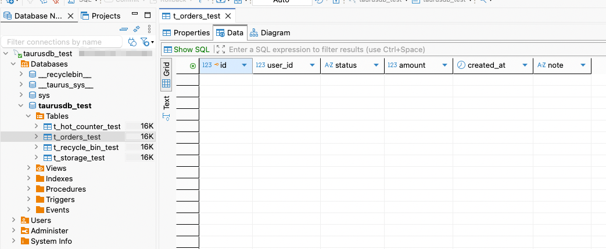

把递归深度调大：

```sql
SET SESSION cte_max_recursion_depth = 220000;
```

一次性插入 200000 行测试数据：

```sql
INSERT INTO t_orders_test (user_id, status, amount, created_at, note)
WITH RECURSIVE seq AS (
  SELECT 1 AS n
  UNION ALL
  SELECT n + 1 FROM seq WHERE n < 200000
)
SELECT
  FLOOR(1 + RAND() * 20000) AS user_id,
  ELT(1 + FLOOR(RAND() * 4), 'PENDING', 'PAID', 'CANCELLED', 'REFUNDED') AS status,
  ROUND(10 + RAND() * 20000, 2) AS amount,
  NOW() - INTERVAL FLOOR(RAND() * 365) DAY AS created_at,
  CONCAT(
    'note_',
    FLOOR(RAND() * 1000000),
    '_',
    RPAD('', 300, 'x')
  ) AS note
FROM seq;
```

确认数据量：

```sql
SELECT COUNT(*) AS total_rows FROM t_orders_test;
```

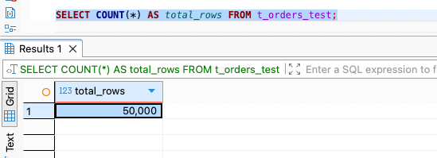

再把一部分 `note` 扩长一轮，增加文本扫描和排序代价：

```sql
UPDATE t_orders_test
SET note = CONCAT(note, '_', RPAD('', 300, 'y'))
WHERE id % 2 = 0;
```

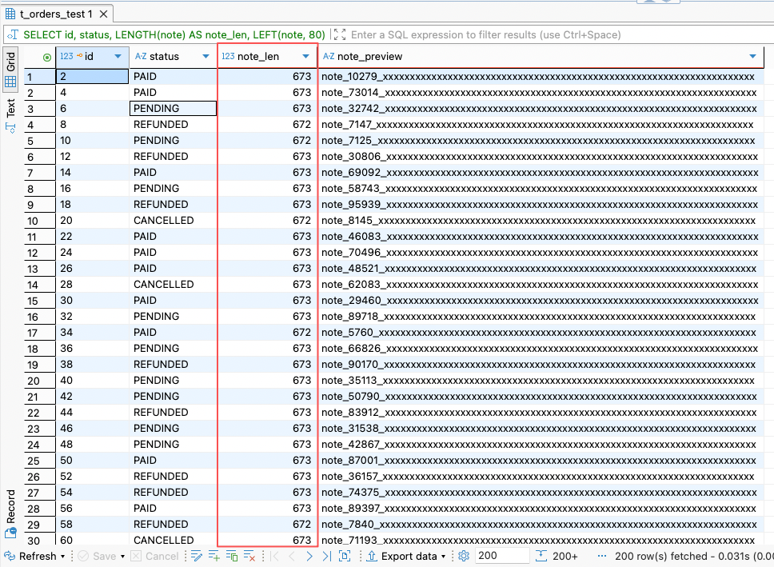

验证长 `note` 更新成功：

```sql
SELECT
  id,
  status,
  LENGTH(note) AS note_len,
  LEFT(note, 200) AS note_preview
FROM t_orders_test
WHERE id % 2 = 0
LIMIT 10;
```

前置造数阶段建议保留 4 张图：

- 造数前表结构
- 造数后记录数
- 长 `note` 更新后的样本行
- 基础造数脚本执行成功

#### 4.2.2 performance_schema 前置限制

如果要使用 `find_top_slow_sql` 或 `diagnose_slow_query` 做本地慢 SQL 分析，请先确认实例已开启 `performance_schema`。如果该参数为 `OFF`，本地 `statement digest` 证据不可用，结果通常会返回 `inconclusive` 或明确提示 `performance_schema` 未开启。

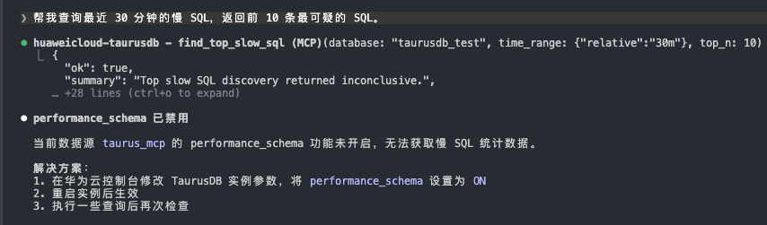

如果当前实例未开启 `performance_schema`，建议按以下步骤处理：

1. 进入华为云 TaurusDB 实例控制台
2. 打开实例参数配置页面
3. 将参数 `performance_schema` 修改为 `ON`
4. 保存参数变更
5. 重启实例，使参数生效
6. 重启后重新执行测试查询，再调用 `find_top_slow_sql` 或 `diagnose_slow_query`

#### 4.2.3 场景 1：模糊匹配 + 排序 + 大 offset

目标：

- 验证 `LIKE '%999%'` 导致的全表扫描
- 验证排序 + offset 对慢 SQL 排名的影响
- 验证 `find_top_slow_sql` 和 `diagnose_slow_query` 能否识别该场景

```sql
SELECT
  id,
  user_id,
  status,
  amount,
  created_at
FROM t_orders_test
WHERE note LIKE '%999%'
ORDER BY created_at DESC
LIMIT 100 OFFSET 500;
```

建议连续执行这条 SQL `5-10` 次，再立刻调用 `find_top_slow_sql`。

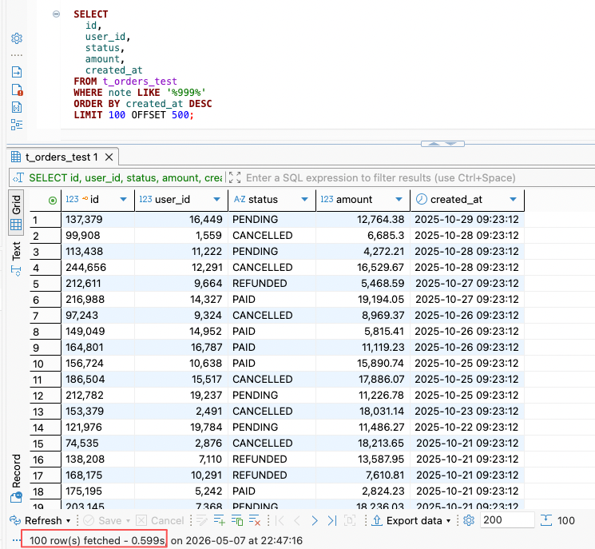

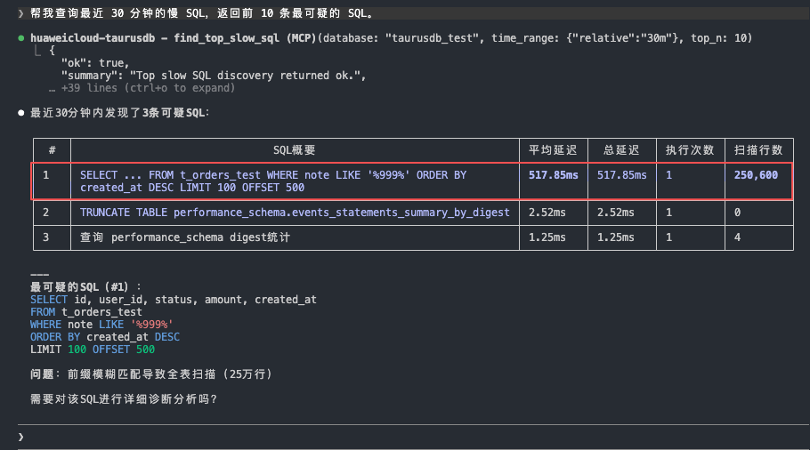

场景 1 根因分析结果：
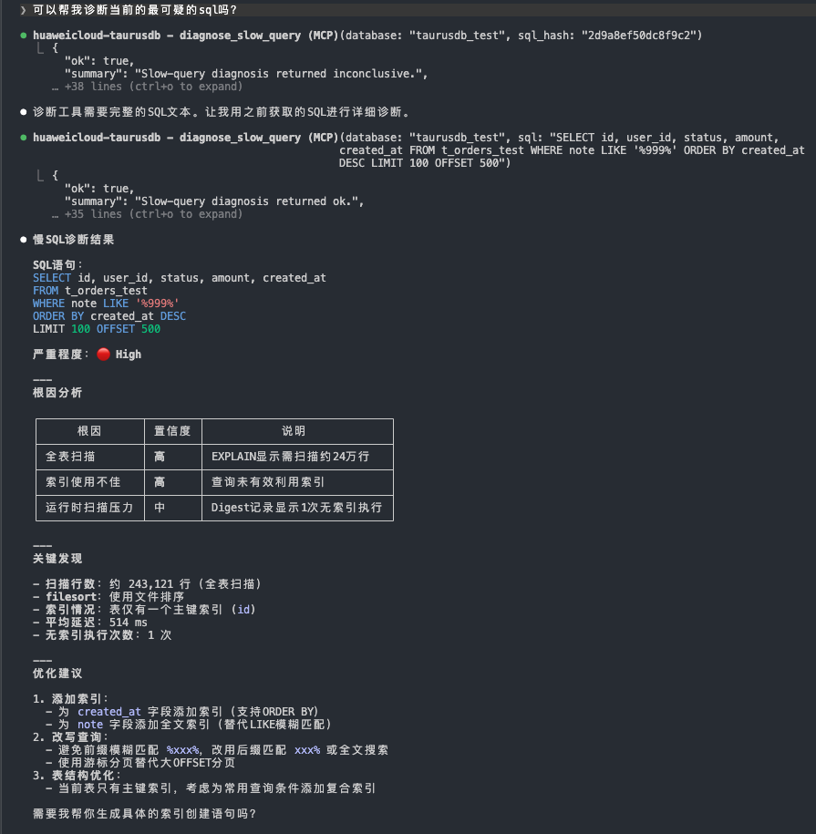

场景 1 结论：`find_top_slow_sql` 已识别 `LIKE '%999%'` 查询，`diagnose_slow_query` 已给出全表扫描、模糊匹配和排序相关根因。

场景 1 需要至少 3 张图：

1. 场景 1 SQL 执行截图
2. `find_top_slow_sql` 命中场景 1 SQL 的截图
3. `diagnose_slow_query` 返回场景 1 根因分析的截图

场景 1 验收点：

- `find_top_slow_sql` 中能看到 `WHERE note LIKE '%999%'`
- `diagnose_slow_query` 能指出全表扫描、模糊匹配或排序相关问题
- 返回里最好包含 `rows_examined`、`avg_latency_ms` 或 explain 证据

#### 4.2.4 场景 2：按无索引列排序并返回长字段

目标：

- 验证长字段返回和无索引排序的慢 SQL 场景
- 验证大 offset 和 `ORDER BY note DESC` 是否能进入慢 SQL 排名
- 验证根因分析能否指出 `ORDER BY note DESC` 的问题

```sql
SELECT
  id,
  user_id,
  status,
  amount,
  created_at,
  note
FROM t_orders_test
WHERE status IN ('PENDING', 'PAID', 'CANCELLED', 'REFUNDED')
ORDER BY note DESC
LIMIT 200 OFFSET 20000;
```

建议连续执行这条 SQL `5-10` 次，再立刻调用 `find_top_slow_sql`。

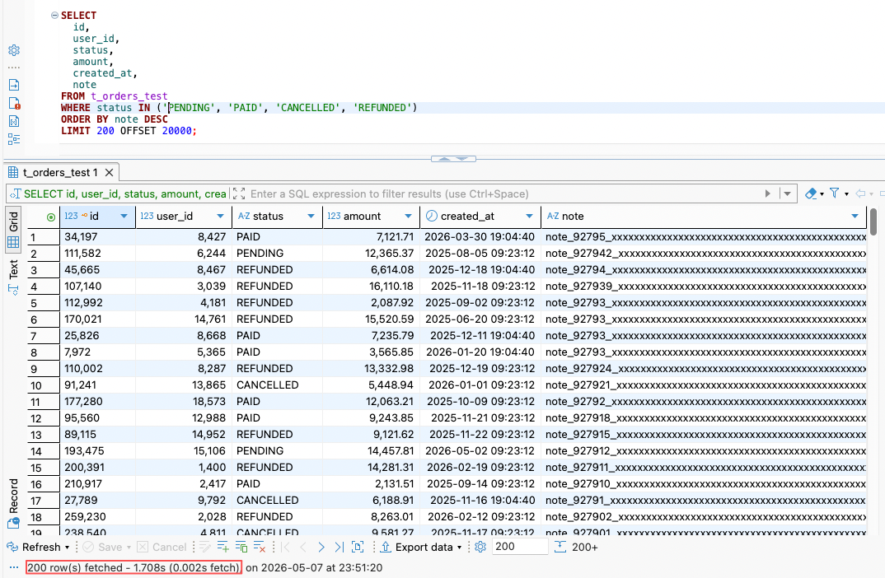
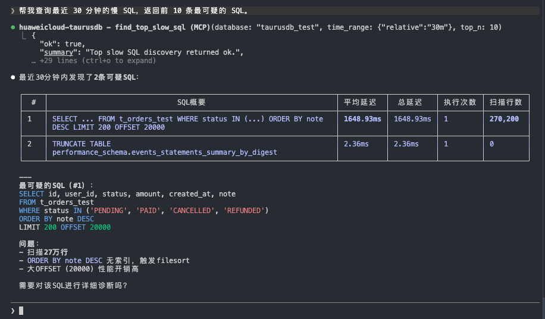

场景 2 根因分析结果：
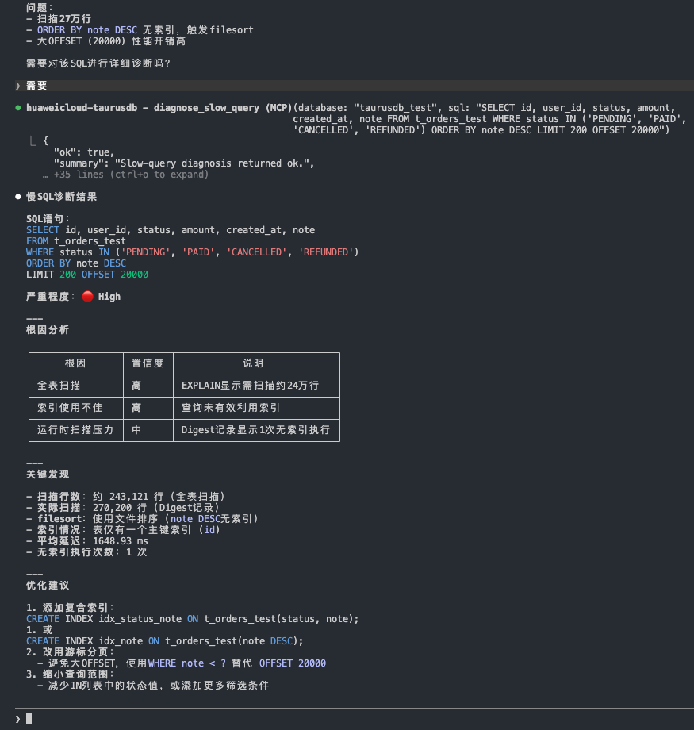

场景 2 结论：`find_top_slow_sql` 已识别 `ORDER BY note DESC` 查询，`diagnose_slow_query` 已给出无索引排序、长字段返回和大 offset 相关根因。

场景 2 需要至少 3 张图：

1. 场景 2 SQL 执行截图
2. `find_top_slow_sql` 命中场景 2 SQL 的截图
3. `diagnose_slow_query` 返回场景 2 根因分析的截图

场景 2 验收点：

- `find_top_slow_sql` 中能看到 `ORDER BY note DESC`
- `diagnose_slow_query` 能指出无索引排序、长字段返回、大 offset 或排序代价问题
- 返回里最好包含 `rows_examined`、`avg_latency_ms` 或 explain 证据

#### 4.2.5 慢 SQL 场景统一执行顺序

推荐顺序：

1. 先插入 200000 行
2. 截图 `COUNT(*)`
3. 截图长 `note` 样本行
4. 连续执行场景 1 SQL
5. 立刻调用 `find_top_slow_sql`
6. 对场景 1 SQL 调用 `diagnose_slow_query`
7. 连续执行场景 2 SQL
8. 再次调用 `find_top_slow_sql`
9. 对场景 2 SQL 调用 `diagnose_slow_query`

慢 SQL 场景统一截图点：

- 造数前表为空
- 造数后记录数
- 长 note 更新成功后的样本行
- 场景 1 SQL 执行结果
- 场景 1 的 `find_top_slow_sql`
- 场景 1 的 `diagnose_slow_query`
- 场景 2 SQL 执行结果
- 场景 2 的 `find_top_slow_sql`
- 场景 2 的 `diagnose_slow_query`

### 4.3 造连接压力样本

目标：验证 `diagnose_connection_spike` / `show_processlist`。

#### 4.3.1 场景目标

- 验证工具是否能识别 `Sleep` 会话堆积
- 验证工具是否能识别活跃会话和连接增长
- 验证 `show_processlist` 与 `diagnose_connection_spike` 的联合证据链

#### 4.3.2 场景准备

建议至少准备 3 个数据库会话：

1. 会话 A：保持空闲，制造 `Sleep`
2. 会话 B：保持空闲，制造 `Sleep`
3. 会话 C：执行较慢 SQL，制造活跃连接

如果希望连接特征更明显，可以再加 1 到 2 个会话。

#### 4.3.3 触发步骤

会话 A：

```sql
SELECT 1;
```

执行后保持连接不断开，让它进入 `Sleep`。

会话 B：

```sql
SELECT 1;
```

执行后保持连接不断开，让它进入 `Sleep`。

会话 C：

```sql
SELECT
  id,
  user_id,
  status,
  amount,
  created_at,
  note
FROM t_orders_test
WHERE status IN ('PENDING', 'PAID', 'CANCELLED', 'REFUNDED')
ORDER BY note DESC
LIMIT 200 OFFSET 20000;
```

如果需要更多活跃连接，再额外开会话 D、E 执行同类慢 SQL。

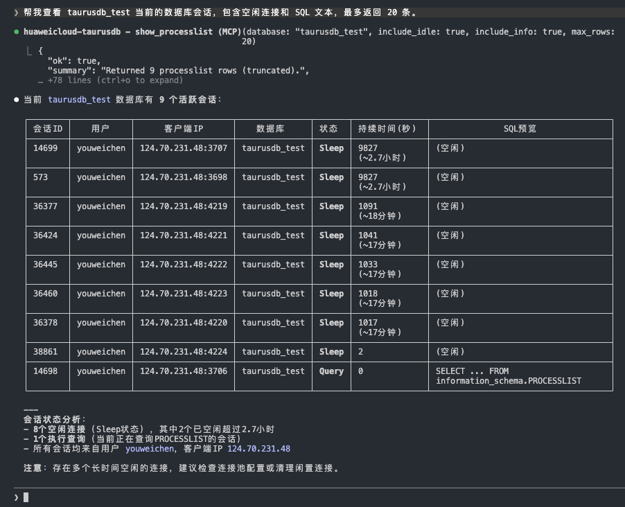

无ces指标：
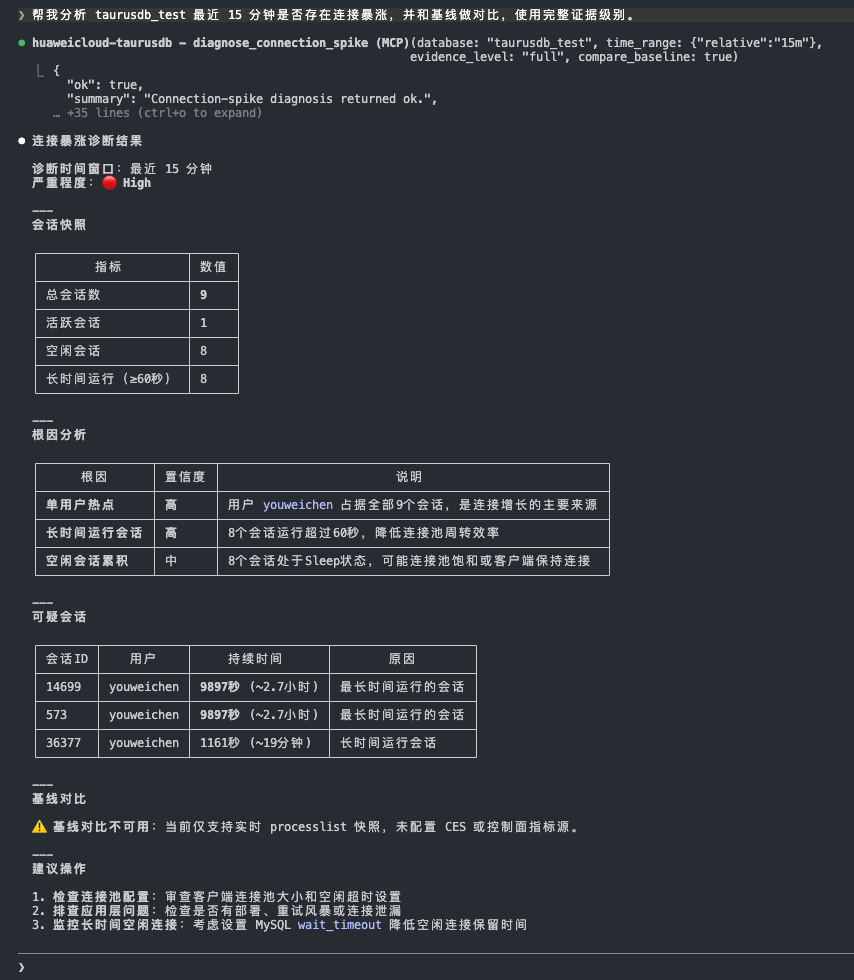

#### 4.3.4 MCP 调用

先调用：

```json
{
  "datasource": "taurus_mcp",
  "database": "taurusdb_test",
  "include_idle": true,
  "include_info": true,
  "max_rows": 20
}
```

对应工具：

- `show_processlist`

然后调用：

```json
{
  "datasource": "taurus_mcp",
  "database": "taurusdb_test",
  "time_range": { "relative": "15m" },
  "compare_baseline": true,
  "evidence_level": "full"
}
```

对应工具：

- `diagnose_connection_spike`

#### 4.3.5 需要截图的结果

连接压力场景至少保留 3 张图：

1. 会话 C 的慢 SQL 执行截图
2. `show_processlist` 结果截图
3. `diagnose_connection_spike` 结果截图

#### 4.3.6 验收点

- `show_processlist` 中能看到 `Sleep` 会话
- `show_processlist` 中能看到至少一条活跃 SQL
- `diagnose_connection_spike` 返回 `evidence`
- `diagnose_connection_spike` 最好能指出连接堆积、可疑 user、client host 或会话状态

#### 4.3.7 场景结论模板

连接压力场景结论：`show_processlist` 已捕获空闲和活跃会话，`diagnose_connection_spike` 已返回连接增长相关证据，并能继续下钻到慢 SQL 或锁竞争方向。

### 4.4 造锁竞争样本

目标：验证 `diagnose_lock_contention`。

#### 4.4.1 场景目标

- 验证工具是否能识别 blocker / waiter
- 验证工具是否能识别行锁竞争
- 验证工具是否能识别 `Sleep` 或无活跃 SQL 但事务未提交的 blocker
- 验证多 waiter 被同一个 blocker 阻塞时的聚合诊断能力
- 验证无锁基线和解锁后复测结果
- 验证 `diagnose_lock_contention` 是否返回结构化证据和根因方向

#### 4.4.2 前置准备

确保热点表和测试数据已存在。建议在 DBeaver / DataGrip 中执行写 SQL，因为 MCP 默认只读工具不执行 DDL / DML。

```sql
INSERT INTO t_hot_counter_test (counter_key, counter_value, updated_at)
VALUES ('global', 0, NOW())
ON DUPLICATE KEY UPDATE updated_at = NOW();
```

建议至少准备 3 到 4 个数据库会话：

- 会话 A：持有事务不提交，作为 blocker
- 会话 B：更新同一行，作为 waiter
- 会话 C：可选，更新同一行，制造多 waiter
- 会话 D：可选，用于执行 `ALTER TABLE` 验证 metadata lock / 表级锁方向

#### 4.4.3 场景 0：无锁竞争基线

在没有任何未提交事务和阻塞 SQL 时，先调用锁竞争诊断，作为正常状态对照。

自然语言触发：

```text
帮我分析 taurusdb_test 当前是否存在锁竞争，使用完整证据级别，并返回原始证据。
```

预期结果：

- 当前锁等待数为 0，或返回无明显锁竞争
- 当前实现通常返回 `status=inconclusive`、`severity=info`，表示当前快照没有捕获到锁等待，不代表工具失败
- 这张图用于证明工具在无问题时不会误报

截图点：

1. 无锁竞争时的 `diagnose_lock_contention` 结果截图

#### 4.4.4 场景 1：单 blocker / 单 waiter 行锁竞争

这个场景建议按“先看 blocker，再看 waiter，然后看 processlist，最后看诊断结果”的顺序阅读截图。

会话 A 执行：

```sql
BEGIN;
UPDATE t_hot_counter_test
SET counter_value = counter_value + 1, updated_at = NOW()
WHERE counter_key = 'global';
```

执行后不要提交，让会话 A 持有 `global` 这一行的行锁。

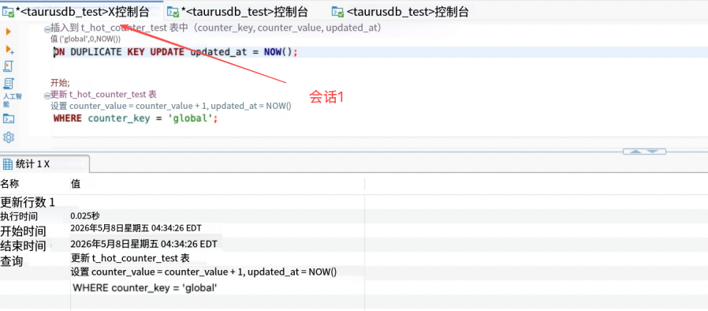

会话 B 执行：

```sql
UPDATE t_hot_counter_test
SET counter_value = counter_value + 1, updated_at = NOW()
WHERE counter_key = 'global';
```

会话 B 会被挂起，保持这个阻塞窗口，不要中断。

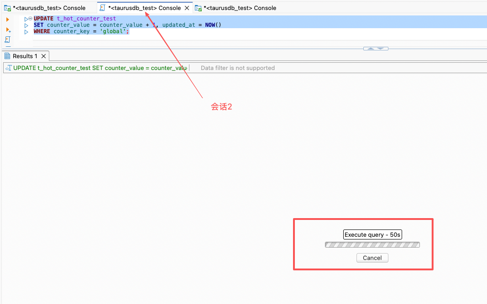

到这里，前两张 SQL 客户端截图已经建立了最基本的角色对应关系：

1. 第一张图先证明会话 A 未提交事务，是 blocker。
2. 第二张图再证明会话 B 更新同一行后进入等待，是 waiter。
3. 后续的 `show_processlist` 截图用于把 blocker / waiter 的 session id 固定下来。
4. 最后的 `diagnose_lock_contention` 截图用于把现场现象收口成结构化结论。

先看现场：

```text
帮我查看 taurusdb_test 当前的数据库会话，包含空闲连接和 SQL 文本，最多返回 20 条。
```

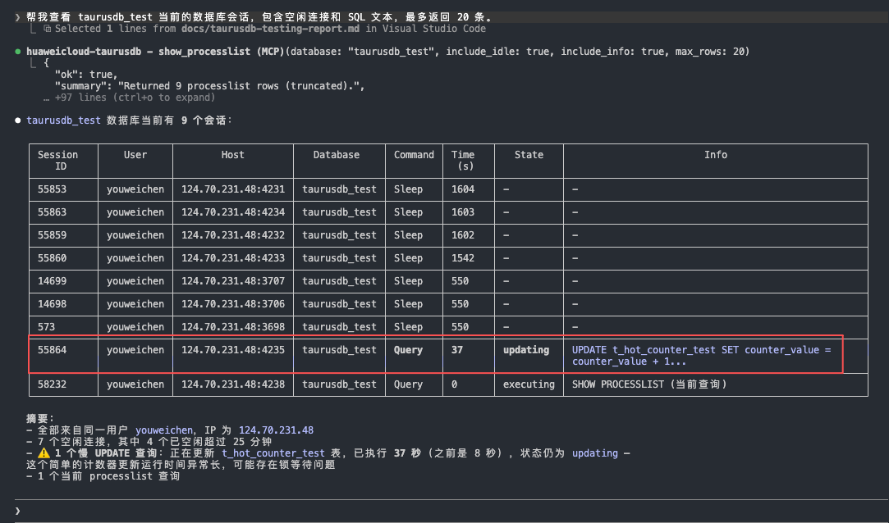

再做锁竞争诊断：

```text
帮我分析 taurusdb_test 当前是否存在锁竞争，使用完整证据级别，并返回原始证据。
```

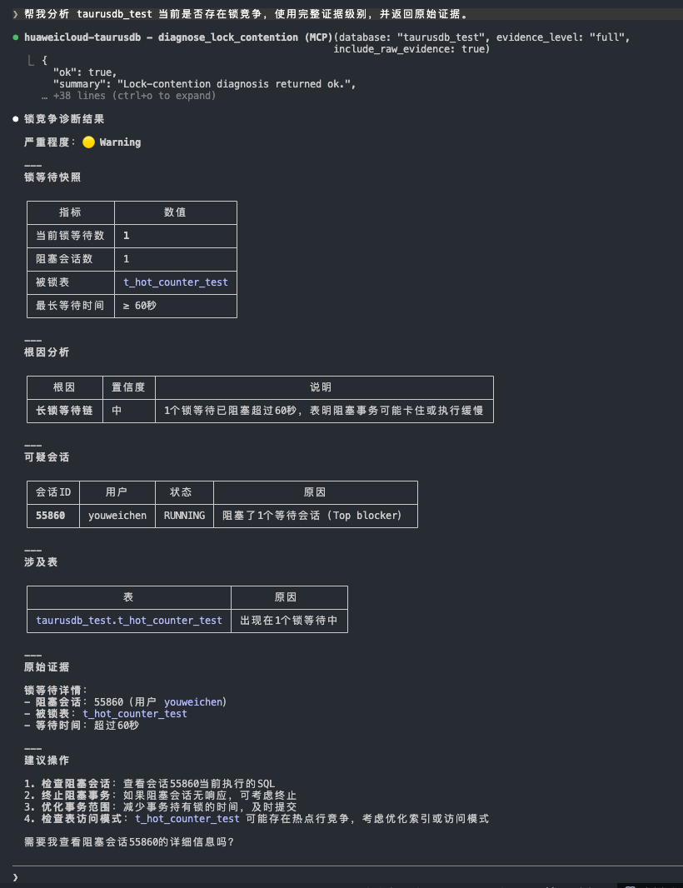

推荐排版顺序：

1. 第一排先放会话 A 和会话 B 两张 SQL 客户端截图，标题分别标成“图 1 blocker”“图 2 waiter”。
2. 第二排放 `show_processlist`，图注里重复标出会话 A / B 的 session id，对齐第一排角色。
3. 第三排放 `diagnose_lock_contention`，图注里直接写“已识别 blocker 与 waiter”，让读者在最后一张图完成结论闭环。
4. 如果版面有限，优先保证 `show_processlist` 和 `diagnose_lock_contention` 中的 session id 与关键信息可读，不要把证据图压缩到无法对照。

场景 1 结论：会话 A 未提交事务并持有热点行锁，会话 B 更新同一行进入等待，`show_processlist` 和 `diagnose_lock_contention` 能共同证明当前存在行锁竞争。

#### 4.4.5 场景 2：单 blocker / 多 waiter

保持场景 1 中的会话 A 不提交，再额外打开会话 C 和会话 D，对同一行执行相同更新。这个场景建议按“先看 blocker，再看两个 waiter，最后看诊断结果”的顺序阅读截图。

步骤 1：确认 blocker 仍在持锁。

会话 A（blocker，持续持有 `counter_key = 'global'` 的行锁）：
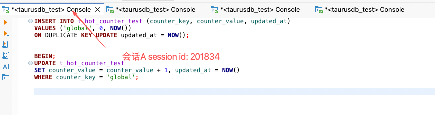

步骤 2：制造第一个 waiter。

会话 C（waiter 1，对同一行发起更新并进入等待）：

```sql
UPDATE t_hot_counter_test
SET counter_value = counter_value + 1, updated_at = NOW()
WHERE counter_key = 'global';
```

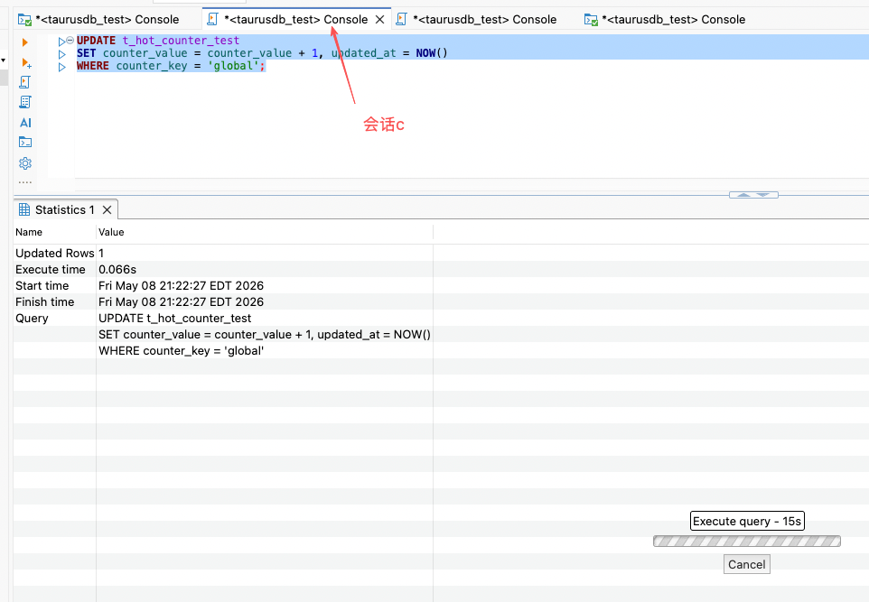

步骤 3：制造第二个 waiter。

会话 D（waiter 2，对同一行发起相同更新并进入等待）：

```sql
UPDATE t_hot_counter_test
SET counter_value = counter_value + 1, updated_at = NOW()
WHERE counter_key = 'global';
```

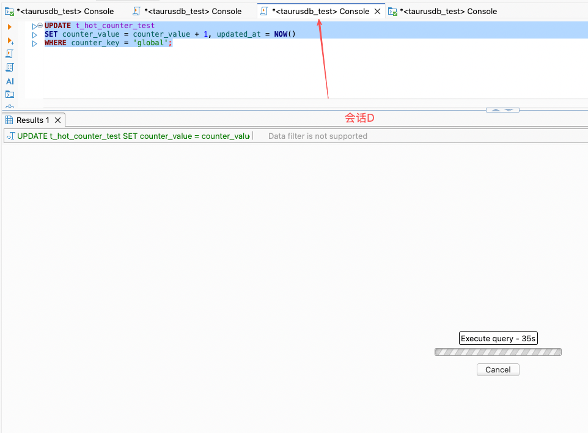

到这里，三张 SQL 客户端截图已经能建立最基本的时间线和角色对应关系：

1. 图 1 先证明会话 A 没有提交，是唯一 blocker。
2. 图 2 再证明会话 C 被同一热点行阻塞，是 waiter 1。
3. 图 3 最后证明会话 D 也被同一热点行阻塞，是 waiter 2。
4. 后续的 `show_processlist` 和 `diagnose_lock_contention` 截图，应分别用来做“现场证据补强”和“结构化结论收口”。

自然语言触发：

```text
帮我分析 taurusdb_test 当前是否存在锁竞争，重点看是否有单个 blocker 阻塞多个 waiter，使用完整证据级别，并返回原始证据。
```

预期结果：

- `diagnose_lock_contention` 能看到同一个 blocker 关联多个等待会话
- 根因候选应指向单 blocker 热点、热点行或长事务持锁
- 可疑会话中应出现 blocker session id

截图点：

1. SQL 客户端时间线截图：按“blocker A -> waiter C -> waiter D”的顺序摆放，证明单个 blocker 先后阻塞两个 waiter
2. `show_processlist` 结果截图：把会话 A / C / D 的 session id 放在同一张图里，作为 SQL 客户端截图与诊断结果之间的映射桥梁
3. `diagnose_lock_contention` 结果截图：高亮同一个 blocker 关联多个 waiter，作为该场景的最终结论图

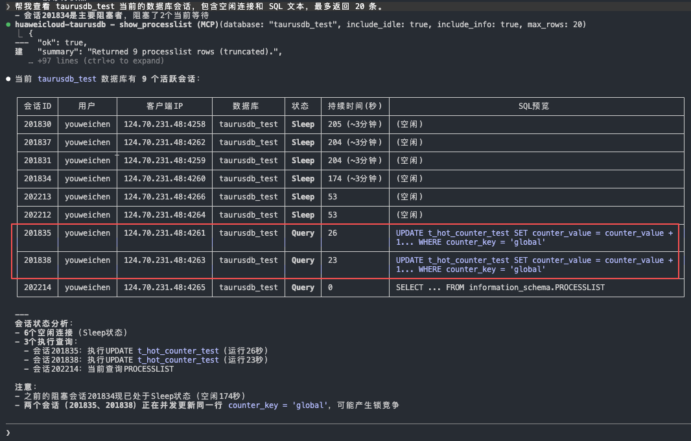

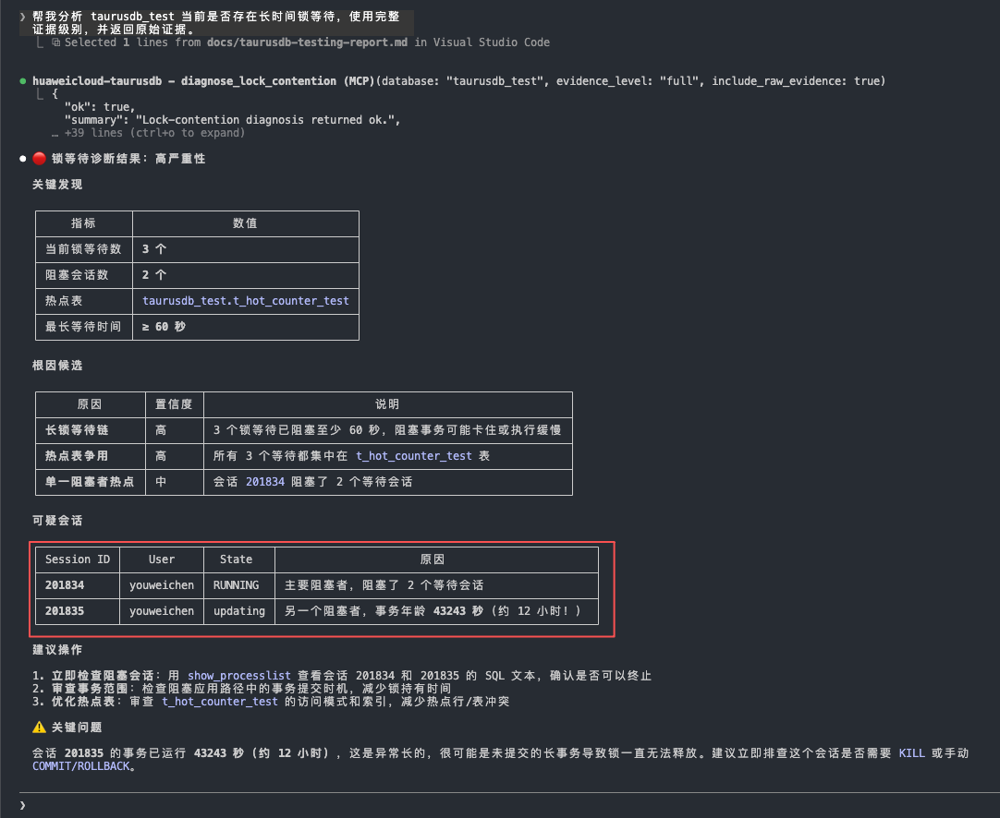

推荐排版顺序：

1. 第一排先放 3 张 SQL 客户端截图，标题分别标成“图 1 blocker”“图 2 waiter 1”“图 3 waiter 2”。
2. 第二排放 `show_processlist`，对应图 4，在图注里重复标出会话 A / C / D 的 session id，对齐第一排角色。
3. 第三排放 `diagnose_lock_contention`，对应图 5，图注里直接写“同一个 blocker 关联多个 waiter”，让读者在最后一张图完成结论闭环。
4. 如果版面有限，宁可把图 4 和图 5 放大，也不要压缩第一排三张图到看不清 session id。

#### 4.4.6 场景 3：表级锁 / Metadata Lock 方向

该场景用于验证 DDL 或 metadata lock 相关的诊断方向。执行前确认这是测试库，避免影响真实业务。

步骤 1：先让会话 A 持有事务上下文，作为后续 DDL 等待的前置条件。

会话 A（保持事务不提交，用于制造后续 DDL 等待窗口）：

```sql
BEGIN;
SELECT * FROM t_hot_counter_test WHERE counter_key = 'global' FOR UPDATE;
```

会话 A 不提交。

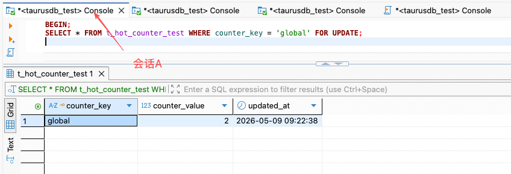

步骤 2：再让会话 D 执行 DDL，观察是否进入 metadata lock 或表级锁等待。

会话 D（执行 `ALTER TABLE`，如果出现挂起即说明已进入等待窗口）：

```sql
ALTER TABLE t_hot_counter_test ADD COLUMN mdl_test_col INT NULL;
```

如果列已经存在，先换一个临时列名，例如 `mdl_test_col_2`。保持会话 D 等待时立即调用诊断。

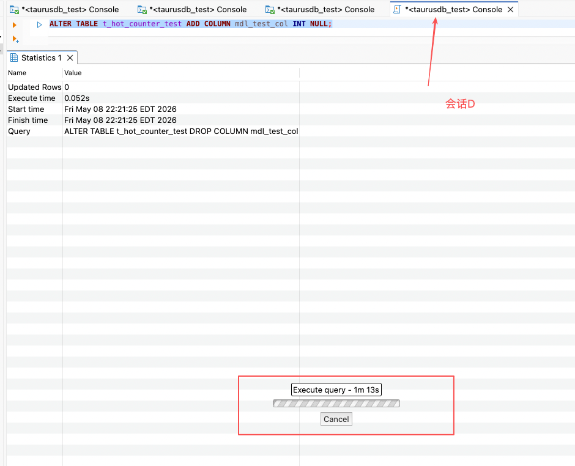

这个场景也建议按“先看 DDL 等待，再看 processlist 现场，最后看诊断结论”的顺序组织截图：

1. 第一张图先证明 `ALTER TABLE` 已经挂起，说明等待窗口已经形成。
2. 第二张图再用 `show_processlist` 把等待中的 DDL 会话和对应 session id 固定下来。
3. 第三张图最后用 `diagnose_lock_contention` 判断这是 metadata lock、表级锁，还是更宽泛的 DDL 被阻塞方向。

自然语言触发：

```text
帮我分析 taurusdb_test 当前是否存在表级锁或 metadata lock 等待，使用完整证据级别，并返回原始证据。
```

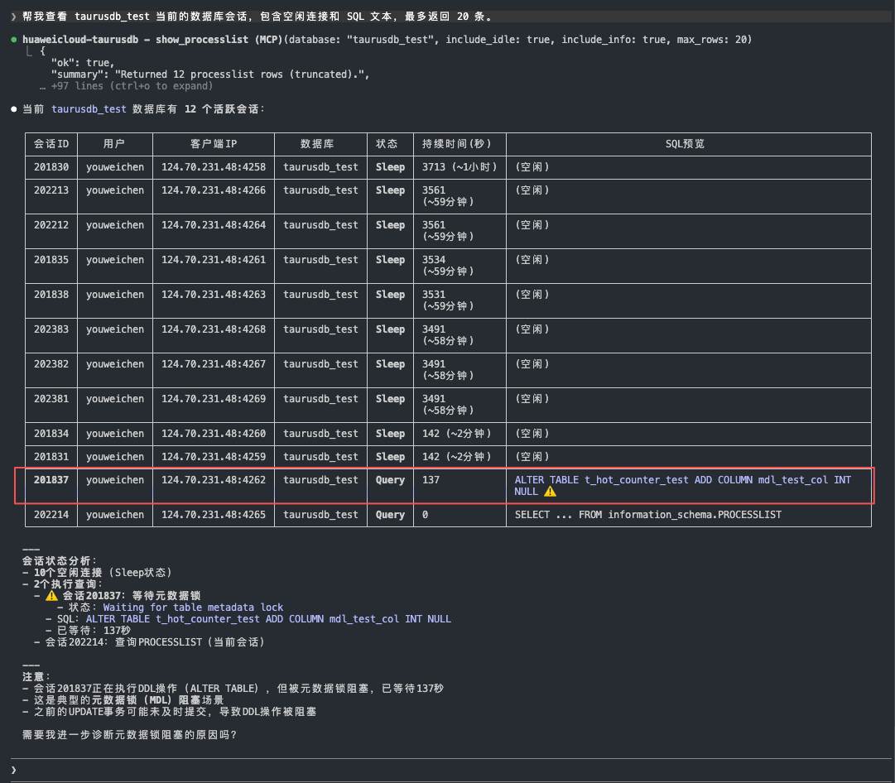

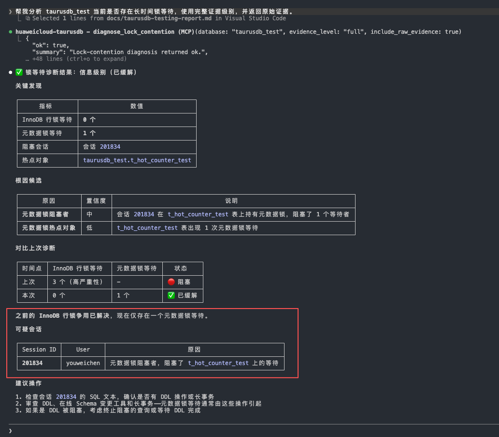

预期结果：

- `show_processlist` 可能看到 `ALTER TABLE` 等待
- `diagnose_lock_contention` 可能返回 metadata lock、表级锁或 DDL 被阻塞方向
- 如果当前内核或权限无法暴露 metadata lock 细节，报告中应记录为“未获取到 metadata lock 明细，但 processlist 已捕获 DDL 等待”

清理 SQL：

```sql
ROLLBACK;
ALTER TABLE t_hot_counter_test DROP COLUMN mdl_test_col;
```

如果使用了其他临时列名，清理对应列名。

截图点：

1. SQL 客户端时间线截图：会话 D 的 `ALTER TABLE` 等待截图，作为 DDL 被阻塞的起点证据
2. `show_processlist` 结果截图：把等待中的 `ALTER TABLE`、对应 session id 和等待时长放在同一张图里，作为客户端截图与诊断结果之间的映射桥梁
3. `diagnose_lock_contention` 结果截图：高亮 metadata lock、表级锁或 DDL 被阻塞方向，作为该场景的最终结论图

推荐排版顺序：

1. 第一排放会话 D 的 `ALTER TABLE` 等待截图，图注里直接写“DDL 已进入等待窗口”。
2. 第二排放 `show_processlist`，图注里重复标出 `ALTER TABLE` 对应 session id，和第一排对齐。
3. 第三排放 `diagnose_lock_contention`，图注里明确写“诊断已指向 metadata lock / 表级锁 / DDL 被阻塞方向”。
4. 如果诊断结果没有直接给出 metadata lock 明细，就在图注里明确说明“未拿到 metadata lock 明细，但 processlist 已证实 DDL 正在等待”，避免读者误判为场景失败。

### 4.5 造存储压力样本

目标：验证 `diagnose_storage_pressure`。

方案：

1. 向 `t_storage_test` 插入约 1000 行长文本数据，制造表存储占用
2. 执行 `GROUP BY + ORDER BY` 查询，制造临时表和排序压力
3. 可选：对比 `Created_tmp_disk_tables` 前后值，确认查询触发了磁盘临时表
4. 调用 `diagnose_storage_pressure`，确认返回 `statement_digest` 和 `table_storage` 证据

造数 SQL：

```sql
TRUNCATE TABLE t_storage_test;

INSERT INTO t_storage_test(category, payload, created_at)
SELECT
  CONCAT('cat-', MOD(a.n + b.n * 10 + c.n * 100, 20)),
  RPAD(CONCAT('payload-', a.n, '-', b.n, '-', c.n), 4096, 'x'),
  TIMESTAMP('2026-01-01') + INTERVAL (a.n + b.n * 10 + c.n * 100) SECOND
FROM
  (SELECT 0 n UNION ALL SELECT 1 UNION ALL SELECT 2 UNION ALL SELECT 3 UNION ALL SELECT 4
   UNION ALL SELECT 5 UNION ALL SELECT 6 UNION ALL SELECT 7 UNION ALL SELECT 8 UNION ALL SELECT 9) a
CROSS JOIN
  (SELECT 0 n UNION ALL SELECT 1 UNION ALL SELECT 2 UNION ALL SELECT 3 UNION ALL SELECT 4
   UNION ALL SELECT 5 UNION ALL SELECT 6 UNION ALL SELECT 7 UNION ALL SELECT 8 UNION ALL SELECT 9) b
CROSS JOIN
  (SELECT 0 n UNION ALL SELECT 1 UNION ALL SELECT 2 UNION ALL SELECT 3 UNION ALL SELECT 4
   UNION ALL SELECT 5 UNION ALL SELECT 6 UNION ALL SELECT 7 UNION ALL SELECT 8 UNION ALL SELECT 9) c;
```

如果想更稳定地触发临时表落盘，可以先设置：

```sql
SET SESSION internal_tmp_mem_storage_engine = MEMORY;
SET SESSION tmp_table_size = 1024;
SET SESSION max_heap_table_size = 1024;
```

压力查询 SQL：

```sql
SHOW SESSION STATUS LIKE 'Created_tmp_disk_tables';

SELECT category, payload, COUNT(*) AS row_count
FROM t_storage_test
GROUP BY category, payload
ORDER BY payload
LIMIT 20;

SHOW SESSION STATUS LIKE 'Created_tmp_disk_tables';
```

重点确认：

- 第二次 `Created_tmp_disk_tables` 比第一次大
- 上面的查询执行成功

`diagnose_storage_pressure` 推荐输入：

```json
{
  "datasource": "taurus_mcp",
  "database": "taurusdb_test",
  "scope": "table",
  "table": "t_storage_test",
  "evidence_level": "full",
  "include_raw_evidence": true,
  "max_candidates": 5
}
```

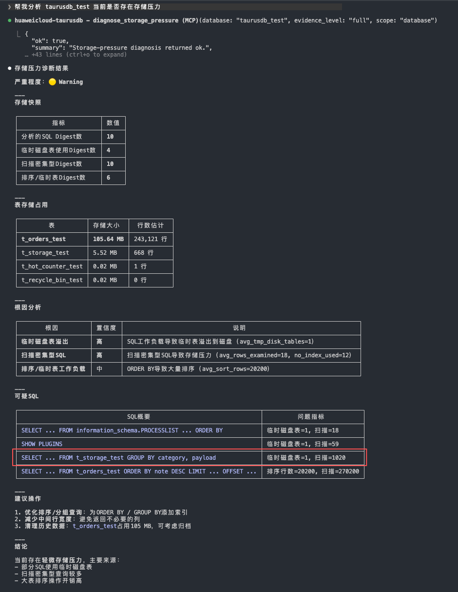

预期结果：

- 返回 `tool=diagnose_storage_pressure`
- 返回 `status=ok`
- `root_cause_candidates` 出现 `storage_pressure_tmp_disk_spill` 或 `storage_pressure_scan_heavy_sql`
- `evidence` 同时包含 `statement_digest` 和 `table_storage`
- `suspicious_entities.tables` 包含 `t_storage_test`

如果这一组没有稳定触发，可以把 `RPAD(..., 4096, 'x')` 提高到 `8192`，或把同一条压力查询连续执行 2 到 3 次。

截图点：

- `t_storage_test` 造数后的记录数或样本数据截图
- `Created_tmp_disk_tables` 前后对比截图
- `diagnose_storage_pressure` 返回 `statement_digest` / `table_storage` 证据的截图

### 4.6 回收站验证样本

前提：

- 当前实例支持 recycle bin
- tools 已暴露 `list_recycle_bin` / `restore_recycle_bin_table`

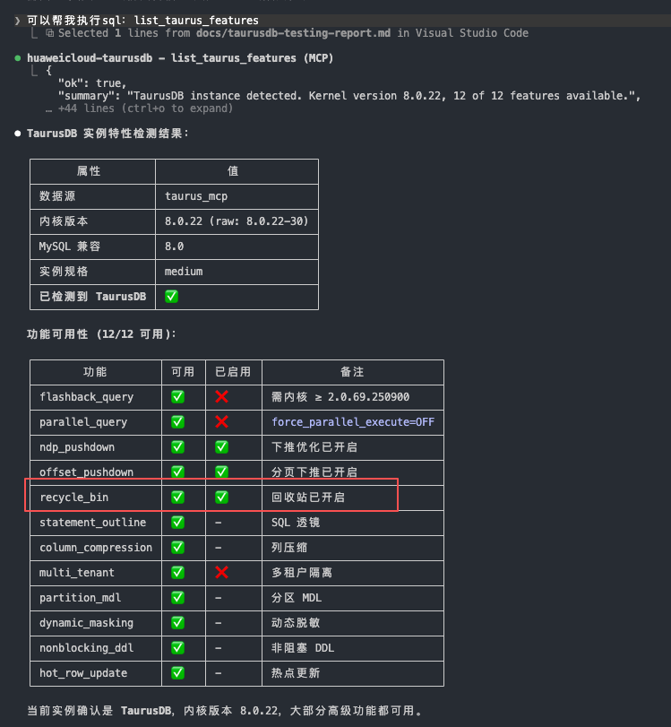
确认当前TaurusDB内核版本中支持并上线recyle_bin这个功能

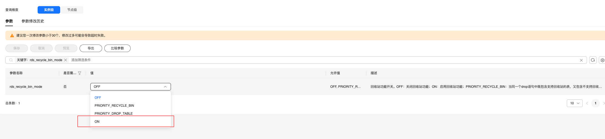
在参数列表中开启`rds_recycle_bin_mode`，设置成`ON`。

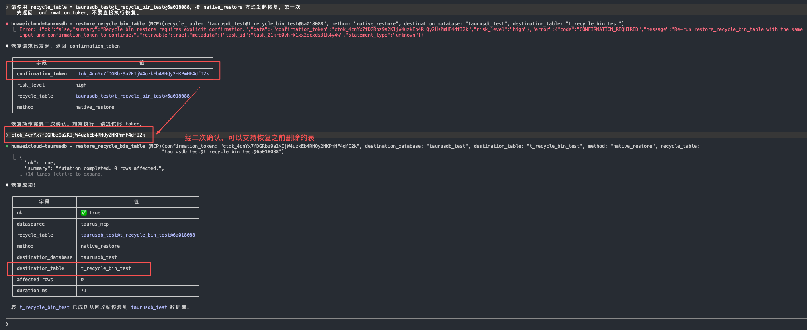

推荐先确认：

1. `list_taurus_features`
2. `list_recycle_bin`
3. `restore_recycle_bin_table`

最小造景步骤：

1. 建一个可丢弃测试表并插入少量数据
2. `DROP TABLE`，让目标表进入 TaurusDB recycle bin
3. 调用 `list_recycle_bin`
4. 第一次调用 `restore_recycle_bin_table`，不带 `confirmation_token`
5. 记录返回的 `confirmation_token`
6. 用完全相同的参数重试恢复

准备 SQL：

```sql
CREATE TABLE t_recycle_bin_test (
  id BIGINT PRIMARY KEY AUTO_INCREMENT,
  name VARCHAR(64) NOT NULL,
  created_at TIMESTAMP NOT NULL DEFAULT CURRENT_TIMESTAMP
) ENGINE=InnoDB;

INSERT INTO t_recycle_bin_test(name) VALUES ('a'), ('b'), ('c');

DROP TABLE t_recycle_bin_test;
```

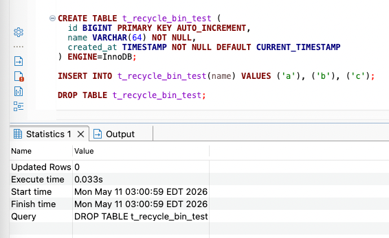

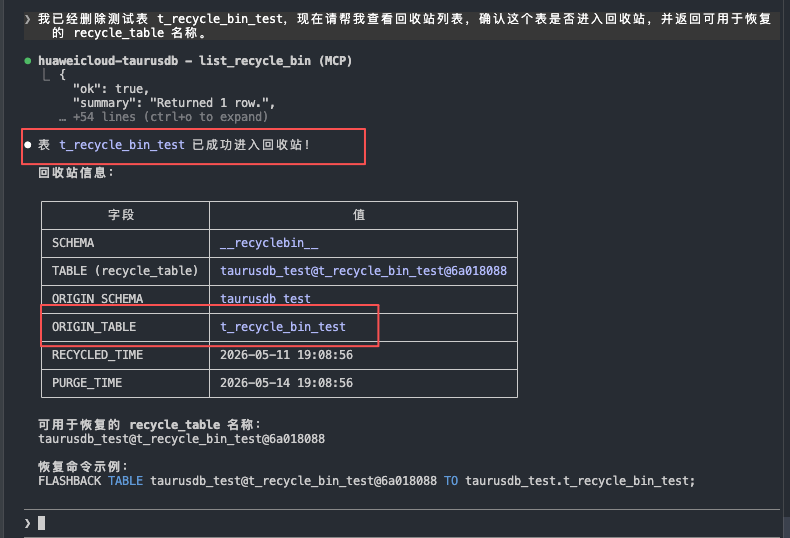

### 4.7 Flashback Query 验证样本

前提：

- 当前实例支持 `flashback_query`
- `flashback_query.enabled = true`
- 工具已暴露 `flashback_query`
- `SHOW VARIABLES LIKE 'innodb_rds_backquery_enable'` 返回 `ON` 或 `1`
- 测试表是 `InnoDB`，并且已经启用 `BACKQUERY=1`
- 使用可丢弃测试表，不要直接在生产表上构造历史版本

推荐先确认：

1. `list_taurus_features`
2. `execute_readonly_sql`
3. `flashback_query`

如果 `flashback_query.available = true` 但 `enabled = false`：

- 说明当前内核版本已经满足最低要求，但实例参数开关未开启，或尚未生效
- 需要先在 TaurusDB 控制台打开 `innodb_rds_backquery_enable`
- 如需对已有测试表启用 flashback，执行 `ALTER TABLE <table_name> BACKQUERY=1`
- 如果刚开启实例参数，等待状态切换完成后再重新探测 `list_taurus_features`

验证目标：

- `flashback_query` 能返回指定历史时间点的数据视图
- 当前普通 `SELECT` 能返回更新后的当前值
- 历史查询结果与当前结果存在预期差异
- `flashback_query` 只返回历史只读结果，不修改当前表数据

推荐验证步骤：

1. 建一个启用 `BACKQUERY=1` 的可丢弃测试表并插入初始数据
2. 记录一个时间点 `T1`
3. 等待 1 到 2 秒，确保更新与 `T1` 不落在同一秒
4. 对同一行执行 `UPDATE`，把 `status` 从 `draft` 改成 `published`
5. 记录第二个时间点 `T2`
6. 用普通 `SELECT` 查询当前结果，确认当前值已经变化
7. 用 `flashback_query` 按 `T1` 回查同一行历史值
8. 对比历史态与当前态

已验证截图：

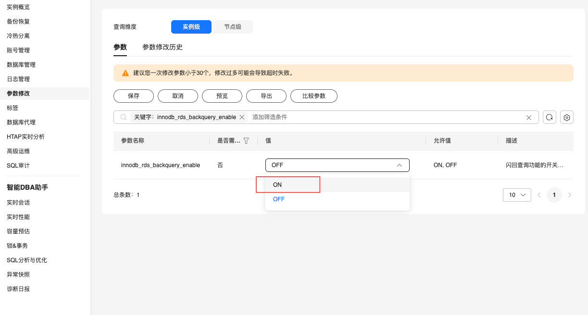

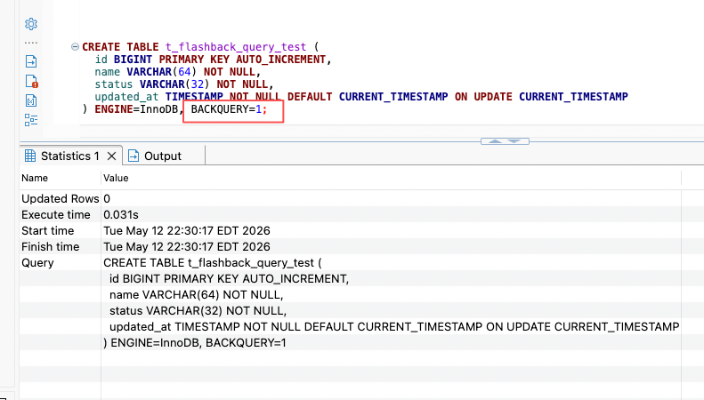

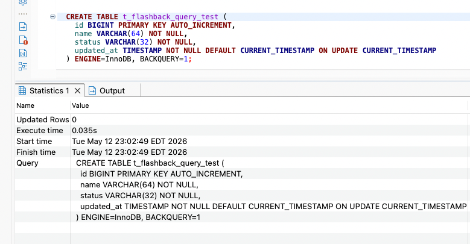

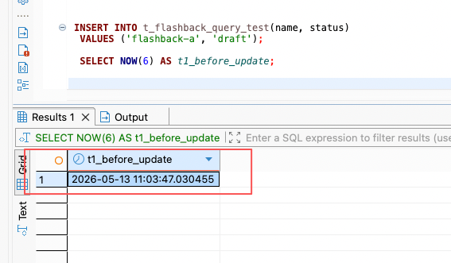

准备 SQL：

```sql
CREATE TABLE t_flashback_query_test (
  id BIGINT PRIMARY KEY AUTO_INCREMENT,
  name VARCHAR(64) NOT NULL,
  status VARCHAR(32) NOT NULL,
  updated_at TIMESTAMP NOT NULL DEFAULT CURRENT_TIMESTAMP ON UPDATE CURRENT_TIMESTAMP
) ENGINE=InnoDB, BACKQUERY=1;

INSERT INTO t_flashback_query_test(name, status)
VALUES ('flashback-a', 'draft');

SELECT NOW(6) AS t1_before_update;

UPDATE t_flashback_query_test
SET status = 'published'
WHERE id = 1;

SELECT NOW(6) AS t2_after_update;
```

时间点记录示例：

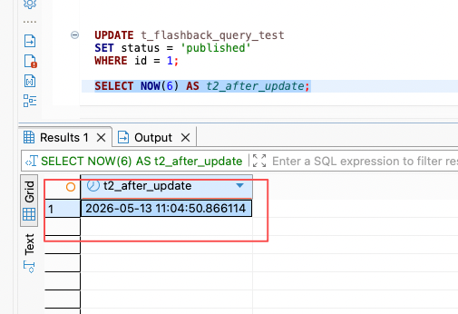

`flashback_query` 推荐输入：

```json
{
  "datasource": "taurus_mcp",
  "database": "taurusdb_test",
  "table": "t_flashback_query_test",
  "as_of": {
    "timestamp": "paste_t1_before_update_here"
  },
  "where": "id = 1",
  "columns": ["id", "name", "status", "updated_at"],
  "limit": 1
}
```

绝对时间查询示例：

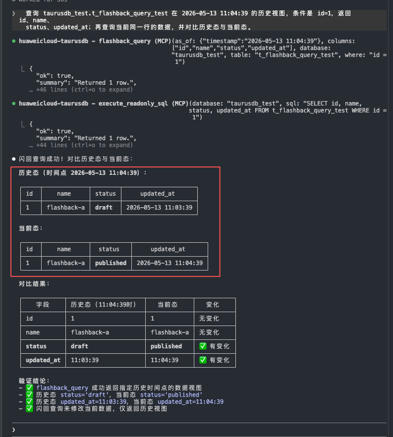

大致时间查询示例：

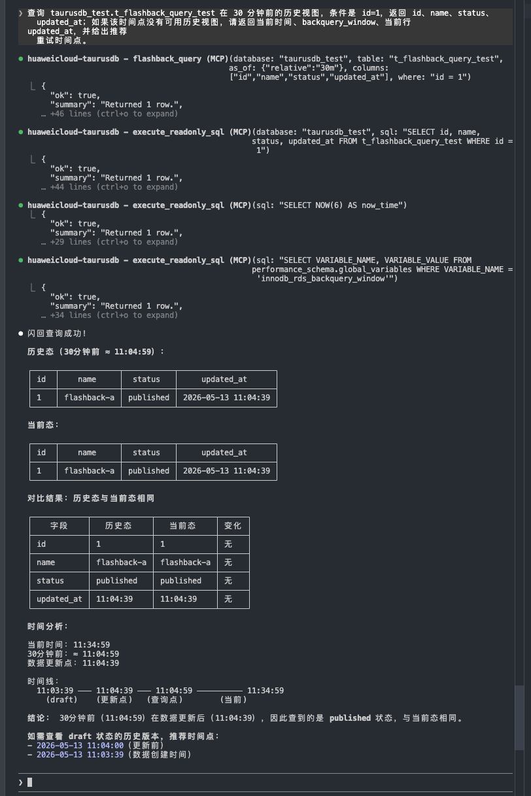

当前态对比 SQL：

```sql
SELECT id, name, status, updated_at
FROM t_flashback_query_test
WHERE id = 1;
```

验收：

- `flashback_query` 返回 `status='draft'`
- 当前普通 `SELECT` 返回 `status='published'`
- 历史态与当前态的 `updated_at` 存在预期差异
- `flashback_query` 只返回历史只读结果，不改变当前表数据

如果时间点太靠近导致结果不稳定：

- 在记录 `T1` 后等待 1 到 2 秒再执行 `UPDATE`
- 当前实现会把 flashback 时间点格式化到秒级；即使采集时用了 `NOW(6)`，实际查询仍按秒级时间点执行
- 当前实现支持自然语言中的相对时间表达，但底层仍要落到具体时间点；严格验证时建议优先使用 `T1` 的绝对时间
- 如果实例参数已开启但 tool 仍未暴露或仍显示 `enabled=false`，先重新执行 `list_taurus_features`，再检查实例参数是否已生效

截图点：

- `list_taurus_features` 中 `flashback_query` 状态
- `SHOW VARIABLES LIKE 'innodb_rds_backquery_enable'` 结果
- `T1` / `T2` 时间点记录
- `flashback_query` 返回历史值
- 普通 `SELECT` 返回当前值
- 同一行历史态与当前态对比结果

### 4.8 Enhanced Explain 专属能力验证样本

前提：
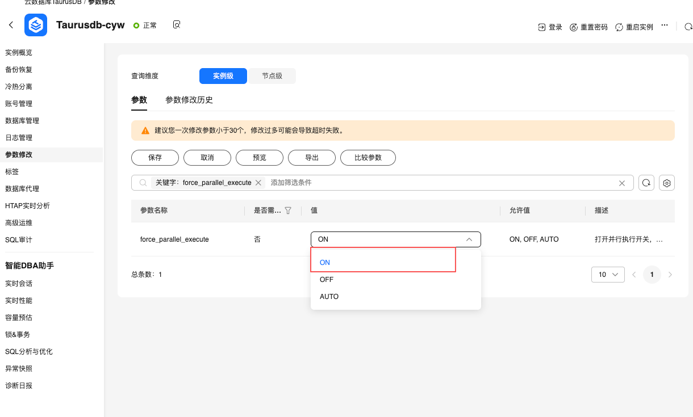

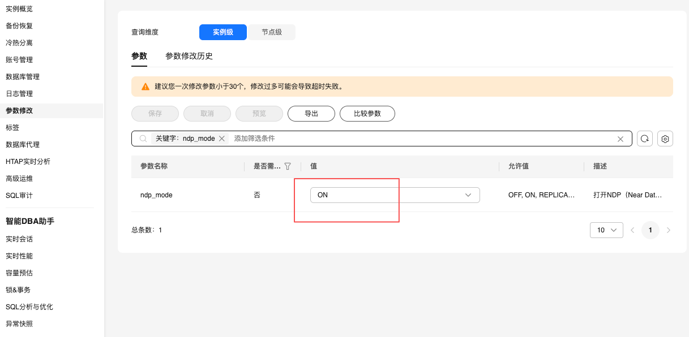

- 当前实例支持 TaurusDB 专属 explain 增强
- `list_taurus_features` 已返回 `ndp_pushdown`、`parallel_query`、`offset_pushdown`
- 工具已暴露 `explain_sql_enhanced`

推荐先确认：

1. `list_taurus_features`
2. `explain_sql_enhanced`

最小造景步骤：

1. 准备一张行数足够多的测试表
2. 分别构造大分页、聚合扫描、过滤聚合三类 SQL
3. 对每条 SQL 执行 `explain_sql_enhanced`
4. 记录返回中的 `taurusHints`、`optimizationSuggestions`、`blockedReason`

准备 SQL：

```sql
DROP TABLE IF EXISTS t_explain_taurus_test;

CREATE TABLE t_explain_taurus_test (
  id BIGINT PRIMARY KEY AUTO_INCREMENT,
  user_id BIGINT NOT NULL,
  status VARCHAR(32) NOT NULL,
  amount DECIMAL(12,2) NOT NULL,
  created_at DATETIME NOT NULL,
  note VARCHAR(255) NOT NULL
) ENGINE=InnoDB;

SET SESSION cte_max_recursion_depth = 60000;

INSERT INTO t_explain_taurus_test (user_id, status, amount, created_at, note)
WITH RECURSIVE seq AS (
  SELECT 1 AS n
  UNION ALL
  SELECT n + 1 FROM seq WHERE n < 50000
)
SELECT
  n % 1000,
  CASE
    WHEN n % 4 = 0 THEN 'paid'
    WHEN n % 4 = 1 THEN 'pending'
    WHEN n % 4 = 2 THEN 'cancelled'
    ELSE 'refunded'
  END,
  (n % 10000) / 10.0,
  TIMESTAMP('2026-01-01 00:00:00') + INTERVAL (n % 14400) MINUTE,
  RPAD(CONCAT('note-', n), 120, 'x')
FROM seq;
```

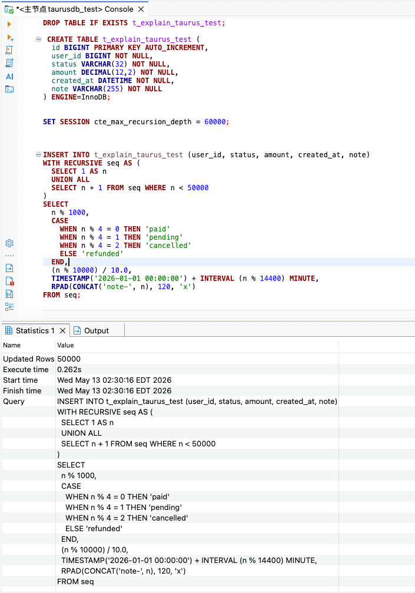

验证 SQL 1：`offset_pushdown`

```sql
SELECT id, user_id, status
FROM t_explain_taurus_test
ORDER BY id
LIMIT 20 OFFSET 5000;
```

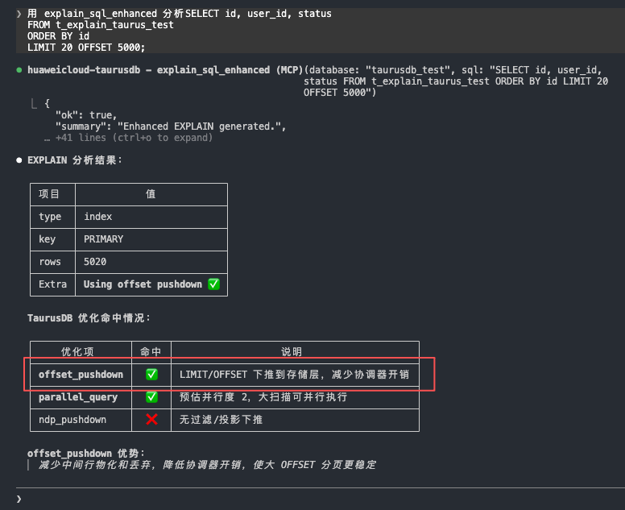

验证 SQL 2：`parallel_query`

```sql
SELECT status, COUNT(*) AS cnt
FROM t_explain_taurus_test
GROUP BY status;
```

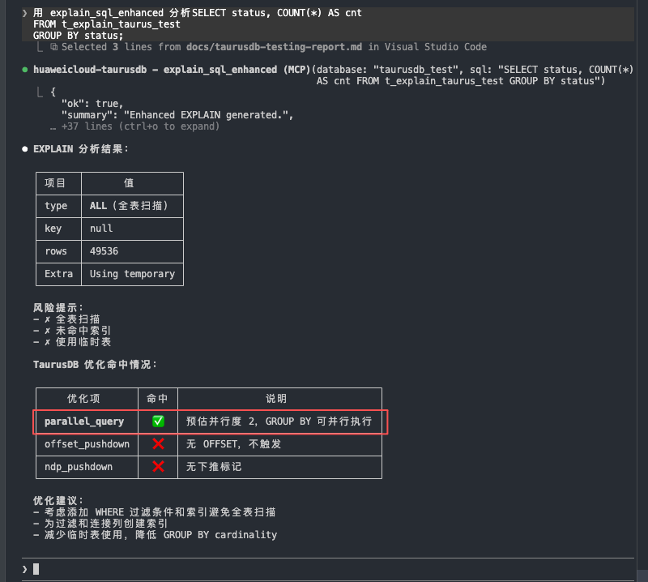

验证 SQL 3：`ndp_pushdown`

```sql
SELECT user_id, amount
    FROM t_orders_test WHERE status = 'paid'
      AND created_at >= '2026-01-03 00:00:00'
    LIMIT 1000;
```

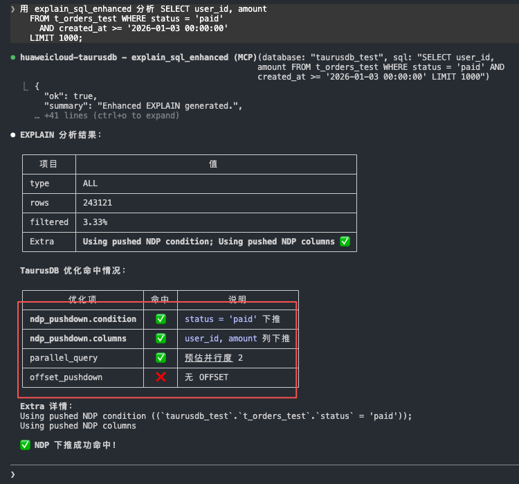

`explain_sql_enhanced` 推荐输入示例：

```json
{
  "datasource": "taurus_mcp",
  "database": "taurusdb_test",
  "sql": "SELECT id, user_id, status FROM t_explain_taurus_test ORDER BY id LIMIT 20 OFFSET 5000"
}
```

预期结果：

- `list_taurus_features` 中这三项显示 `available=true`
- `explain_sql_enhanced` 返回 `taurusHints`
- 大分页 SQL 能看到 `offset_pushdown` 相关提示
- 聚合或扫描类 SQL 能看到 `parallel_query`、`ndp_pushdown` 的可用性或阻断原因
- 如果实例未开启某项能力，返回里应明确体现 `enabled=false` 或 `blockedReason`

截图点：

- `list_taurus_features` 中这三项能力的状态
- `offset_pushdown` 场景的增强 explain
- `parallel_query` 场景的增强 explain
- `ndp_pushdown` 场景的增强 explain

### 4.9 Dynamic Masking 验证样本

前提：

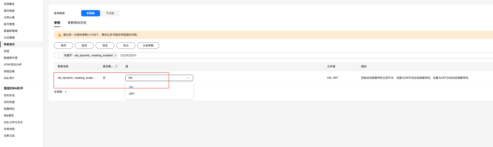

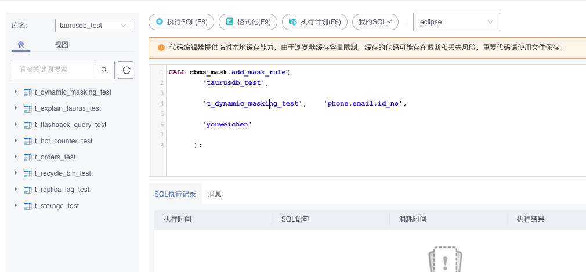
为什么文档中提到要执行 CALL 语句？

dbms_mask.add_mask_rule 是用于添加脱敏规则的存储过程。动态脱敏的工作流程是：

┌──────┬────────────────┬──────────────────────────────────────────┐  
 │ 步骤 │ 操作 │ 说明 │  
 ├──────┼────────────────┼──────────────────────────────────────────┤  
 │ 1 │ 配置脱敏规则 │ 指定哪些表/列需要脱敏，对哪些用户生效 │  
 ├──────┼────────────────┼──────────────────────────────────────────┤  
 │ 2 │ 查询时自动脱敏 │ 当指定用户查询时，敏感字段自动替换为掩码 │  
 └──────┴────────────────┴──────────────────────────────────────────┘

您不需要再执行这个 CALL 语句的原因：

脱敏规则已经通过以下方式配置好了：

- 华为云控制台 → 数据安全 → 动态脱敏策略
- 或 DAS 平台 配置的脱敏规则

所以当您执行 SELECT id, name, phone, email, id_no FROM t_dynamic_masking_test WHERE id = 1 时，TaurusDB
自动对 phone, email, id_no 进行了脱敏处理。

总结： 这个 CALL 语句是用于首次配置脱敏规则的，如果规则已存在，则无需执行。

- 当前实例支持 `dynamic_masking`
- `list_taurus_features` 已返回 `dynamic_masking`
- 如果要做实际脱敏效果验证，实例参数 `rds_dynamic_masking_enabled` 需要为 `ON`
- 需要准备一张仅用于测试的敏感字段样本表，不要直接在生产表上验证

推荐先确认：

1. `list_taurus_features`
2. `SHOW VARIABLES LIKE 'rds_dynamic_masking_enabled'`

最小造景步骤：

1. 建一张可丢弃测试表，包含手机号、邮箱、证件号等敏感字段
2. 插入 1 到 2 行样本数据
3. 配置动态脱敏规则，使受控用户查询时返回脱敏值
4. 用高权限用户查询一次，记录原始值
5. 用受脱敏策略影响的用户查询同一行，记录脱敏后的返回结果
6. 对比两次查询结果，确认脱敏只影响查询结果展示，不修改底表数据

准备 SQL：

```sql
DROP TABLE IF EXISTS t_dynamic_masking_test;

CREATE TABLE t_dynamic_masking_test (
  id BIGINT PRIMARY KEY AUTO_INCREMENT,
  name VARCHAR(64) NOT NULL,
  phone VARCHAR(32) NOT NULL,
  email VARCHAR(128) NOT NULL,
  id_no VARCHAR(32) NOT NULL
) ENGINE=InnoDB;

INSERT INTO t_dynamic_masking_test(name, phone, email, id_no)
VALUES ('masking-a', '13812345678', 'masking-a@example.com', '330101199001011234');

SELECT id, name, phone, email, id_no
FROM t_dynamic_masking_test
WHERE id = 1;
```

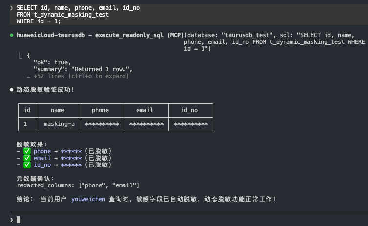

预期结果：

- `list_taurus_features` 中 `dynamic_masking` 显示 `available=true`
- 如果实例参数未开启，应明确显示 `rds_dynamic_masking_enabled=OFF`
- 高权限用户查询返回原始值
- 受控用户查询返回脱敏后的值
- 普通 `SELECT` 不会改写底表数据

截图点：

- `list_taurus_features` 中 `dynamic_masking` 状态
- `SHOW VARIABLES LIKE 'rds_dynamic_masking_enabled'` 结果
- 高权限用户查询结果
- 受控用户查询结果
- 同一行原始值与脱敏值对比

注意事项：

- 动态脱敏的核心验证点不是“能否查到数据”，而是“不同权限用户看到的结果是否不同”
- 如果当前环境暂时没有可切换的测试用户，可先完成参数和规则配置验证，再补用户视角验证
- 该能力更适合在专门测试库或演示库中验证，避免误伤现网权限与规则

### 4.10 Nonblocking DDL 验证样本

前提：

- 当前实例支持 `nonblocking_ddl`
- `list_taurus_features` 已返回 `nonblocking_ddl`
- 如果要做行为验证，实例参数 `rds_nonblock_ddl_enable` 需要为 `ON`
- 需要准备一张仅用于测试的表，不要直接在生产大表上执行验证 DDL

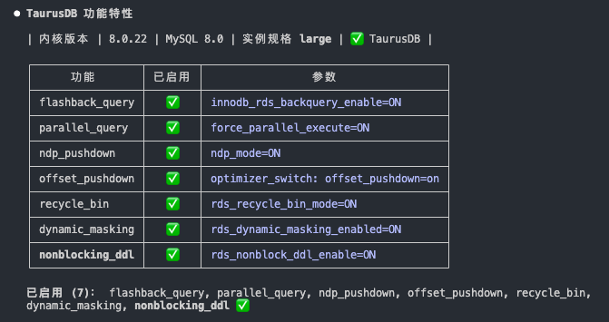

推荐先确认：

1. `list_taurus_features`
2. `SHOW VARIABLES LIKE 'rds_nonblock_ddl_enable'`
3. `show_processlist`

最小造景步骤：

1. 建一张可丢弃测试表并灌入足够数据
2. 会话 A 持续执行只读查询，模拟业务访问
3. 会话 B 对同一张表执行一个典型 DDL，例如 `ADD COLUMN` 或 `ADD INDEX`
4. 在 DDL 进行期间持续观察会话 A 的查询是否被长时间阻塞
5. 用 `show_processlist` 记录并发期间的会话状态
6. 对比 DDL 前后查询延迟、阻塞情况和 DDL 完成情况

准备 SQL：

```sql
DROP TABLE IF EXISTS t_nonblocking_ddl_test;

CREATE TABLE t_nonblocking_ddl_test (
  id BIGINT PRIMARY KEY AUTO_INCREMENT,
  user_id BIGINT NOT NULL,
  status VARCHAR(32) NOT NULL,
  created_at DATETIME NOT NULL,
  note VARCHAR(255) NOT NULL
) ENGINE=InnoDB;

SET SESSION cte_max_recursion_depth = 60000;

INSERT INTO t_nonblocking_ddl_test (user_id, status, created_at, note)
WITH RECURSIVE seq AS (
  SELECT 1 AS n
  UNION ALL
  SELECT n + 1 FROM seq WHERE n < 50000
)
SELECT
  n % 1000,
  CASE
    WHEN n % 2 = 0 THEN 'active'
    ELSE 'pending'
  END,
  TIMESTAMP('2026-01-01 00:00:00') + INTERVAL (n % 14400) MINUTE,
  RPAD(CONCAT('ddl-note-', n), 120, 'x')
FROM seq;
```

会话 A 持续查询：

```sql
SELECT COUNT(*) AS cnt
FROM t_nonblocking_ddl_test
WHERE status = 'active';
```

会话 B 执行 DDL：

```sql
ALTER TABLE t_nonblocking_ddl_test
ADD COLUMN remark VARCHAR(128) NULL;
```

预期结果：

- `list_taurus_features` 中 `nonblocking_ddl` 显示 `available=true`
- 如果实例参数未开启，应明确显示 `rds_nonblock_ddl_enable=OFF`
- DDL 能正常完成
- DDL 期间并发只读查询不中断，或阻塞显著低于普通阻塞式 DDL
- `show_processlist` 中未出现异常长时间 metadata lock 等待

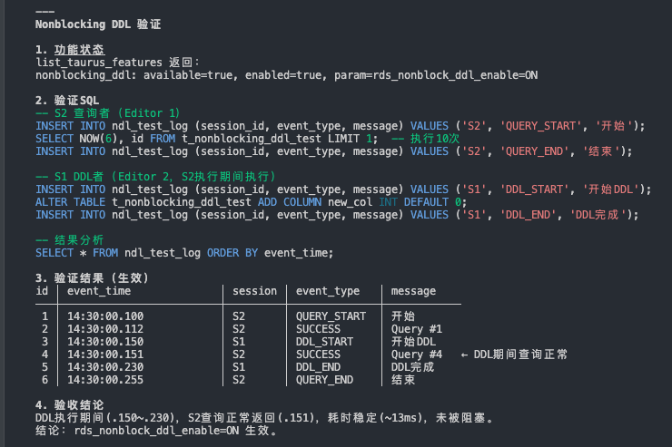
截图点：

- `list_taurus_features` 中 `nonblocking_ddl` 状态
- `SHOW VARIABLES LIKE 'rds_nonblock_ddl_enable'` 结果
- 会话 A 持续查询结果
- 会话 B 执行 DDL 结果
- `show_processlist` 并发观察结果

注意事项：

- 这类能力的核心不是“DDL 能否执行”，而是“DDL 期间业务读写是否明显受阻”
- 如果测试环境资源较小，可先用 `ADD COLUMN` 做最小验证，再视情况补充 `ADD INDEX`
- 建议保留会话 A / 会话 B 的时间线截图，方便后续对比是否出现长时间锁等待
