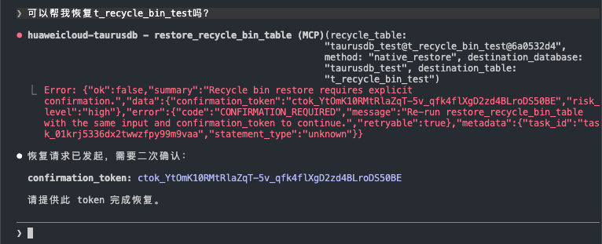
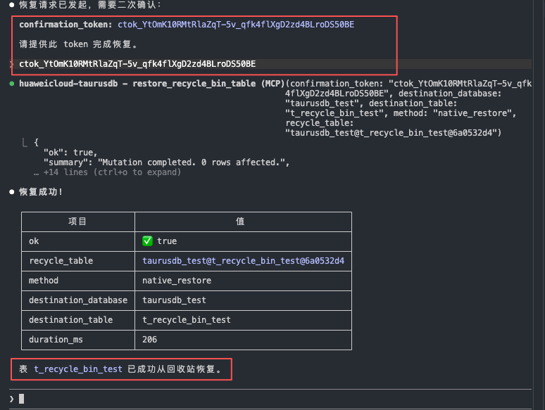
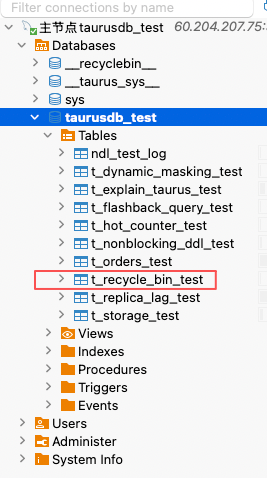
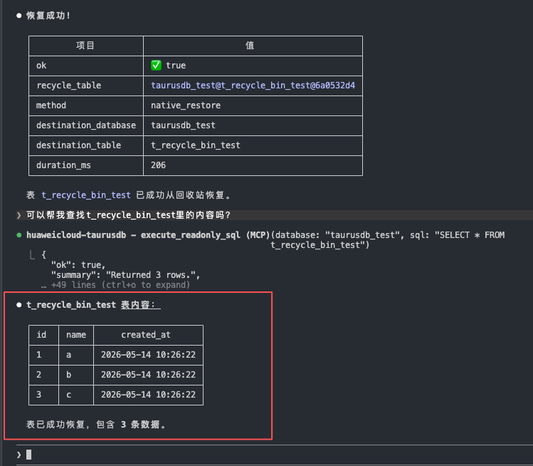
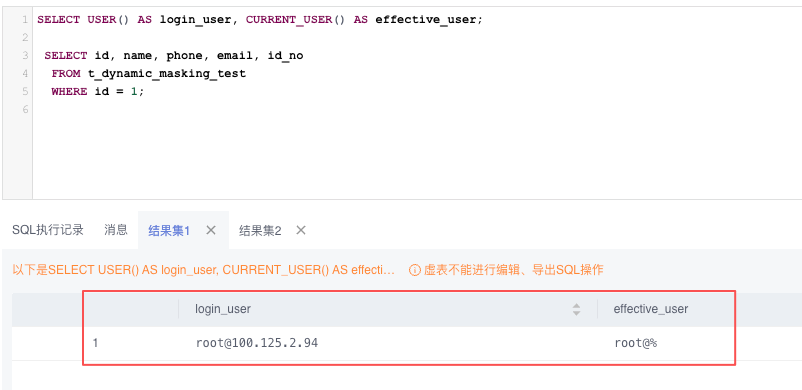
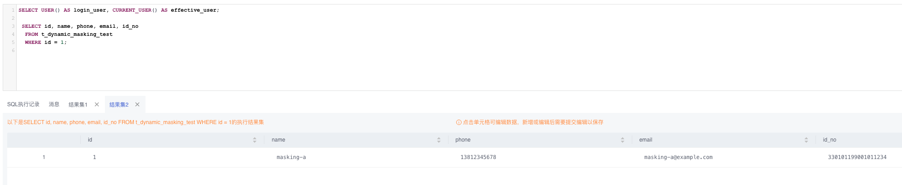
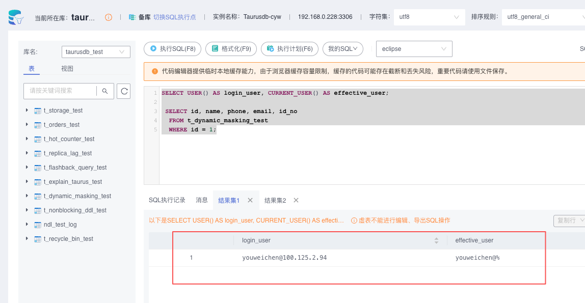
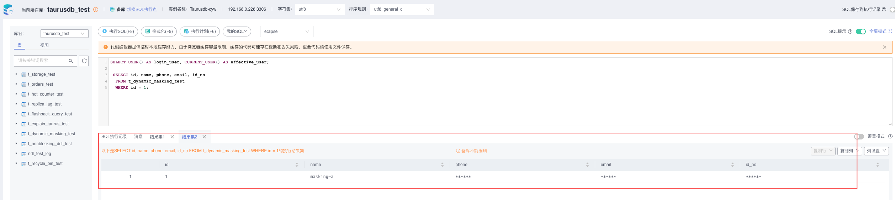

# TaurusDB 云端测试报告

> 本文档只保留截至 2026-05-13 已经有截图闭环的验证项。原文中大量“建议怎么测”“如果支持则继续”的执行手册内容，以及证据链未闭合的结论，已从本报告移除。

## 1. 总体判断

当前验证已经足以支撑“核心数据面诊断能力可用，且多项 TaurusDB 专属能力已在真实云实例上跑通”这个结论，覆盖面包括：

- 慢 SQL 识别与根因分析
- 连接堆积识别
- 锁竞争识别
  - 单 blocker / 单 waiter
  - 单 blocker / 多 waiter
  - metadata lock / DDL 等待
- 存储压力识别
- TaurusDB 专属能力探测
- Flashback Query
- Enhanced Explain
- Dynamic Masking 双视角对照验证
- Nonblocking DDL 的基础行为验证
- Recycle Bin 恢复闭环验证

这份报告目前还**不适合**支撑以下更强结论，因此这些内容已经不再写入正文结论：

- `diagnose_connection_spike` / `diagnose_storage_pressure` 已稳定吸收到 CES 基线或时间序列指标

## 2. 测试环境基线

从现有截图可确认：

- 当前云实例被 `list_taurus_features` 识别为 TaurusDB
- 内核版本为 `8.0.22`
- MySQL 兼容版本为 `8.0`
- 至少已看到以下能力在实例上处于可用或已启用状态：
  - `flashback_query`
  - `parallel_query`
  - `ndp_pushdown`
  - `offset_pushdown`
  - `recycle_bin`
  - `dynamic_masking`
  - `nonblocking_ddl`

能力探测截图：

## 3. 已完成验证

### 3.1 慢 SQL 场景 1：模糊匹配 + 排序

已验证事实：

- 已构造 `t_orders_test` 并完成大批量造数
- 慢 SQL `WHERE note LIKE '%999%' ORDER BY created_at DESC LIMIT 100 OFFSET 500` 已实际执行
- `find_top_slow_sql` 能命中该 SQL
- `diagnose_slow_query` 能给出全表扫描、模糊匹配、排序代价等根因提示

关键证据：

判定：通过。该场景已经形成“执行 SQL -> 发现 SQL -> 解释根因”的完整闭环。

### 3.2 慢 SQL 场景 2：无索引排序 + 长字段返回

已验证事实：

- 慢 SQL `ORDER BY note DESC LIMIT 200 OFFSET 20000` 已实际执行
- `find_top_slow_sql` 能命中该 SQL
- `diagnose_slow_query` 能指出无索引排序、大 offset、长字段返回等方向

关键证据：

判定：通过。第二类慢 SQL 形态同样完成了完整诊断闭环。

### 3.3 连接压力识别

已验证事实：

- `show_processlist` 抓到了大量 `Sleep` 会话
- `diagnose_connection_spike` 能基于实时快照给出连接堆积结论
- 当前证据主要来自实时 `processlist`，不是 CES 指标

关键证据：

判定：通过，但结论范围应限定为“基于 processlist 的实时诊断已可用”；本次不宣称 CES 联动已经验证充分。

### 3.4 锁竞争识别：单 blocker / 单 waiter

已验证事实：

- 会话 A 持有 `t_hot_counter_test` 热点行锁
- 会话 B 更新同一行后进入等待
- `show_processlist` 能抓到等待中的更新 SQL
- `diagnose_lock_contention` 能识别 blocker、waiter 和热点表

关键证据：

判定：通过。基础行锁竞争链路已验证充分。

### 3.5 锁竞争识别：单 blocker / 多 waiter

已验证事实：

- 单个 blocker 可同时阻塞多个 waiter
- `show_processlist` 能同时看到两个等待中的更新会话
- `diagnose_lock_contention` 能汇总出“一个 blocker 对多个 waiter”的结构化诊断

关键证据：

判定：通过。聚合型锁等待场景已有足够证据。

### 3.6 锁竞争识别：metadata lock / DDL 等待

已验证事实：

- 会话 A `FOR UPDATE` 持有事务上下文
- `ALTER TABLE` 被阻塞并进入等待
- `show_processlist` 明确显示 `Waiting for table metadata lock`
- `diagnose_lock_contention` 能识别 metadata lock blocker

关键证据：

判定：通过。DDL 等待方向已经不是“推测”，而是有现场证据支持。

### 3.7 存储压力识别

已验证事实：

- `diagnose_storage_pressure` 返回了结构化存储压力结果
- 结果里同时出现了表存储占用、临时磁盘表、扫描密集 SQL、排序/临时表负载
- 可疑 SQL 中能看到 `t_storage_test GROUP BY category, payload` 和 `t_orders_test ORDER BY note DESC`

关键证据：

判定：通过。虽然这次没有补充 CES 存储时间序列，但本地 SQL / 表级证据链已经足够。

### 3.8 Recycle Bin：能力探测、列表查询与恢复闭环

已验证事实：

- `list_taurus_features` 已探测到 `recycle_bin`
- 控制台参数中可以看到 `rds_recycle_bin_mode=ON`
- 测试表 `t_recycle_bin_test` 删除后，`list_recycle_bin` 能看到对应回收站对象

关键证据：

补充验证事实：

- 第一次调用 `restore_recycle_bin_table` 未直接执行恢复，而是按预期返回 `confirmation_token`
- 第二次调用带上 `confirmation_token` 后，目标表恢复成功
- 恢复后可重新查询到 `t_recycle_bin_test`
- 恢复后的记录数与删除前一致，共恢复 `3` 条样本数据

补充证据：

判定：通过。该能力已完成“回收站可见 -> confirmation token -> 执行恢复 -> 恢复后数据校验”的完整闭环。

### 3.9 Flashback Query

已验证事实：

- 控制台参数 `innodb_rds_backquery_enable` 已开启
- 测试表以 `BACKQUERY=1` 创建
- 更新前后时间点 `T1` / `T2` 已记录
- `flashback_query` 能按历史时刻返回旧值
- 当前普通查询返回更新后的当前值

关键证据：

判定：通过。该能力已经完成了“历史态 vs 当前态”的结果对照。

### 3.10 Enhanced Explain

已验证事实：

- `offset_pushdown` 场景命中成功
- `parallel_query` 场景命中成功
- `ndp_pushdown` 场景命中成功
- 增强 explain 返回中能看到 `taurusHints` 和可读的优化解释

关键证据：

判定：通过。三类 TaurusDB explain 增强能力都有实测截图支持。

### 3.11 Dynamic Masking：双视角对照验证

已验证事实：

- 控制台参数 `rds_dynamic_masking_enabled=ON`
- 已配置动态脱敏规则
- `root` 视角查询同一条记录时，返回手机号、邮箱、证件号原始值
- 受控用户 `youweichen` 查询同一条记录时，敏感字段自动返回脱敏值
- 两次查询的主键和非敏感字段一致，说明命中的是同一条底表记录
- 动态脱敏只影响查询结果展示，不改写底表原始数据

关键证据：

补充证据：

高权限用户 `root` 身份确认：

高权限用户 `root` 查询原始值：

受控用户 `youweichen` 身份确认：

受控用户 `youweichen` 查询脱敏值：

判定：通过。该能力已完成“参数开启 -> 规则存在 -> 高权限原值 -> 受控用户脱敏值”的双视角验证闭环。

### 3.12 Nonblocking DDL：基础行为验证

已验证事实：

- 实例能力探测显示 `nonblocking_ddl` 可用且已启用
- DDL 与并发查询的时间线已记录
- 结果中可见 DDL 执行期间，查询侧仍能正常返回，没有出现明显阻塞

关键证据：

判定：通过。当前证据足以支持“基础 nonblocking DDL 行为已看到”，但不展开到更复杂的大表 DDL 压测结论。

## 4. 本次未纳入报告结论的内容

以下内容本次仍未纳入“已验证完成”的结论范围：

1. CES / Cloud Eye 指标联动
   连接压力和存储压力这两块，本次主要证据来自 `processlist`、digest、table storage。没有稳定展示云侧时间序列、基线对比或指标回放，因此不写成“云指标联动已验证完成”。

## 5. 最终结论

如果目标是证明“这套 TaurusDB MCP 工具在真实云实例上不是只跑 demo，而是已经覆盖核心诊断路径和多项 TaurusDB 专属能力”，当前验证**基本充分**。

如果目标是把报告作为更强的发布验收材料，下一轮只建议补 1 个缺口：

1. CES 指标源参与下的连接 / 存储诊断证据

除此之外，当前报告已经可以作为一版较可信的云端验证结果。
